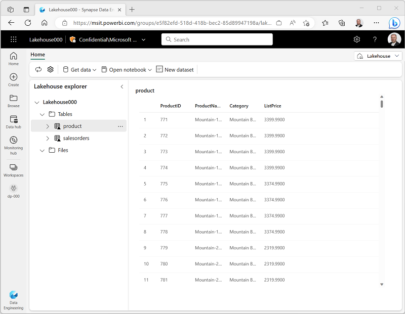
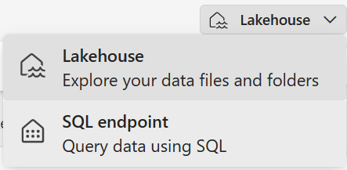
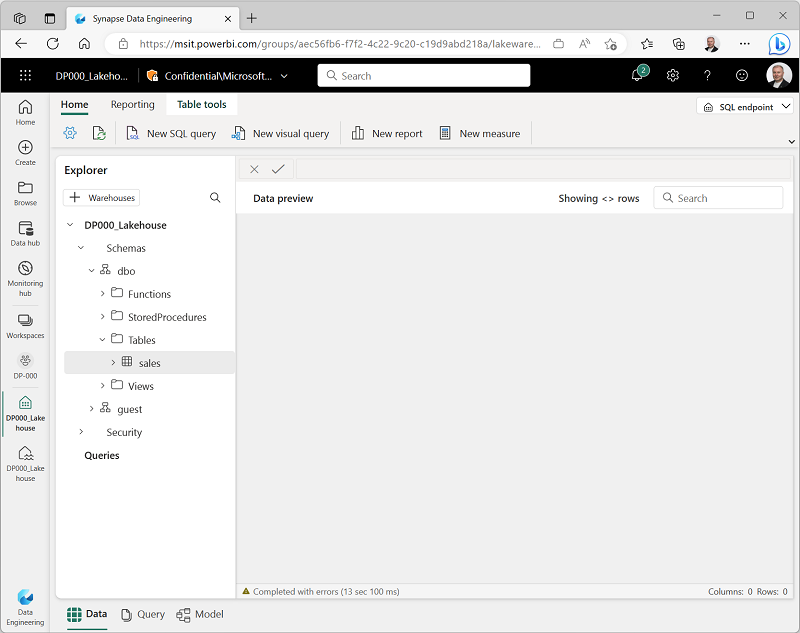
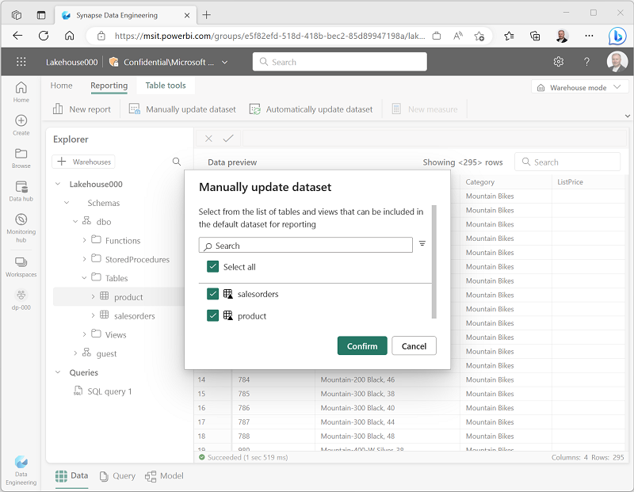

---
lab:
    title: 'Create a lakehouse'
    module: 'Get started with Lakehouses'
---

---
*The UI is changing frequently -we'll need to update (or remove) screenshots prior to release.*

---

# Create a lakehouse

Large-scale data analytics solutions have traditionally been built around a *data warehouse*, in which data is stored in relational tables and queried using SQL. The growth in "big data" (characterized by high *volumes*, *variety*, and *velocity* of new data assets) together with the availability of low-cost storage and cloud-scale distributed compute technologies has led to an alternative approach to analytical data storage; the *data lake*. In a data lake, data is stored as files without imposing a fixed schema for storage. Increasingly, data engineers and analysts seek to benefit from the best features of both of these approaches by combining them in a *data lakehouse*; in which data is stored in files in a data lake and a relational schema is applied to them as a metadata layer so that they can be queried using traditional SQL semantics.

In Microsoft Fabric, a lakehouse provides highly scalable file storage in a *OneLake* storage service with a metastore for relational objects such as tables and views based on the Apache Spark *Delta Lake* table format. Delta Lake enables you to "overlay" file data with a schema of tables that support transactional semantics and other capabilities commonly found in a traditional relational data warehouse.

This lab will take approximately **45** minutes to complete.

## Before you start

You'll need a Power BI Premium subscription with access to the Microsoft Fabric preview.

## Create a workspace

Before working with data in Fabric, you should create a workspace with support for premium features.

1. Sign into your Power BI service at [https://app.powerbi.com](https://app.powerbi.com).
2. In the menu bar on the left, select **Workspaces** (the icon looks similar to &#128455;).
3. Create a new workspace with a name of your choice, selecting the **Premium per user** licensing mode.
4. When your new workspace opens, it should be empty, as shown here:

    

## Create a lakehouse

Now that you have a workspace, it's time to switch to the *Data engineering* experience in the portal and create a data lakehouse for your data files.

1. At the bottom left of the Power BI portal, select the **Power BI** icon and switch to the **Data engineering** experience, as shown here:

    

    The data engineering home page provides shortcuts to create commonly used data engineering assets:

    

2. In the **Data engineering** home page, create a new **Lakehouse** with a name of your choice.

    After a minute or so, a new lakehouse will be created:

    

3. View the new lakehouse, and note that the **Lakehouse explorer** pane on the left enables you to browse tables and files in the lakehouse:
    - The **Tables** folder contains relational abstractions over files that you can query using SQL semantics. Tables in a Microsoft Fabric lakehouse are based on the open source *Delta* file format, commonly used in Apache Spark.
    - The **Files** folder contains data files in the OneLake storage for the lakehouse that are not associated with managed delta tables.

    Currently, there are no tables or files in the lakehouse.

## Load data into the lakehouse

There are multiple ways to load data into the lakehouse.

### Upload a file

One of the simplest ways to ingest small amounts of data into the lakehouse is to upload files or folders from your local computer.

1. Download the **orders.csv** file from [https://raw.githubusercontent.com/MicrosoftLearning/dp-data/main/orders.csv](https://raw.githubusercontent.com/MicrosoftLearning/dp-data/main/orders.csv), saving it as **orders.csv** on your local computer
2. Return to the web browser tab containing your lakehouse, and in the **...** menu for the **Files** folder in the **Lakehouse explorer** pane, select **Upload** and **Upload file**, and then upload the **orders.csv** file from your local computer to the lakehouse.
3. After the file has been uploaded, select **Files** verify that the **orders.csv** file has been uploaded, as shown here:

    

4. Select the **orders.csv** file to see a preview of its contents.

### Load file data into a table

The sales data you uploaded is in a file, which data analysts and engineers can work with directly by using Apache Spark code. However, in many scenarios you may want to load the data from the file into a table so that you can query it using SQL.

1. On the **Home** page, select the **Files** folder so you can see the **orders.csv** file it contains.
2. In the **...** menu for the **orders.csv** file select **Load to Delta table**.
3. In **Load to table** dialog box, set the table name to **salesorders** and confirm the load operation. Then wait for the table to be created and loaded.
3. In the **Lakehouse explorer** pane, select the **salesorders** table that has been created for the table data.

    

4. In the **...** menu for the **salesorders** table, select **View table files** to see the underlying files for this table

    

    Files for a delta table are stored in *Parquet* format, and include a subfolder named **_delta_log** in which details of transactions applied to the table are logged.

### Copy data with a pipeline

When you need to regularly copy data from an external source into the lakehouse, you can create a pipeline that contains a **Copy Data** activity. Pipelines can be run on-demand or scheduled to run at specific intervals.

1. On the **Home** page, in the **Get data** menu, select **New data pipeline**. When prompted, name the pipeline **Import Data**.

    The pipeline editor opens in a new browser tab (if you are prompted to allow pop-ups, do so).

2. If the **Copy Data** wizard doesn't open automatically, select **Copy Data** in the pipeline editor page.
3. In the **Copy Data** wizard, on the **Choose a data source** page, in the **data sources** section, review the list of available sources. Then on the **File** tab, select **HTTP**.

    

4. Select **Next** and then select **Create new connection** and enter the following settings for the connection to your data source:
    - **URL**: `https://raw.githubusercontent.com/MicrosoftLearning/dp-data/main/products.csv`
    - **Connection**: Create new connection
    - **Connection name**: web_product_data
    - **Authentication kind**: Basic
    - **Username**: *Leave blank*
    - **Password**: *Leave blank*

5. Select **Next**. Then ensure the following settings are selected:
    - **Relative URL**: *Leave blank*
    - **Request method**: GET
    - **Additional headers**: *Leave blank*
    - **Binary copy**: <u>Un</u>selected
    - **Request timeout**: *Leave blank*
    - **Max concurrent connections**: *Leave blank*
6. Select **Next**, and then ensure that the following settings are selected:
    - **File format**: DelimitedText
    - **Column delimiter**: Comma (,)
    - **Row delimiter**: Line feed (\n)
    - **First row as header**: Selected
    - **Compression type**: None
7. Select **Preview data** to see a sample of the data that will be ingested. Then close the data preview and select **Next**.
8. On the **Choose data destination** page, select your existing lakehouse. Then select **Next**.
9. Set the following data destination options (noting that you can copy the data to a file, or to a table - which creates the necessary files in the **Tables** storage area as well as the relational table metadata), and then select **Next**:
    - **Root folder**: Tables
    - **Table name**: `product`
10. On the **Copy summary** page, review the details of your copy operation and then select **OK**

    A new pipeline containing a **Copy Data** activity is created, as shown here:

    

11. Use the **&#9655; Run** button to run the pipeline, saving the pipeline when prompted.

    When the pipeline starts to run, you can monitor its status in the **Output** pane under the pipeline designer. Wait until it has succeeeded.

    

12. Close the browser tab containing the pipeline designer and return to the tab containing your lakehouse.
13. In the **Lakehouse explorer** pane, in the **...** menu for **Tables**, select **Refresh** to see the **product** table created by the pipeline.
14. Select the **product** table to see a preview of its data.

    

## Use SQL to query tables

When you create a lakehouse and define tables in it, a SQL endpoint is automatically created through which the tables can be queried using SQL `SELECT` statements.

1. At the top-right of the Lakehouse page, switch from **Lake mode** to **SQL endpoint** as shown here:

    

2. Wait a short time until the SQL query endpoint for your lakehouse opens in a visual interface from which you can query its tables, as shown here:

    

3. Use the **New SQL query** button to open a new query editor, and enter the following SQL query:

    ```sql
    SELECT p.ProductName, COUNT(s.SalesOrderID) AS OrderCount
    FROM salesorders AS s
    JOIN product AS p
        ON s.ProductID = p.ProductID
    GROUP BY  p.ProductName
    ORDER BY p.ProductName
    ```

4. Use the **&#9655; Run** button to run the query and view the results, which should show the number of orders placed for each product.

## Create a report

Creating and populating tables in a lakehouse automatically generated a default *dataset* that you can use as the basis for a Power BI data visualization.

1. In the tabs at the bottom of the **Explorer** pane, select **Data**. Then at the top of the page, select the **Reporting** tab.
2. In the **Reporting** menu, select **Manually update dataset**. Then select all of the tables in the lakehouse (**salesorders** and **product**) and confirm the update:

    

    ---
    *This fails - for some reason it doesn't recognize the **product** table!*

    *We can wait for this to be fixed, or just cut this section (it's nice to show the end-to-end; but at this point we've covered the core "lakehouse" stuff)*

    ---

3. In the tabs at the bottom of the **Explorer** pane, select **Model**.

    ---
    *If we get the model to refresh, we'll add steps here to create a relationship between the two tables.*

    ---


4. In the toolbar, select **New report**.

    ---
    *If the dataset refreshes, we'll add steps here to create a simple report.*

    ---

## Clean up resources

In this exercise, you have created a lakehouse and imported data into it. You've seen how a lakehouse consists of files stored in a OneLake data store, some of which are used to store the data for managed tables. The managed tables can be explored and manipulated using Spark, queried using SQL, and included in a dataset to support data visualizations.

If you've finished exploring your lakehouse, you can delete the workspace you created for this exercise.

1. In the bar on the left, select the icon for your workspace to view all of the items it contains.
2. In the **...** menu on the toolbar, select **Workspace settings**.
3. In the **Other** section, select **Delete this workspace**.
