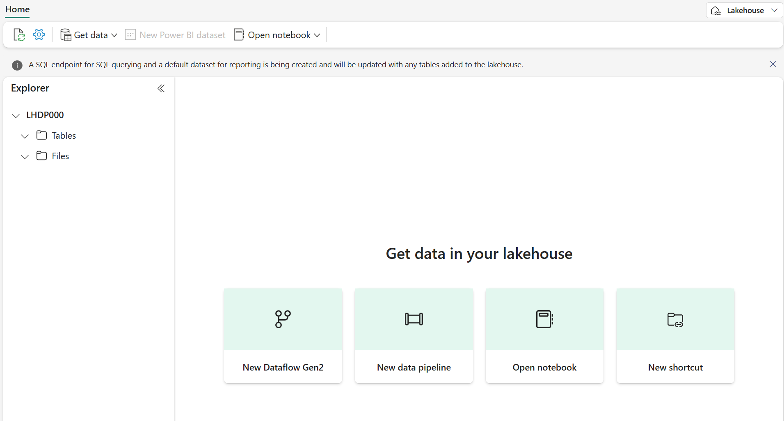
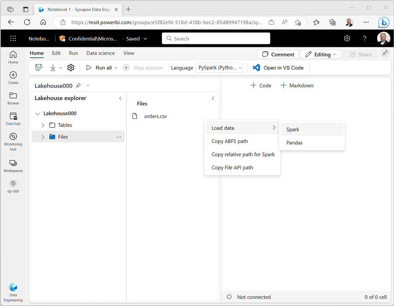
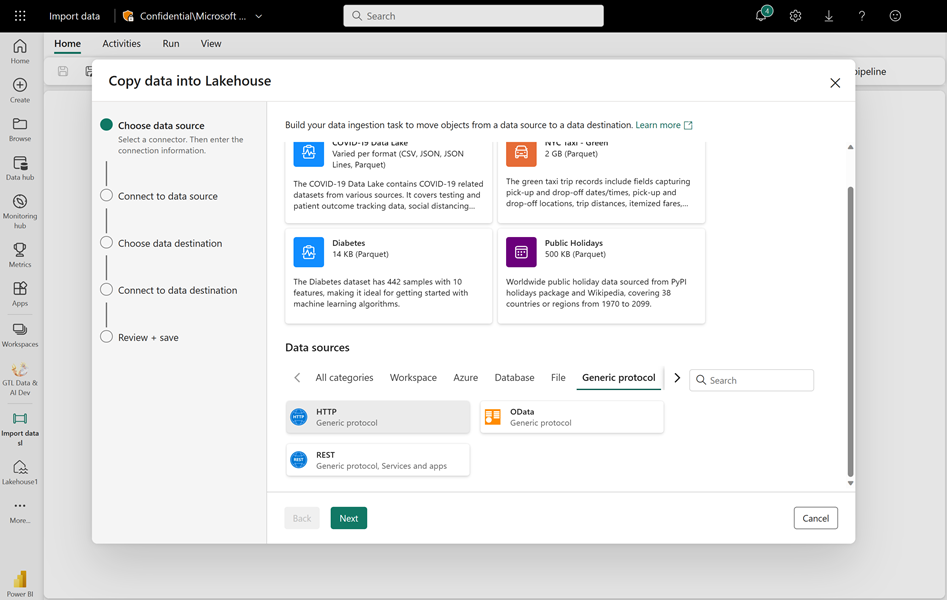

---
lab:
    title: 'Create a lakehouse'
    module: 'Get started with Lakehouses'
---

# Create a lakehouse

Large-scale data analytics solutions have traditionally been built around a *data warehouse*, in which data is stored in relational tables and queried using SQL. The growth in "big data" (characterized by high *volumes*, *variety*, and *velocity* of new data assets) together with the availability of low-cost storage and cloud-scale distributed compute technologies has led to an alternative approach to analytical data storage; the *data lake*. In a data lake, data is stored as files without imposing a fixed schema for storage. Increasingly, data engineers and analysts seek to benefit from the best features of both of these approaches by combining them in a *data lakehouse*; in which data is stored in files in a data lake and a relational schema is applied to them as a metadata layer so that they can be queried using traditional SQL semantics.

In *Trident*, a lakehouse is an artifact in a workspace that provides highly scalable file storage in a *OneLake* storage service with a relational metastore based on Apache Spark *Delta Lake* technology. Delta Lake enables you to "overlay" file data with a relational schema of tables that support transactional semantics and other capabilities commonly found in a traditional relational data warehouse.

This lab will take approximately **30** minutes to complete.

## Before you start

You'll need a Power BI Premium subscription with access to the Trident preview.

## Create a workspace

Before working with data in *Trident*, you should create a workspace with support for premium features.

1. Sign into your Power BI service at [https://app.powerbi.com](https://app.powerbi.com).
2. In the menu bar on the left, select **Workspaces** (the icon looks similar to &#128455;).
3. Create a new workspace with a name of your choice, selecting the **Premium per user** licensing mode.
4. When your new workspace opens, it should be empty, as shown here:

    

## Create a lakehouse

Now that you have a workspace, it's time to switch to the *Data engineering* experience in the portal and create a data lakehouse for your data files.

1. At the bottom left of the Power BI portal, select the **Power BI** icon and switch to the **Data engineering** experience, as shown here:

    

    The data engineering home page provides shortcuts to create commonly used data engineering assets:

    

2. In the **Data engineering** home page, create a new **Lakehouse** with a name of your choice.

    After a minute or so, a new lakehouse will be created:

    

3. View the new lakehouse, and note that the pane on the left provides two tabs in which you can browse data assets in the lakehouse:
    - The **Lake view** tab enables you to view files in the OneLake storage for the lakehouse. Files that are associated with managed tables are shown in the **Tables** section, while other data files are shown in the **Files** section.
    - The **Table view** tab shows the managed tables defined in the Delta Lake metastore for the lakehouse.

    Currently, there are no files or tables in the lakehouse.

## Load data into the lakehouse

There are multiple ways to load data into the lakehouse.

### Upload a file

One of the simplest ways to ingest small amounts of data into the lakehouse is to upload files or folders from your local computer.

1. Download the **sales.csv** file from [https://raw.githubusercontent.com/MicrosoftLearning/dp-data/main/sales.csv](https://raw.githubusercontent.com/MicrosoftLearning/dp-data/main/sales.csv), saving it as **sales.csv** on your local computer
2. Return to the web browser tab containing your lakehouse, and in the **...** menu for the **Files** node in the **Lake view** pane, select **Upload** and **Upload file**, and then upload the **sales.csv** file from your local computer to the lakehouse.
3. After the file has been uploaded, select **Files** verify that the **sales.csv** file has been uploaded, as shown here:

    

4. Select the **sales.csv** file to see a preview of its contents.

### Load file data into a table

The sales data you uploaded is in a file, which data analysts and engineers can work with directly by using Apache Spark code. However, in many scenarios you may want to load the data from the file into a table so that you can query it using SQL.

1. On the **Home** page while viewing the contents of the **sales.csv** file in your datalake, in the **Open notebook** menu, select **New notebook**.

    After a few seconds, a new notebook containing a single *cell* will open. Notebooks are made up of one or more cells that can contain *code* or *markdown* (formatted text).

2. Select the existing cell in the notebook, which contains some simple code, and then use its **&#128465;** (*Delete*) icon at its top-right to remove it - you will not need this code.
3. In the pane on the left, select the **Files** list to reveal a new pane showing the **sales.csv** file you uploaded previously:

    

2. In the **...** menu for **sales.csv**, select **Load data** > **Spark**. A new code cell containing the following code should be added to the notebook:

    ```python
    df = spark.read.format("csv").option("header","true").load("Files/sales.csv")
    # df now is a Spark DataFrame containing CSV data from "Files/sales.csv".
    display(df)
    ```

    > **Tip**: You can hide the pane containing the files on the left by using its **<** icon. Doing so will help you focus on the notebook.

3. Use the **&#9655; Run cell** button on the left of the cell to run it.

    > **Note**: Since this is the first time you've run any Spark code in this session, the Spark pool must be started. This means that the first run in the session can take a minute or so to complete. Subsequent runs will be quicker.

4. When the cell command has completed, review the output below the cell, which should look similar to this:

    | Index | SalesOrderNumber | SalesOrderLineNumber | OrderDate | CustomerName | Email | Item | Quantity | UnitPrice | Tax |
    | -- | -- | -- | -- | -- | -- | -- | -- | -- | -- |
    | 1 | SO43701 | 11 | 2019-07-01 | Christy Zhu | christy12@adventure-works.com | Mountain-100 Silver, 44 | 16 | 3399.99 | 271.9992 |
    | 2 | SO43704 | 1 | 2019-07-01 | Julio Ruiz | julio1@adventure-works.com | Mountain-100 Black, 48 | 1 | 3374.99 | 269.9992 |
    | 3 | SO43705 | 1 | 2019-07-01 | Curtis Lu | curtis9@adventure-works.com | Mountain-100 Silver, 38 | 1 | 3399.99 | 271.9992 |
    | ... | ... | ... | ... | ... | ... | ... | ... | ... | ... |

5. Under the output, use the **+ Code** button to adda  new code cell to the notebook. Then add the following code to the new cell:

    ```Python
    # Create a new table
    df.write.format("delta").saveAsTable("salesorders")
    ```

6. Run the new code cell and wait for it to complete.
7. In the navigation bar on the left edge of the portal, select **&#128447;** (*Browse*). Then, in the **Recent** category, select your lakehouse.
8. In the **Lake view** pane, in the **...** menu for the **Tables** node, select **Refresh**. Then expand the **Tables** node and select the **salesorders** folder to view the files that have been created for the table data.
9. Select the **Table view** tab, and verify that the **salesorders** table is listed in the metastore.
10. Select the **salesorders** table to see a preview of the data it contains.

    

### Copy data with a pipeline

When you need to regularly copy data from an external source into the lakehouse, you can create a pipeline that contains a **Copy Data** activity. Pipelines can be run on-demand or scheduled to run at specific intervals.

1. On the **Home** page, in the **Get data** menu, select **New data pipeline**.

    The pipeline editor opens in a new browser tab (if you are prompted to allow pop-ups, do so).

2. If the **Copy Data** wizard doesn't open automatically, select **Copy Data** in the pipeline editor page.
3. In the **Copy Data** wizard, on the **Choose a data source** page, in the **data sources** section, review the list of available sources. Then on the **File** tab, select **HTTP**.

    

4. Select **Next** and then select **Create new connection** and enter the following settings for the connection to your data source:
    - **URL**: `https://raw.githubusercontent.com/MicrosoftLearning/dp-data/main/products.csv`
    - **Connection**: Create new connection
    - **Connection name**: web_product_data
    - **Authentication kind**: Anonymous

5. Select **Next**. Then ensure the following settings are selected:
    - **Relative URL**: *Leave blank*
    - **Request method**: GET
    - **Additional headers**: *Leave blank*
    - **Binary copy**: <u>Un</u>selected
    - **Request timeout**: *Leave blank*
    - **Max concurrent connections**: *Leave blank*
6. Select **Next**, and then ensure that the following settings are selected:
    - **File format**: DelimitedText
    - **Column delimiter**: Comma (,)
    - **Row delimiter**: Line feed (\n)
    - **First row as header**: Selected
    - **Compression type**: None
7. Select **Preview data** to see a sample of the data that will be ingested. Then close the data preview and select **Next**.
8. On the **Choose data destination** page, select your existing lakehouse. Then select **Next**.
9. Set the following data destination options (noting that you can copy the data to a file, or to a table - which creates the necessary files in the **Tables** storage area as well as the relational table metadata), and then select **Next**:
    - **Root folder**: Tables
    - **Table name**: `product`
10. On the **Copy summary** page, review the details of your copy operation and then select **OK**

    A new pipeline containing a **Copy Data** activity is created, as shown here:

    

11. Use the **&#9655; Run** button to run the pipeline, saving the pipeline as **Copy Product Data** when prompted.

    When the pipeline starts to run, you can monitor its status in the **Output** pane under the pipeline designer. Wait until it has succeeeded.

    

12. Close the browser tab containing the pipeline designer and return to the tab containing your lakehouse.
13. On the **Home** page, select the **Table view** tab; and in the **...** menu for **Tables**, select **Refresh**.
14. Verify that the **product** table has been created.
15. Select the **product** table to see a preview of its data.

    

16. Select the **Lave view** tab and refresh the **Tables** section to see the folder for the **product** data files.

    

In this exercise, you have created a lakehouse and imported data into it. You've seen how a lakehouse consists of files stored in a OneLake data store, some of which are used to store the data for managed tables.

---
*Possibly extend this to include working with a dataset so students see the point of defining tables in a lakehouse to support Power BI reporting. There seem to be some issues at the moment though - the default dataset doesn't seem to include the latest table and there's no obvious way to force it to refresh, and creating a new dataset results in a server error*

---
