# Exercise 3: Analyze data in a data warehouse

### Estimated Duration: 75 minutes

In Microsoft Fabric, a data warehouse provides a relational database for large-scale analytics. Unlike the default read-only SQL endpoint for tables defined in a lakehouse, a data warehouse provides full SQL semantics; including the ability to insert, update, and delete data in the tables.

## Lab objectives

You will be able to complete the following tasks:

- Task 1: Create a data warehouse
- Task 2: Create tables and insert data
- Task 3: Define a data model
- Task 4: Query data warehouse tables
- Task 5: Create a view
- Task 6: Create a visual query
- Task 7: Visualize your data

### Task 1: Create a data warehouse

In this task, you will design and implement a data warehouse by organizing data from multiple sources, creating ETL processes, and optimizing for performance. The goal is to enable efficient querying and reporting while ensuring security, compliance, and scalability.

1. At the bottom left of the Power BI portal, select the **Fabric (1)** icon and switch to the **Fabric (2)** experience.

   

   

2. Navigate to your workspace named as **fabric-<inject key="DeploymentID" enableCopy="false"/> (1)**, click on **+ New item (2)** to create a new warehouse.

    
   
4. In the **All items** search for Warehouse (1) and select **Warehouse** (2) from the list.

   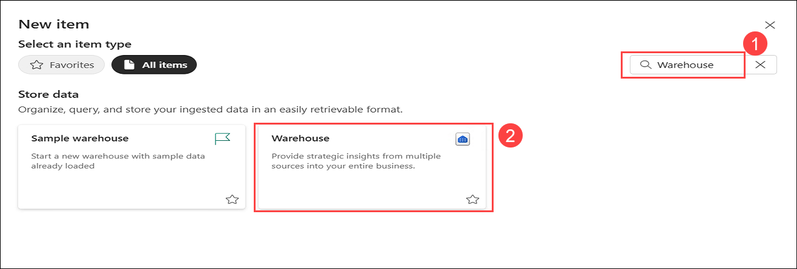
   
   - **Name:** Enter **Data Warehouse-<inject key="DeploymentID" enableCopy="false"/>** **(1)**

   - Click on **Create (2)**

    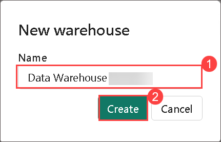

> **Congratulations** on completing the task! Now, it's time to validate it. Here are the steps:
      
   - If you receive an InProgress message, you can hit refresh to see the final status.
   - If you receive a success message, you can proceed to the next task.
   - If not, carefully read the error message and retry the step, following the instructions in the lab guide.
   - If you need any assistance, please contact us at cloudlabs-support@spektrasystems.com. We are available 24/7 to help you out.

<validation step="ed927a03-5062-4d23-bf52-d57ae336f0eb" />

### Task 2: Create tables and insert data

In this task, you will create database tables by defining their structure with appropriate columns and constraints. Afterward, you'll insert data into the tables, ensuring it is ready for querying and further operations.

1. In your new warehouse, select the **Create tables with T-SQL** tile.

   

2. Replace the default SQL code with the following **CREATE TABLE statement (1)** and Use the **&#9655; Run (2)** button to run the SQL script, which creates a new table named **DimProduct** in the **dbo** schema of the data warehouse.

    ```SQL
   CREATE TABLE dbo.DimProduct
   (
       ProductKey INTEGER NOT NULL,
       ProductAltKey VARCHAR(25) NULL,
       ProductName VARCHAR(50) NOT NULL,
       Category VARCHAR(50) NULL,
       ListPrice DECIMAL(5,2) NULL
   );
   GO
    ```

   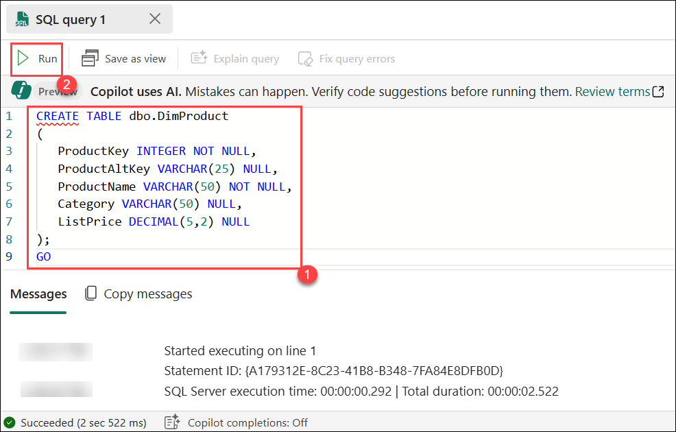

3. Use the **Refresh** button on the toolbar to refresh the view. Then, in the **Explorer** pane, expand **Schemas** > **dbo** > **Tables** and verify that the **DimProduct** table has been created.

4. On the **Home** menu tab, use the **New SQL Query** button and from the drop down select **New SQL Query**  to create a new query, and enter the following INSERT statement:

    ```SQL
   INSERT INTO dbo.DimProduct
   VALUES
   (1, 'RING1', 'Bicycle bell', 'Accessories', 5.99),
   (2, 'BRITE1', 'Front light', 'Accessories', 15.49),
   (3, 'BRITE2', 'Rear light', 'Accessories', 15.49);
   GO
    ```

6. Run the above query to insert three rows into the **DimProduct** table.

7. When the query has finished, select the **Data** tab at the bottom of the page in the data warehouse. In the **Explorer** pane, select the **DimProduct** table and verify that the three rows have been added to the table.

8. On the Home menu tab, use the **New SQL Query** button to create a new query for the table. In the Lab VM, Open the first text file, from **C:\LabFiles\Files\create-dw-01.txt**, and copy the Transact-SQL code related to the 'DimProduct' table. Paste the 'DimProduct' table code into the new query pane you created and similarily copy code from file **C:\LabFiles\Files\create-dw-02.txt** and **C:\LabFiles\Files\create-dw-03.txt** one after the other in same query pane and execute the query.

     

     

9. Run the query, which creates a simple data warehouse schema and loads some data. The script should take around 30 seconds to run.

10. Use the **Refresh** button on the toolbar to refresh the view. Then in the **Explorer** pane, verify that the **dbo** schema in the data warehouse now contains the following four tables:
   
    - **DimCustomer**
    - **DimDate**
    - **DimProduct**
    - **FactSalesOrder**

        

> **Tip**: If the schema takes a while to load, just refresh the browser page.

### Task 3: Define a data model

In this task, you will create a relational data warehouse consisting of fact and dimension tables, where fact tables hold numeric measures for analysis and dimension tables store entity attributes. You'll define relationships between tables in Microsoft Fabric to build a data model for efficient business performance analysis.

1. In the warehouse, from the top navigation pane, select the **Model Layouts** option.

    >**Note:** If you do not see the **Model Layouts** option, close and reopen the Data Warehouse from the left-most navigation pane.

    >**Note:** If the Model Layouts do not display any data upon first opening, try closing and reopening the Data Warehouse.

2. In the model pane, rearrange the tables in your data warehouse so that the **FactSalesOrder** table is in the middle, like this:

    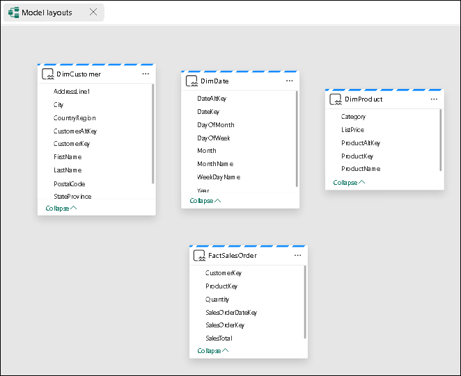

   >**Note:** You might notice some additional tables appearing, as shown below—please ignore them.

      

3. Drag the **ProductKey** field from the **FactSalesOrder** table and drop it on the **ProductKey** field in the **DimProduct** table. Then confirm the following relationship details and click on **Save**.
   
    - **From table**: FactSalesOrder
    - **Column**: ProductKey
    - **To table**: DimProduct
    - **Column**: ProductKey
    - **Cardinality**: Many to one (*:1)
    - **Cross filter direction**: Single
    - **Make this relationship active**: Selected
    - **Assume referential integrity**: Unselected

        

4. Repeat the process to create many-to-one relationships between the following tables and click on **Save**.

    - **FactSalesOrder.CustomerKey** &#8594; **DimCustomer.CustomerKey**

   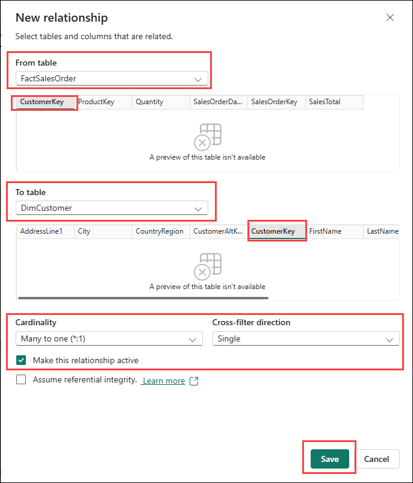

    - **FactSalesOrder.SalesOrderDateKey** &#8594; **DimDate.DateKey**
  
    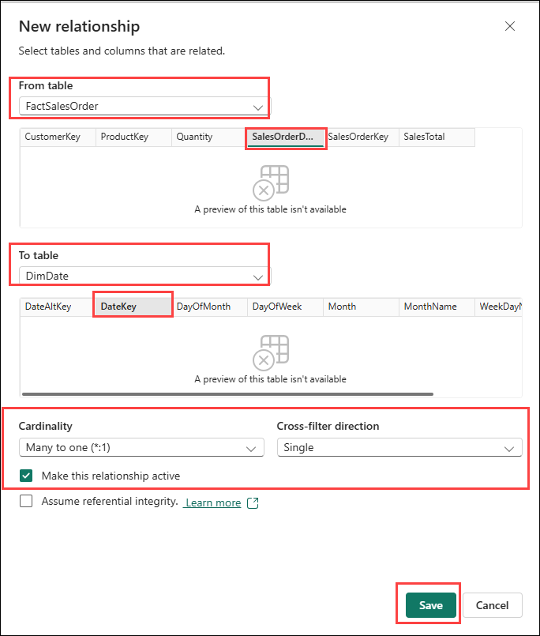

5. When all of the relationships have been defined, the model should look like this:

    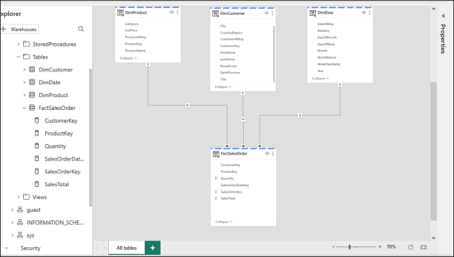

### Task 4: Query data warehouse tables

In this task, you will query data warehouse tables using SQL to retrieve and analyze data. Most queries will involve aggregating and grouping data with functions and GROUP BY clauses, as well as joining related fact and dimension tables using JOIN clauses.

1. Create a new SQL Query, and run the following code:

    ```SQL
   SELECT  d.[Year] AS CalendarYear,
            d.[Month] AS MonthOfYear,
            d.MonthName AS MonthName,
           SUM(so.SalesTotal) AS SalesRevenue
   FROM FactSalesOrder AS so
   JOIN DimDate AS d ON so.SalesOrderDateKey = d.DateKey
   GROUP BY d.[Year], d.[Month], d.MonthName
   ORDER BY CalendarYear, MonthOfYear;
    ```
    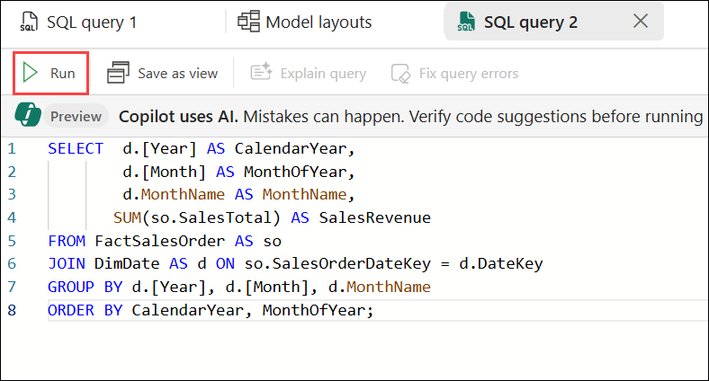
   
2. Note that the attributes in the time dimension enable you to aggregate the measures in the fact table at multiple hierarchical levels- in this case, year and month. This is a common pattern in data warehouses.

3. Modify the query as follows to add a second dimension to the aggregation.

    ```SQL
   SELECT  d.[Year] AS CalendarYear,
           d.[Month] AS MonthOfYear,
           d.MonthName AS MonthName,
           c.CountryRegion AS SalesRegion,
          SUM(so.SalesTotal) AS SalesRevenue
   FROM FactSalesOrder AS so
   JOIN DimDate AS d ON so.SalesOrderDateKey = d.DateKey
   JOIN DimCustomer AS c ON so.CustomerKey = c.CustomerKey
   GROUP BY d.[Year], d.[Month], d.MonthName, c.CountryRegion
   ORDER BY CalendarYear, MonthOfYear, SalesRegion;
    ```

   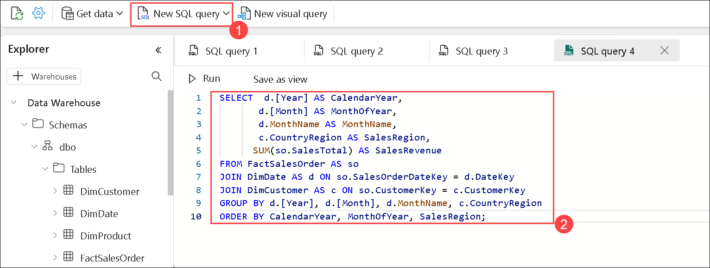

4. Run the modified query and review the results, which now include sales revenue aggregated by year, month and sales region.

### Task 5: Create a view

In this task, you will create a view in the data warehouse to encapsulate SQL logic for easier querying and data abstraction. A Microsoft Fabric data warehouse offers similar capabilities to relational databases, allowing you to create views and stored procedures to streamline complex queries and improve data access efficiency.

1. Modify the query you created previously as follows to create a view (note that you need to remove the ORDER BY clause to create a view).

    ```SQL
   CREATE VIEW vSalesByRegion
   AS
   SELECT  d.[Year] AS CalendarYear,
           d.[Month] AS MonthOfYear,
           d.MonthName AS MonthName,
           c.CountryRegion AS SalesRegion,
          SUM(so.SalesTotal) AS SalesRevenue
   FROM FactSalesOrder AS so
   JOIN DimDate AS d ON so.SalesOrderDateKey = d.DateKey
   JOIN DimCustomer AS c ON so.CustomerKey = c.CustomerKey
   GROUP BY d.[Year], d.[Month], d.MonthName, c.CountryRegion;
    ```
    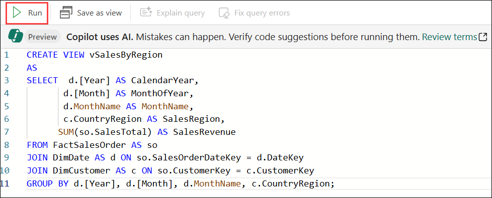

2. Run the query to create the view. Then refresh the data warehouse schema and verify that the new view is listed in the **Explorer** pane.

    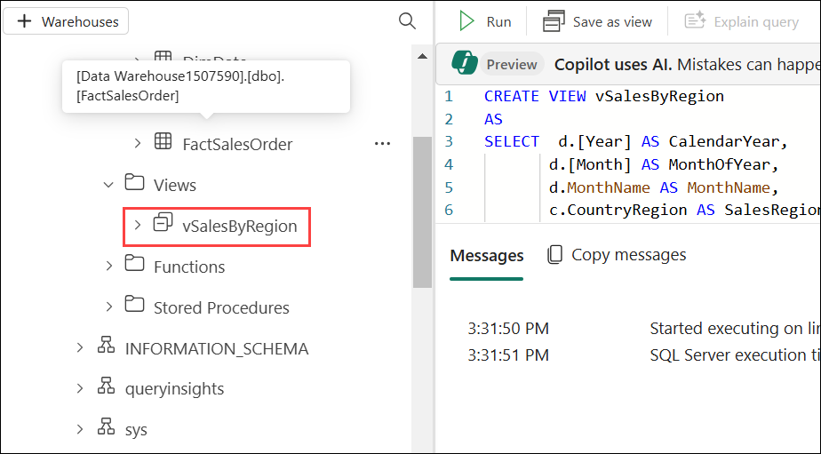

3. Create a new SQL query and run the following SELECT statement:

    ```SQL
   SELECT CalendarYear, MonthName, SalesRegion, SalesRevenue
   FROM vSalesByRegion
   ORDER BY CalendarYear, MonthOfYear, SalesRegion;
    ```

### Task 6: Create a visual query

In this task, you will create a visual query using the graphical query designer to query data warehouse tables without writing SQL code. Similar to Power Query online, this no-code approach allows you to perform data transformations, and for more complex tasks, you can leverage Power Query's M language.

1. On the **Home** menu, select **New visual query** from the drop-down.

1. Drag **FactSalesOrder** onto the **canvas**. Notice that a preview of the table is displayed in the **Preview** pane below.

1. Drag **DimProduct** onto the **canvas**. We now have two tables in our query.

1. Use the **(+)** button on the **FactSalesOrder** table on the canvas to **Merge queries**.

   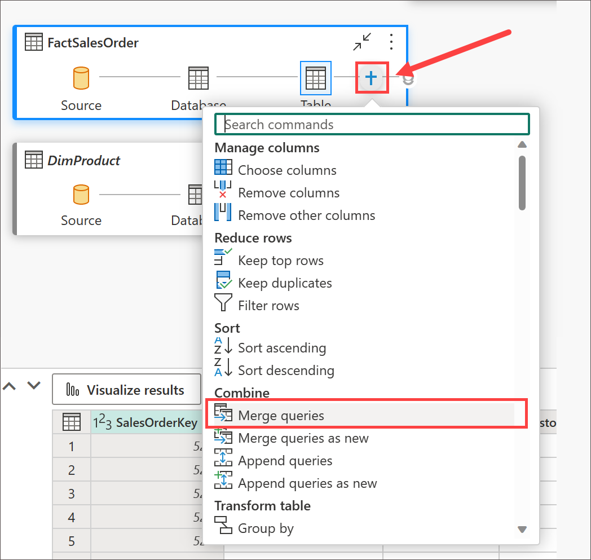

   > **Note:** If the + option is not visible, click on the three dots (i.e., the Actions button) to view the required options. 

1. In the **Merge queries** window, select **DimProduct (1)** as the right table for merge. Select **ProductKey** in both queries, leave the default **Left outer** to join type, and click **OK (4)**.

   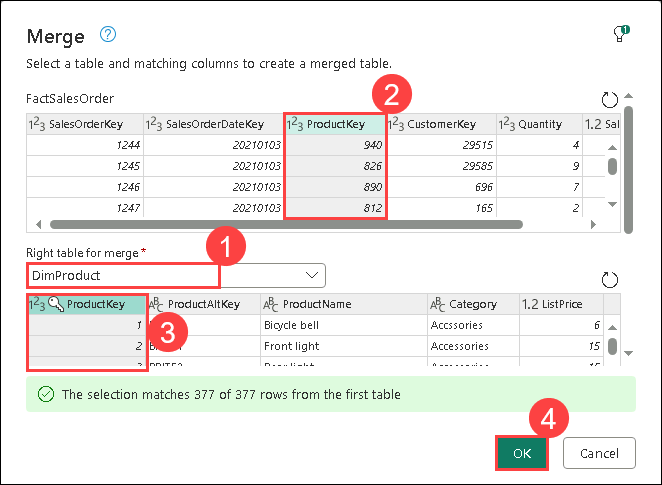

1. In the **Preview**, note that the new **DimProduct** column has been added to the FactSalesOrder table. Expand the column by clicking the **arrow (1)** to the right of the column name. Select **ProductName (2)** and click **OK (3)**.

    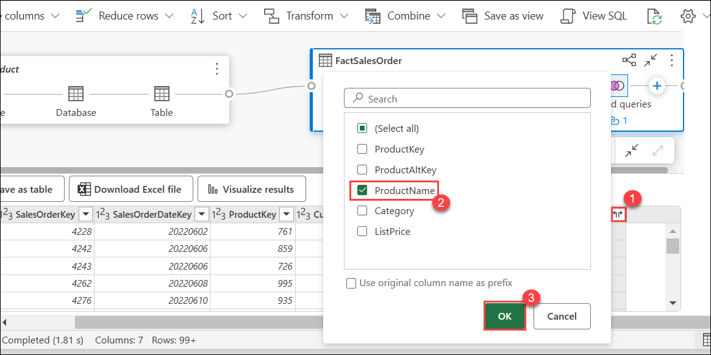

1. If you're interested in looking at data for a single product, per a manager's request, you can now use the **ProductName** column to filter the data in the query. Filter the **ProductName** column to look at **Cable Lock** data only.

    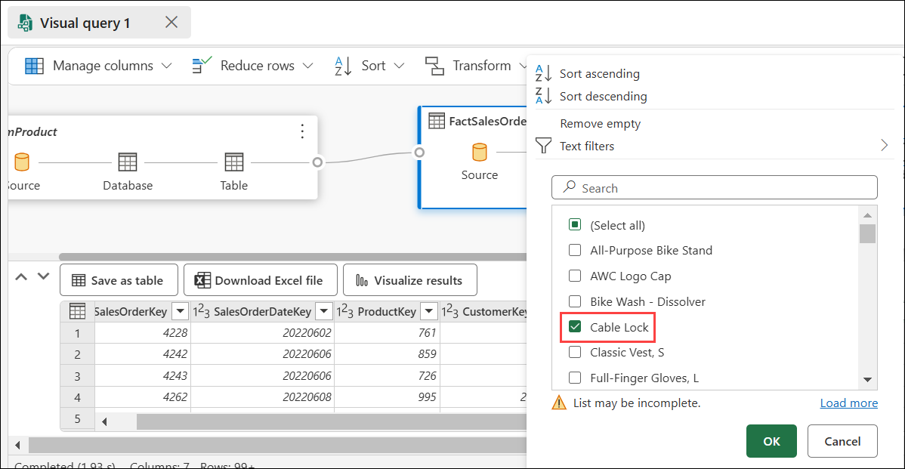

1. From here, you can analyze the results of this single query by selecting **Visualize results** or **Open in Excel**. You can now see exactly what the manager was asking for, so we don't need to analyze the results further.

### Task 7: Visualize your data

In this task, you will visualize your data from a single query or your data warehouse to gain insights and present findings effectively. Before creating visualizations, it's important to hide any columns or tables that may clutter the report and are not user-friendly for report designers.

1. In the **Explorer** pane, select the **Model layout** view.

   

1. Hide the following columns in your Fact and Dimension tables that are not necessary to create a report. Note that this does not remove the columns from the model, it simply hides them from view on the report canvas.
   
   1. FactSalesOrder
      
      - **SalesOrderDateKey**
      - **CustomerKey**
      - **ProductKey**

        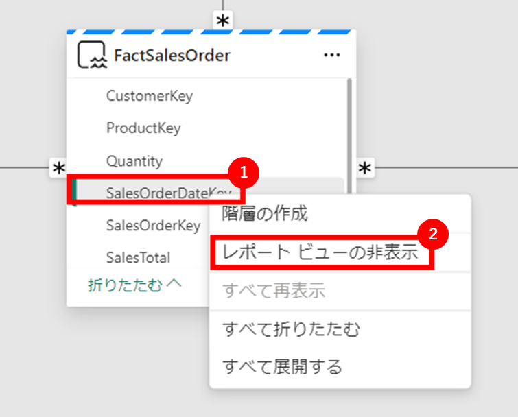

   1. DimCustomer
      - **CustomerKey**
      - **CustomerAltKey**

   1. DimDate
      - **DateKey**
      - **DateAltKey**

   1. DimProduct
      - **ProductKey**
      - **ProductAltKey** 


1. On the Home menu, select **New report (2)** from the **Reporting(1)** tab. This will open a new window, where you can create a Power BI report.

    

1. In the **Data** pane, expand **FactSalesOrder**. Note that the columns you hide are no longer visible. 

    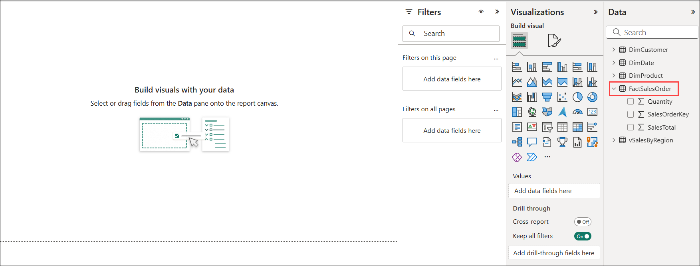

1. Select **SalesTotal**. This will add the column to the **Report canvas**. Because the column is a numeric value, the default visual is a **column chart**.
1. Ensure that the column chart on the canvas is active (with a grey border and handles), and then select **Category** from the **DimProduct** table to add a category to your column chart.
1. In the **Visualizations** pane, change the chart type from a column chart to a **clustered bar chart**. Then resize the chart as necessary to ensure that the categories are readable.

    

1. In the **Visualizations** pane, select the **Format your visual (1)** tab and in the **General** sub-tab, in the **Title** section, change the **Text** to **Total Sales by Category (2)**.

   

1. In the **File** menu, select **Save**. Then save the report as **Sales Report** in the workspace you created previously.

1. In the menu hub on the left, navigate back to the **workspace**. Notice that you now have three items saved in your workspace: your data warehouse, its semantic model (default), and the report you created.

   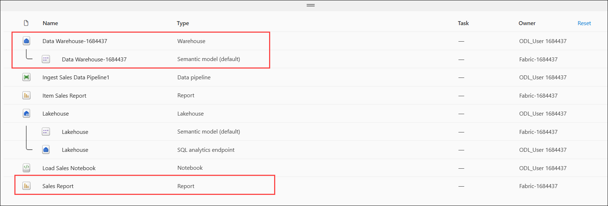

### Summary

In this exercise, you have created a data warehouse that contains multiple tables. You used SQL to insert data into the tables and query them. and also used the visual query tool. Finally, you enhanced the data model for the data warehouse's default dataset and used it as the source for a report.

### You have successfully completed the lab. Click on Next >> to proceed with next exercise.
