# 演習 03: データウェアハウスのデータを分析する

### 所要時間: 60分

## 概要

Microsoft Fabricでは、データウェアハウスは大規模な分析のためのリレーショナルデータベースを提供します。レイクハウスに定義されたテーブルに既定で付属する読み取り専用のSQL分析エンドポイントとは異なり、データウェアハウスは完全なSQLセマンティクスを提供し、テーブル内のデータの挿入、更新、および削除が可能です。

## ラボの目的

次のタスクを完了できるようになります：

- タスク 1: データウェアハウスを作成する
- タスク 2: テーブルを作成し、データを挿入する
- タスク 3: データモデルを定義する
- タスク 4: データウェアハウスのテーブルをクエリする
- タスク 5: ビューを作成する
- タスク 6: ビジュアルクエリを作成する
- タスク 7: データを可視化する

### タスク 1: データウェアハウスを作成する

既にワークスペースを持っているので、ポータルで*データウェアハウス*エクスペリエンスに切り替え、データウェアハウスを作成します。

1. データエンジニアリングポータルの左下で、**データウェアハウス**エクスペリエンスに切り替えます。

1. **Warehouse**をクリックして新しいウェアハウスを作成します。
   
   

1. 名前を **Data Warehouse-<inject key="DeploymentID" enableCopy="false"/>** と入力し、**作成** をクリックします。

     1分ほどで、新しいウェアハウスが作成されます。
    
### タスク 2: テーブルを作成し、データを挿入する

    データウェアハウスは、テーブルやその他のオブジェクトを定義できるリレーショナルデータベースです。

1. 新しいデータウェアハウスで、**T-SQL**タイルを選択します。

    

2. デフォルトのSQLコードを次のCREATE TABLEステートメントに置き換えます：

    ```sql
    CREATE TABLE dbo.DimProduct
    (
            ProductKey INTEGER NOT NULL,
            ProductAltKey VARCHAR(25) NULL,
            ProductName VARCHAR(50) NOT NULL,
            Category VARCHAR(50) NULL,
            ListPrice DECIMAL(5,2) NULL
    );
    GO
    ```

3. **&#9655; Run**ボタンを使用してSQLスクリプトを実行し、データウェアハウスの**dbo**スキーマに**DimProduct**という新しいテーブルを作成します。

    
    
4. **エクスプローラー**ペインで、**Schemas** > **dbo** > **Tables**を展開し、**DimProduct**テーブルが作成されたことを確認します。

    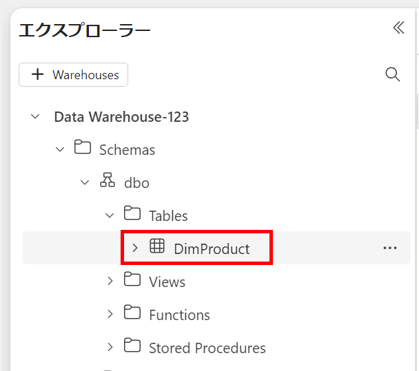

5. **Home**メニュータブで、**新規 SQL クエリ** ボタンを使用して新しいクエリを作成し、次のINSERTステートメントを入力します：

    ```sql
    INSERT INTO dbo.DimProduct
    VALUES
    (1, 'RING1', 'Bicycle bell', 'Accessories', 5.99),
    (2, 'BRITE1', 'Front light', 'Accessories', 15.49),
    (3, 'BRITE2', 'Rear light', 'Accessories', 15.49);
    GO
    ```
    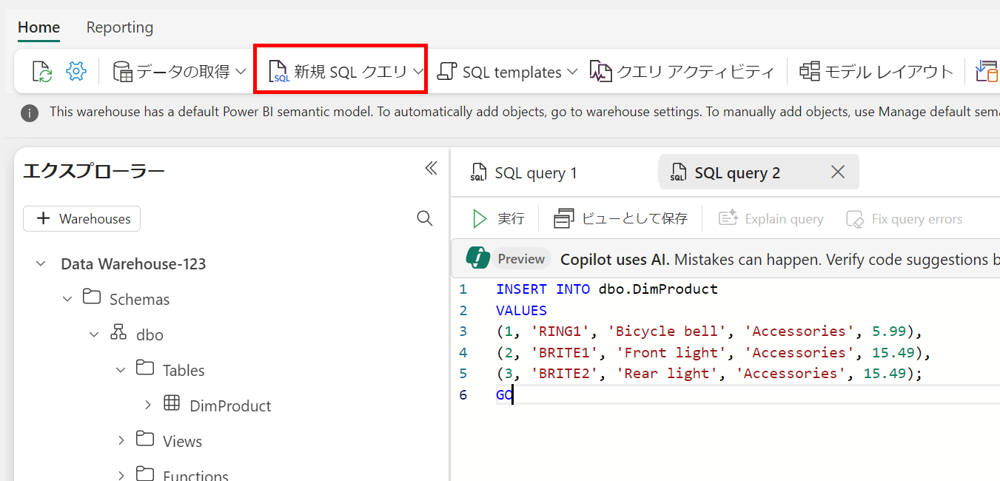

6. 新しいクエリを実行して、**DimProduct**テーブルに3行を挿入します。

7. クエリが完了したら、データウェアハウスのページ下部にある**Data**タブを選択します。**Explorer**ペインで**DimProduct**テーブルを選択し、3行がテーブルに追加されたことを確認します。

    

8. **Home**メニュータブに移動し、**新規 SQL クエリ**ボタンを使用して各テーブルの新しいクエリを生成します。最初のテキストファイル**C:\LabFiles\Files\create-dw.txt**にあるコードを**貼り付け、実行します。**

    

9. クエリを実行すると、シンプルなデータウェアハウススキーマが作成され、いくつかのデータがロードされます。スクリプトの実行には約30秒かかります。

10. ツールバーの **最新の情報に更新** ボタンを使用してビューを更新します。その後、**Explorer**ペインで、データウェアハウスの**dbo**スキーマに次の4つのテーブルが含まれていることを確認します：
    - **DimCustomer**
    - **DimDate**
    - **DimProduct**
    - **FactSalesOrder**

     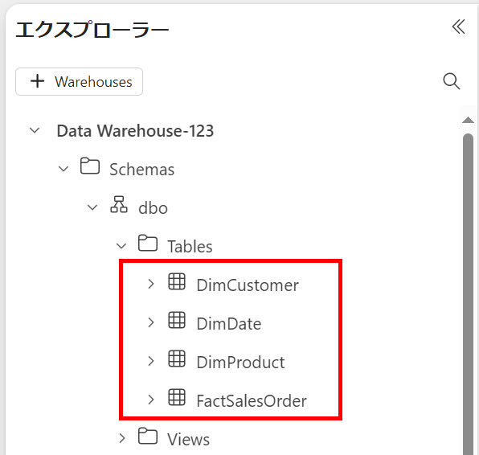  

    > **ヒント**: スキーマの読み込みに時間がかかる場合は、ブラウザページを更新してください。

### タスク 3: データモデルを定義する

リレーショナルデータウェアハウスは通常、**ファクト** テーブルと**ディメンション** テーブルで構成されます。ファクトテーブルには、ビジネスパフォーマンスを分析するために集計できる数値指標（例：売上収益）が含まれ、ディメンションテーブルにはデータを集計するための属性（例：製品、顧客、時間）が含まれます。Microsoft Fabricデータウェアハウスでは、これらのテーブルがもつキー項目を使用してテーブル間の関係が設定されたデータモデルを定義できます。

1. データウェアハウスのリボンで、**モデル レイアウト** fタブを選択します。

    

2. Model layouts タブで、データウェアハウス内のテーブルをドラッグし、**FactSalesOrder**　テーブルを中央に配置します。次のようになります：

    

    > **ヒント**: スキーマの読み込みに時間がかかる場合は、ブラウザページを更新してください。

3. **FactSalesOrder**テーブルの**ProductKey**フィールドをドラッグし、**DimProduct**テーブルの**ProductKey**フィールドにドロップします。

    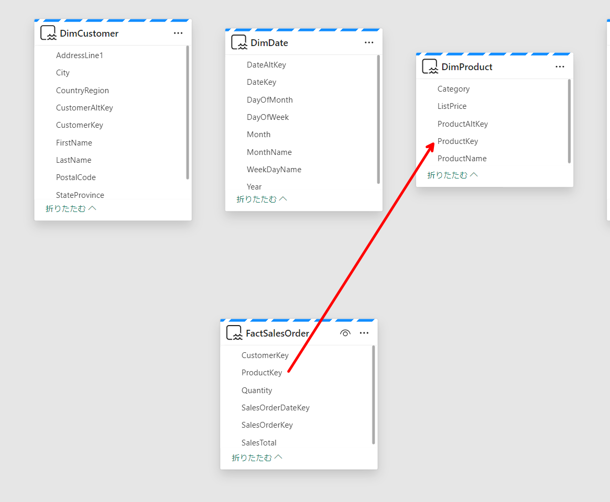

4. 次の関係の詳細を確認し、保存します：
    - **テーブルから**: FactSalesOrder
    - **列**: ProductKey
    - **テーブル表示**: DimProduct
    - **列**: ProductKey
    - **カーディナリティ**: 多対1 (*:1)
    - **クロスフィルターの方向**: 単一
    - **このリレーションシップをアクティブにする**: 選択済み
    - **参照整合性を想定します**: 未選択

    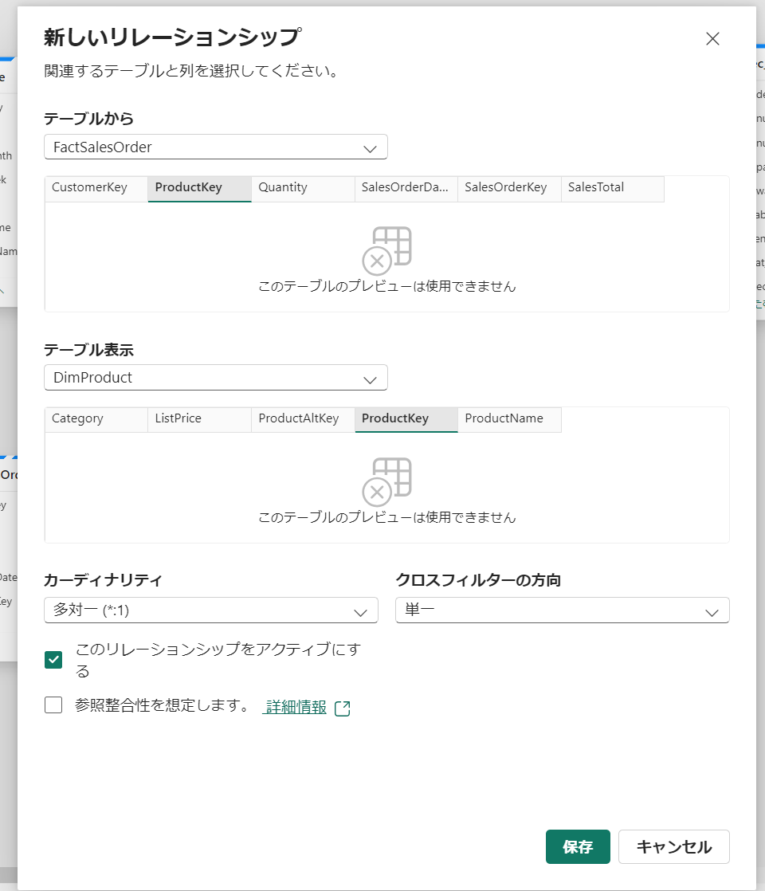

5. 次のテーブル間で多対1の関係を作成するプロセスを繰り返します：
    - **FactOrderSales.CustomerKey** &#8594; **DimCustomer.CustomerKey**
    - **FactOrderSales.SalesOrderDateKey** &#8594; **DimDate.DateKey**

6. すべての関係が定義されたら、モデルは次のようになります：

    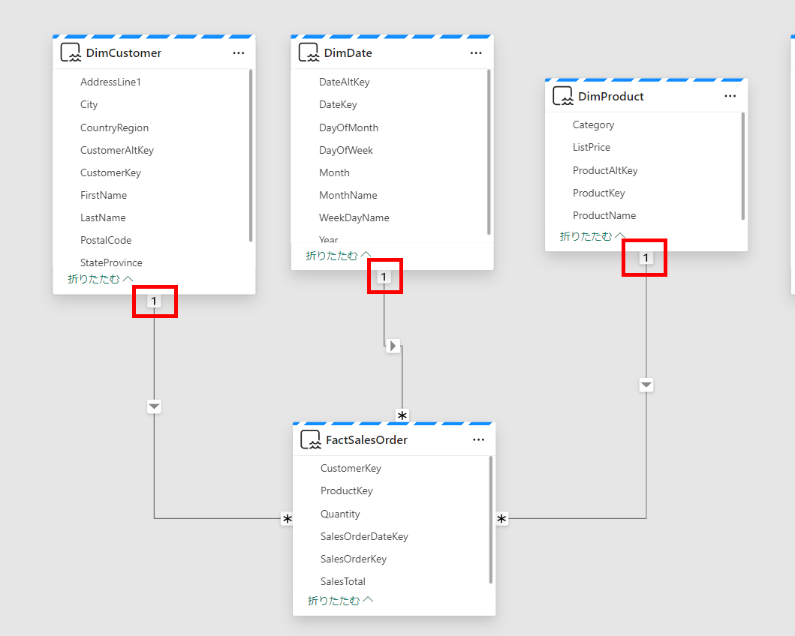

### タスク 4: データウェアハウステーブルをクエリする

データウェアハウスはリレーショナルデータベースであるため、SQLを使用してテーブルをクエリできます。リレーショナルデータウェアハウスのほとんどのクエリは、関連テーブル間でデータを集計およびグループ化（集計関数およびGROUP BY句を使用）することを含みます（JOIN句を使用）。

1. 新しいSQLクエリを作成し、次のコードを実行します：

    ```sql
   SELECT  d.[Year] AS CalendarYear,
            d.[Month] AS MonthOfYear,
            d.MonthName AS MonthName,
           SUM(so.SalesTotal) AS SalesRevenue
   FROM FactSalesOrder AS so
   JOIN DimDate AS d ON so.SalesOrderDateKey = d.DateKey
   GROUP BY d.[Year], d.[Month], d.MonthName
   ORDER BY CalendarYear, MonthOfYear;
    ```

    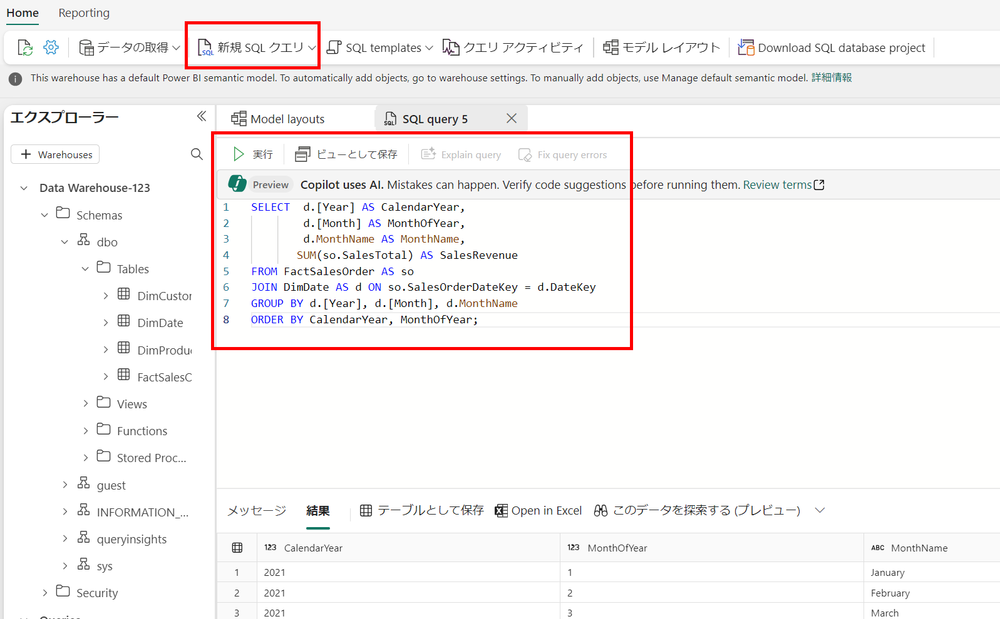

    >**注**: 時間ディメンションの属性により、ファクトテーブルの指標を複数の階層レベル（この場合は年と月）で集計できます。これはデータウェアハウスで一般的なパターンです。

2. クエリを次のように変更して、集計に2番目のディメンションを追加します。

    ```sql
   SELECT  d.[Year] AS CalendarYear,
           d.[Month] AS MonthOfYear,
           d.MonthName AS MonthName,
           c.CountryRegion AS SalesRegion,
          SUM(so.SalesTotal) AS SalesRevenue
   FROM FactSalesOrder AS so
   JOIN DimDate AS d ON so.SalesOrderDateKey = d.DateKey
   JOIN DimCustomer AS c ON so.CustomerKey = c.CustomerKey
   GROUP BY d.[Year], d.[Month], d.MonthName, c.CountryRegion
   ORDER BY CalendarYear, MonthOfYear, SalesRegion;
    ```


3. 変更されたクエリを実行し、年、月、および販売地域ごとに集計された売上収益を含む結果を確認します。

### タスク 5: ビューを作成する

Microsoft Fabricのデータウェアハウスには、リレーショナルデータベースで慣れているかもしれない多くの機能があります。たとえば、SQLロジックをカプセル化するために*ビュー*や*ストアドプロシージャ*などのデータベースオブジェクトを作成できます。

1. 以前に作成したクエリを次のように変更してビューを作成します（ビューを作成するにはORDER BY句を削除する必要があることに注意してください）。

    ```SQL
   CREATE VIEW vSalesByRegion
   AS
   SELECT  d.[Year] AS CalendarYear,
           d.[Month] AS MonthOfYear,
           d.MonthName AS MonthName,
           c.CountryRegion AS SalesRegion,
          SUM(so.SalesTotal) AS SalesRevenue
   FROM FactSalesOrder AS so
   JOIN DimDate AS d ON so.SalesOrderDateKey = d.DateKey
   JOIN DimCustomer AS c ON so.CustomerKey = c.CustomerKey
   GROUP BY d.[Year], d.[Month], d.MonthName, c.CountryRegion;
    ```

2. クエリを実行してビューを作成します。次に、データウェアハウススキーマを更新し、新しいビューが**エクスプローラー** ペインに表示されていることを確認します。
    
    

3. 新しいSQLクエリを作成し、次のSELECTステートメントを実行します：

    ```SQL
   SELECT CalendarYear, MonthName, SalesRegion, SalesRevenue
   FROM vSalesByRegion
   ORDER BY CalendarYear, MonthOfYear, SalesRegion;
    ```

### タスク 6: ビジュアルクエリを作成する

SQLコードを書く代わりに、グラフィカルクエリデザイナーを使用してデータウェアハウスのテーブルをクエリできます。このエクスペリエンスは、コードなしでデータ変換ステップを作成できるPower Queryオンラインに似ています。より複雑なタスクには、Power QueryのM（Mashup）言語を使用できます。

1. **ホーム**メニューで、**New visual query** を選択します。

    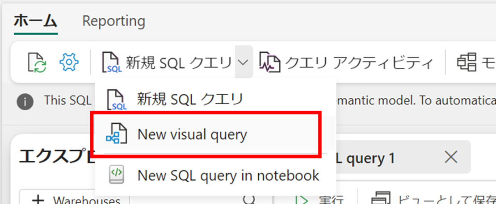

1. **FactSalesOrder**を**キャンバス**にドラッグします。キャンバスで選択されているテーブルのプレビューが下の**プレビューペイン**に表示されます。
    >**ヒント:**　ドラッグするときにはクリックしてから 1,2 秒マウスを動かさずにホールドするとテーブルが浮上してドラッグできるようになります。

    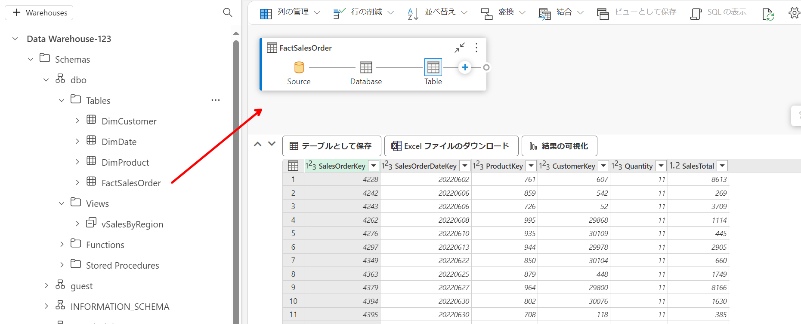

1. **DimProduct**を**キャンバス**にドラッグします。これでクエリに2つのテーブルが追加されました。

1. キャンバス上の **FactSalesOrder** テーブルの **(+)** ボタンを使用して **クエリをマージ** します。

   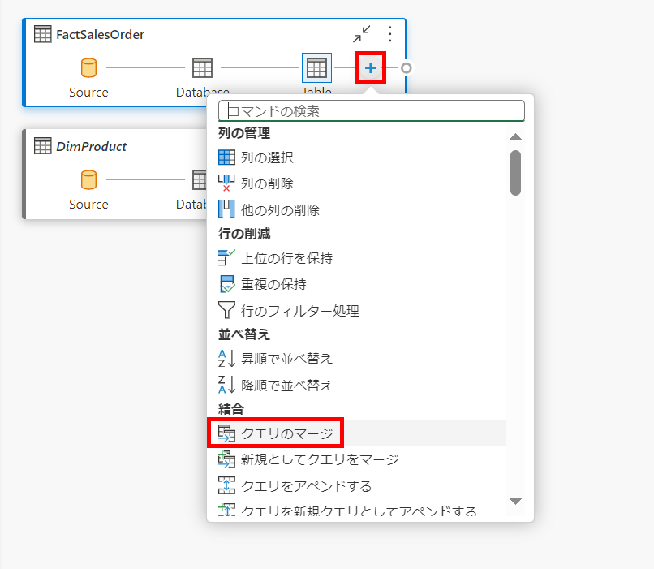

1. **クエリのマージ**ウィンドウで、右側のテーブルとして**DimProduct**を選択します。両方のクエリで**ProductKey**を選択し、デフォルトの**左外部結合**をそのままにして、**OK**をクリックします。

   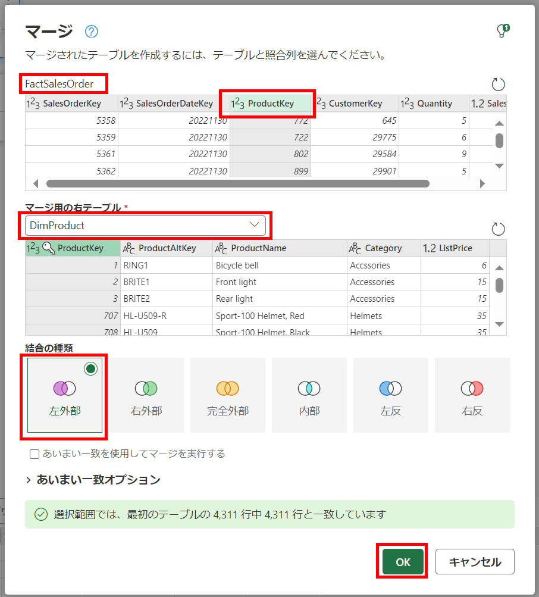

1. **プレビュー**で、新しい**DimProduct**列がFactSalesOrderテーブルに追加されたことに注意してください。列名の右側にある矢印をクリックして列を展開します。**ProductName**を選択し、**OK**をクリックします。

   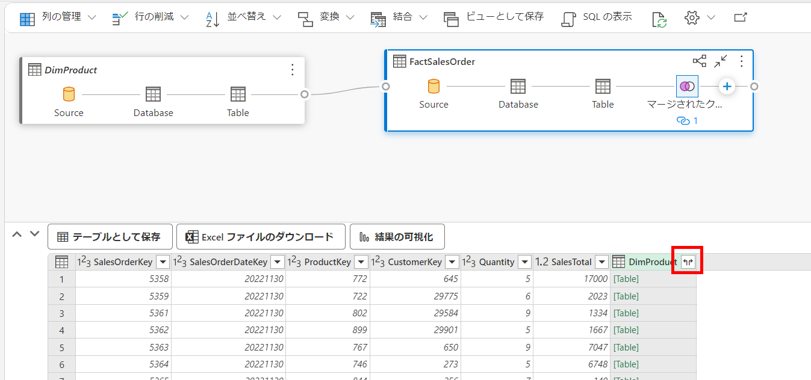

   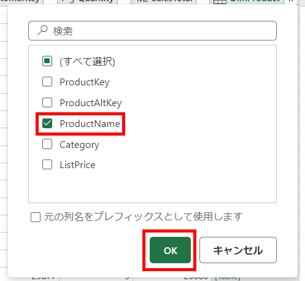

2. マネージャーのリクエストに応じて、単一の製品のデータを確認したい場合は、**ProductName**列を使用してクエリ内のデータをフィルタリングできます。**ProductName**列をフィルタリングして、**Cable Lock**データのみを表示します。

    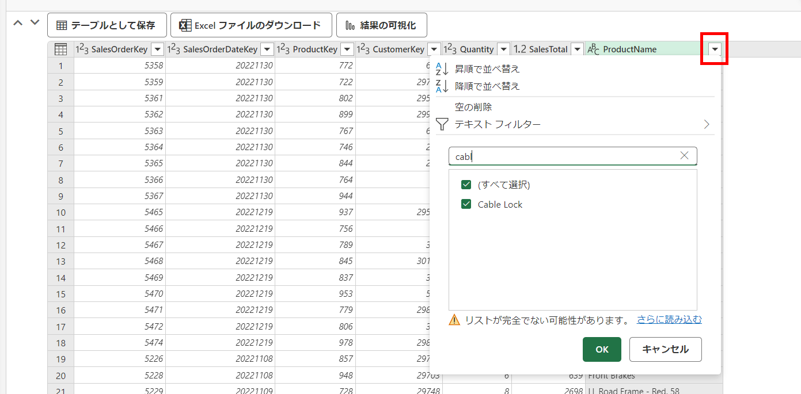

3. ここから、**結果の視覚化** または**Excel ファイルのダウンロード** を選択して、この単一のクエリの結果を分析できます。マネージャーが求めていたものが正確に表示されるため、これ以上の分析は不要です。

### タスク 7: データを可視化する

単一のクエリまたはデータウェアハウス内のデータを簡単に可視化できます。可視化する前に、レポートデザイナーに適さない列やテーブルを非表示にします。

1. ウェアハウスのリボンメニューから、**モデル レイアウト** を選択します。

1. レポートの作成に必要ないFactおよびDimensionテーブルの次の列を非表示にします。これにより、モデルから列が削除されるわけではなく、レポートキャンバス上で非表示になるだけです。

    
    > **ヒント:** ctrl キーを押しながら項目を選択すると一括で非表示に切替が可能です

   1. FactSalesOrder
      - **SalesOrderDateKey**
      - **CustomerKey**
      - **ProductKey**
   2. DimCustomer
      - **CustomerKey**
      - **CustomerAltKey**
   3. DimDate
      - **DateKey**
      - **DateAltKey**
   4. DimProduct
      - **ProductKey**
      - **ProductAltKey** 

6. これでこのデータセットを他の人に展開可能にしてレポートを作成する準備が整いました。ホームメニューで、**New report** を選択します。これにより、新しいウィンドウが開き、Power BIレポートを作成できます。

   
     >**注:** データの追加を確認するポップアップが表示されたら、続行をクリックしてください。

7. **データ**ペインで、**FactSalesOrder**を展開します。非表示にした列が表示されなくなったことに注意してください。

8. **SalesTotal**を選択します。これにより、列が**レポートキャンバス**に追加されます。列が数値であるため、デフォルトのビジュアルは**縦棒グラフ**です。
    
    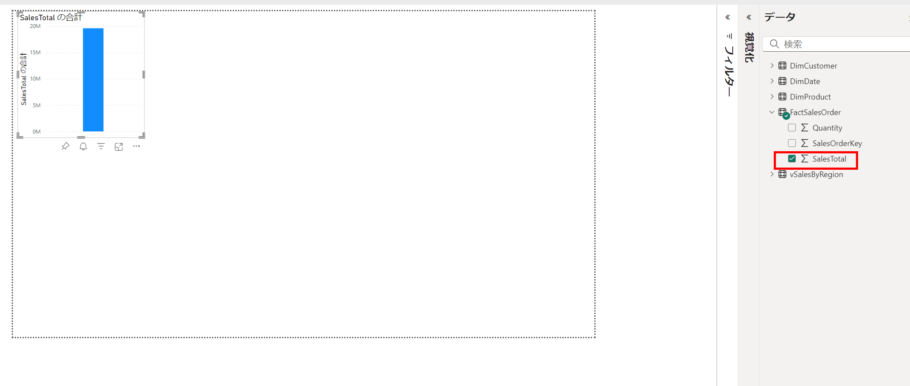

 >**注:** 選択しても追加されない場合は、**SalesTotal**をドラッグします。

9. キャンバス上の縦棒グラフがアクティブ（灰色の枠線とハンドルが表示されている）であることを確認し、次に**DimProduct**テーブルから**Category**を選択して、縦棒グラフにカテゴリを追加します。

10. **Visualizations**ペインで、グラフの種類を縦棒グラフから**クラスター化された横棒グラフ**に変更します。次に、カテゴリが読みやすくなるようにグラフのサイズを調整します。

    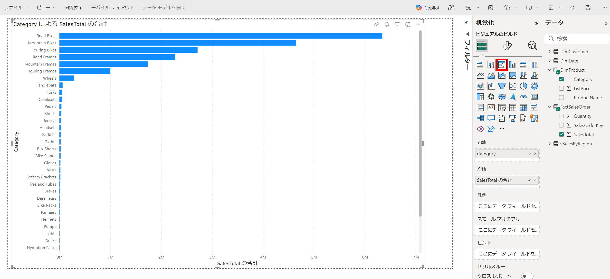

11. **視覚化 (1)** ペインで、**ビジュアルの書式設定 (2)** タブを選択し、**全般 (3)** タブの **タイトル**セクションで、**テキスト**を**カテゴリ別総売上 (4)** に変更します。

    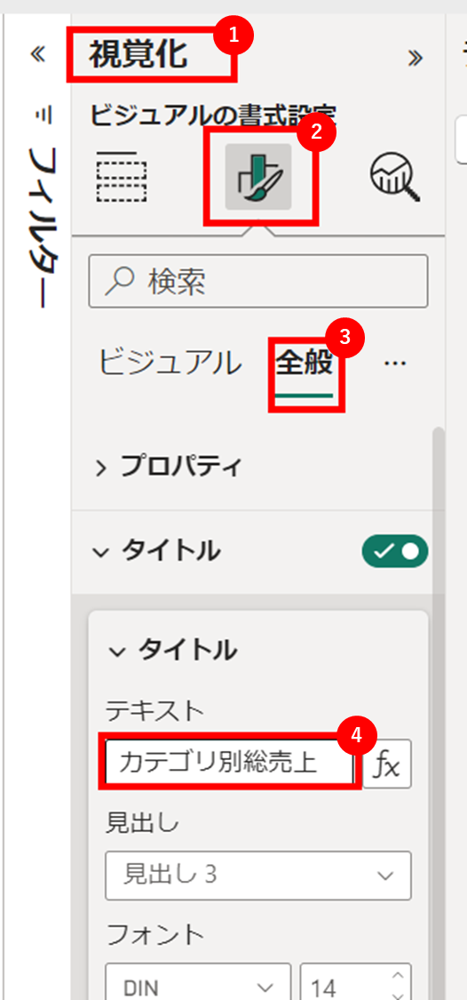

1.  **ファイル**メニューで、**保存**を選択します。次に、レポートを**Sales Report**として以前に作成したワークスペースに保存します。

2.  左側のメニューハブで、ワークスペースに戻ります。ワークスペースにアイテムが保存されていることに注意してください。

    <validation step="ed927a03-5062-4d23-bf52-d57ae336f0eb" />

    > **おめでとうございます** タスクを完了しました！次の手順で検証してください：
    > - 対応するタスクの検証ボタンを押します。
    > - 成功メッセージが表示されたら、次のタスクに進むことができます。表示されない場合は、エラーメッセージをよく読み、ラボガイドの指示に従ってステップを再試行してください。
    > - サポートが必要な場合は、labs-support@spektrasystems.comまでご連絡ください。24時間365日対応しています。

## まとめ

このラボでは、複数のテーブルを含むデータウェアハウスを作成しました。SQLを使用してテーブルにデータを挿入し、クエリを実行しました。また、ビジュアルクエリツールも使用しました。最後に、データウェアハウスのデフォルトデータセットのデータモデルを強化し、それをレポートのソースとして使用しました。

### ラボを正常に完了しました
