# Exercise 2: Create a Dataflow (Gen2) in Microsoft Fabric

### Estimated Duration: 50 Minutes

## Overview

In this exercise, you will create and manage Dataflows (Gen2) within Microsoft Fabric to ingest, transform, and prepare data for analysis. You will learn how to build a dataflow to connect to various data sources, apply transformations using Power Query Online, configure data destinations for storing processed data in a lakehouse, and integrate the dataflow into a pipeline to automate data processing workflows.

## Lab objectives

You will be able to complete the following tasks:

- Task 1: Create a Dataflow (Gen2) to ingest data
- Task 2: Add data destination for Dataflow
- Task 3: Add a dataflow to a pipeline

## Task 1: Create a Dataflow (Gen2) to ingest data

In this task, you will create a Dataflow (Gen2) to efficiently ingest and transform data from multiple sources for analysis. This process streamlines data preparation, enabling you to prepare the data for further processing and insights.

1. From the left navigation pane, select the **fabric-<inject key="DeploymentID" enableCopy="false"/> (1)** workspace, click **+ New item (2)**, then in the right pane, search for **Dataflow Gen2 (3)** and select **Dataflow Gen2 (4)** under the Get data section.

    

    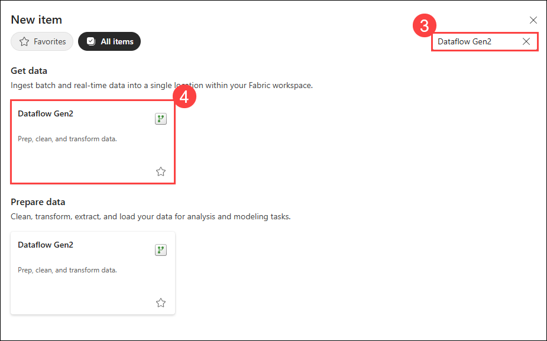

1. In the New Dataflow Gen2 dialog, enter a **name (1)**, **uncheck** the **Git integration option (2)**, and click **Create (3)** to proceed.

    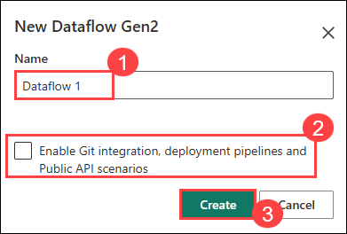

1. After a few seconds, the Power Query editor for your new dataflow opens as shown here. Select **Import from a Text/CSV file**.

    

1. Add the following and click on **Next (7)**:

    - **Link to file**: *Selected* **(1)**
    - **File path or URL**: `https://raw.githubusercontent.com/MicrosoftLearning/dp-data/main/orders.csv` **(2)**
    - **Connection**: Create new connection **(3)**
    - **data gateway**: (none) **(4)**
    - **Authentication kind**: Anonymous **(5)**
    - **Privacy level**: None **(6)**

    

1. Click on **Create** to create the data source. The Power Query editor shows the data source and an initial set of query steps to format the data, as shown below:

    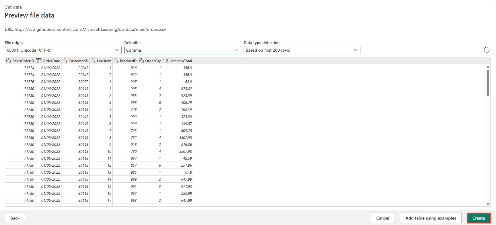

1. From the top menu bar, click the **Add column (1)** tab, then select **Custom column (2)** to create a new column.

    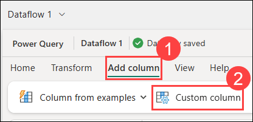

1. In the Custom column dialog, enter **MonthNo (1)** as the new column name, input the formula `Date.Month([OrderDate])` **(2)**, and then click **OK (3)** to apply.

    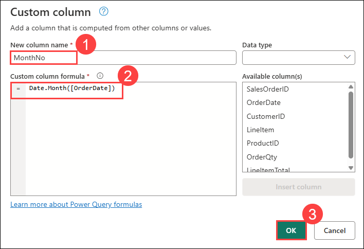

1. The custom column **MonthNo** is now added to the query, and its values are displayed in the data preview pane.

    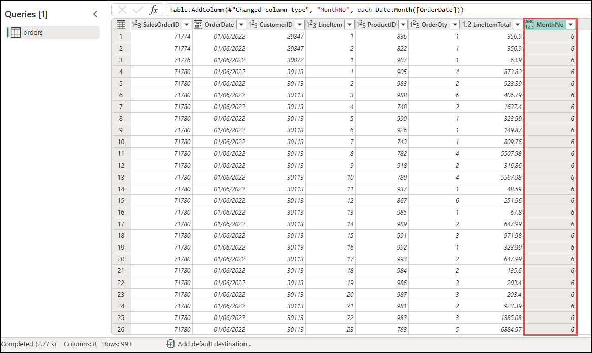

## Task 2: Add data destination for Dataflow

In this task, you’ll add a data destination for the Dataflow to determine where the ingested and transformed data will be stored for future use.

1. At the bottom right corner, click the **+ (1)** icon and select **Lakehouse (2)** from the New destination menu.

    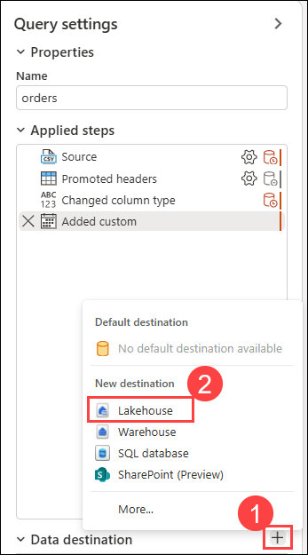

   >**Note:** If this option is greyed out, you may already have a data destination set. Check the data destination at the bottom of the Query settings pane on the right side of the Power Query editor. If a destination is already set, you can change it using the gear.

1. In the **Connect to data destination** dialog box, keep everything as default and click on **Next**.

    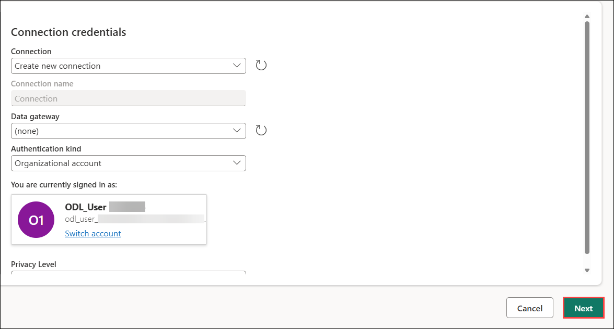

1. From the left pane, expand the **fabric-<inject key="DeploymentID" enableCopy="false"/> (1)**, then select the **fabric-lakehouse<inject key="DeploymentID" enableCopy="false"/> (2)** table.
The Table name field will automatically populate with **orders (3)**.
Click **Next (4)** to continue.

    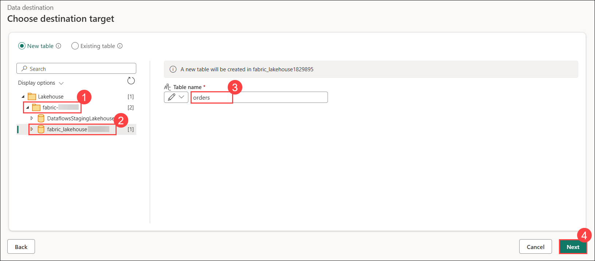

1. On the Destination settings page, observe that **MonthNo** is not selected in the Column mapping, and an informational message is displayed.

1. On the Destination settings page, toggle off the **Use Automatic Settings** option. Then, right-click on the **MonthNo** column header and select **Change Type** to set **MonthNo** as a **Whole number**. Finally, click on **Save Settings**.

    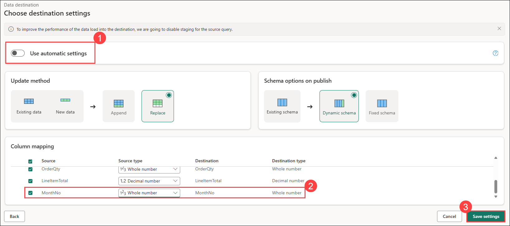

1. Select **Publish** to publish the dataflow from the bottom right.

    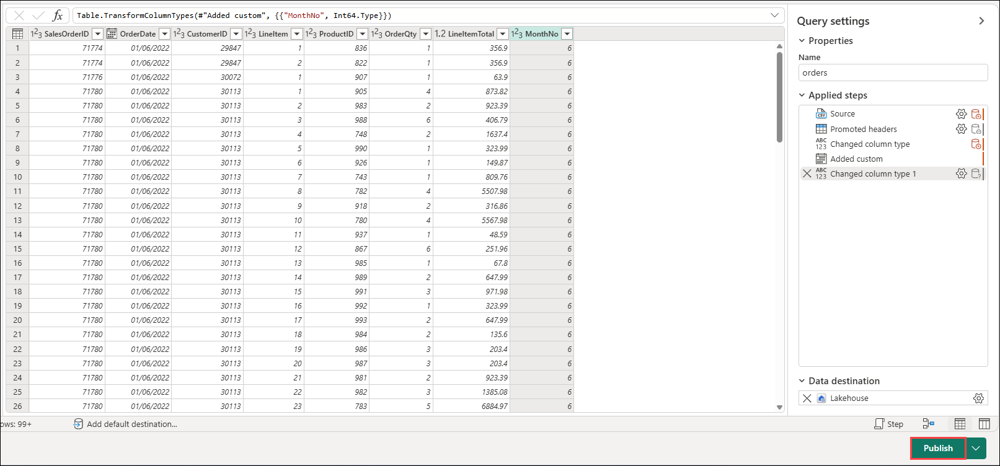

1. Once published, click on the **ellipsis (1)** next to the published dataflow in the workspace, select **Properties (2)**, 

    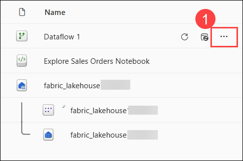

    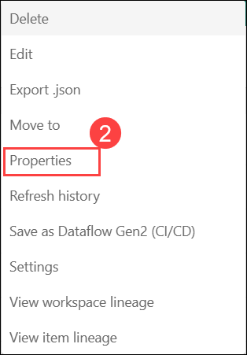

1. Rename the dataflow as **Transform Orders Dataflow (1)** and click on **Save (2)**.

    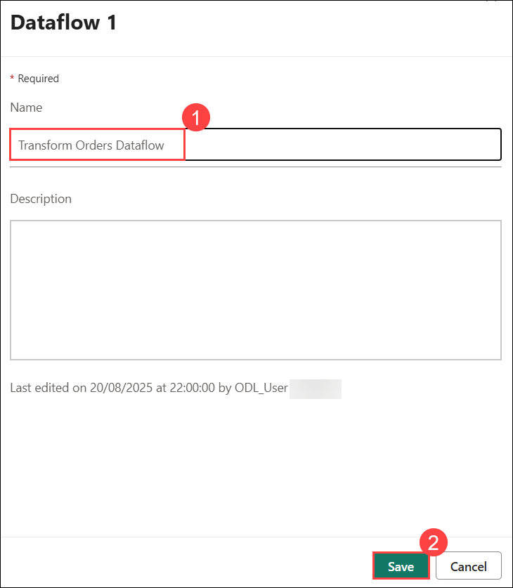

## Task 3: Add a dataflow to a pipeline

In this task, you’ll add a dataflow to a pipeline to streamline the data processing workflow and enable automated data transformations.

1. From the left navigation pane, select the **fabric-<inject key="DeploymentID" enableCopy="false"/> (1)** workspace, click **+ New item (2)**, then from the right pane, select **Data Pipeline (3)** under the Get data section.

    

    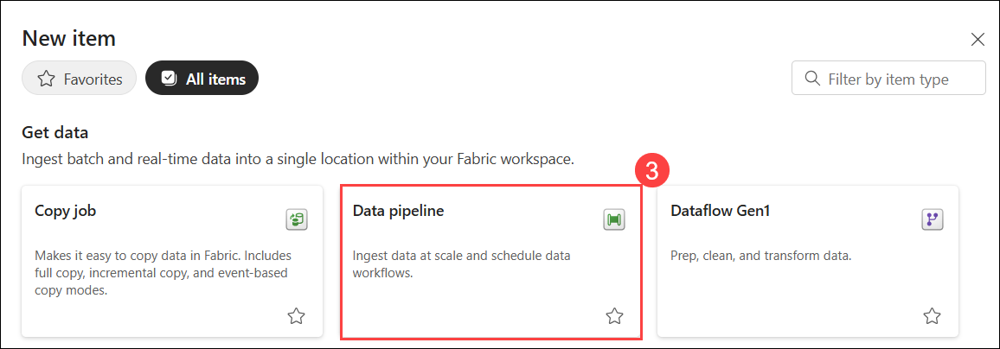

1. In the New pipeline dialog box, enter the name **Load Orders pipeline (1)**, then click **Create (2)**.

    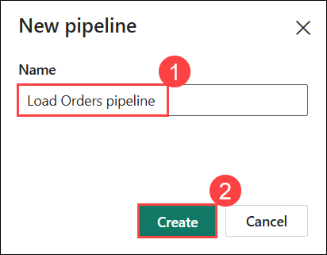
  
   > **Note**: If the Copy Data wizard opens automatically, close it!

1. Select **pipeline activity (1)** and add a **Dataflow (2)** activity to the pipeline.

    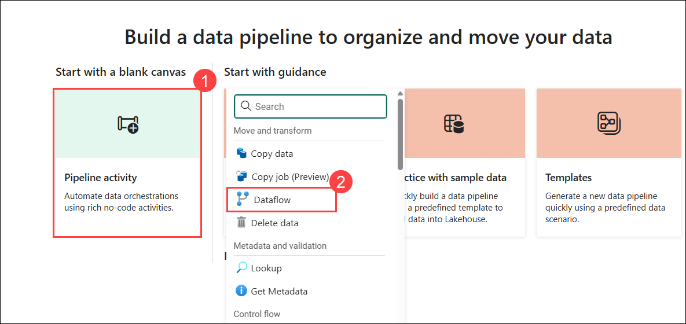

1. Select the Dataflow1 activity, go to **Settings (1)** from the bottom pane, choose **fabric-<inject key="DeploymentID" enableCopy="false"/>**  **(2)** as the Workspace, and select **Transform Orders Dataflow (3)** as the Dataflow.

    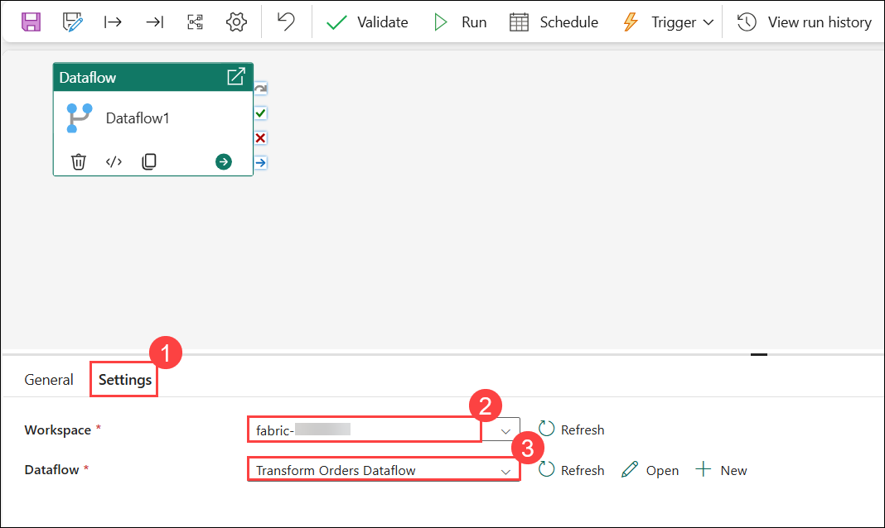
   
1. **Save (2)** the pipeline using the **disk icon** from the top-left, then click **Run (2)** to execute it.

    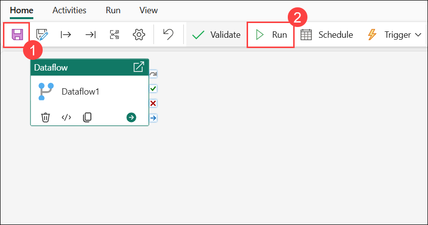

1. The pipeline run may take a few minutes. Verify its completion under the **Output** tab at the bottom, where the Pipeline status and Activity status should show as Succeeded.

    

1. From the left pane, click **fabric_lakehouse<inject key="DeploymentID" enableCopy="false"/>** **(1)**, expand the **Tables (2)** section, and select the **orders (3**) table to view the loaded data.

    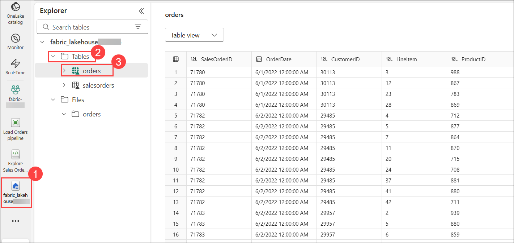

   >**Note:** You might have to refresh the browser to get the expected output.

## Summary

In this exercise, you have completed the following:

- Created a Dataflow (Gen2) to ingest data.
- Added a data destination for the Dataflow.
- Added a Dataflow to a pipeline.

### You have successfully completed the exercise. Now, click on **Next >>** from the lower right corner to move on to the next page.
       
   
