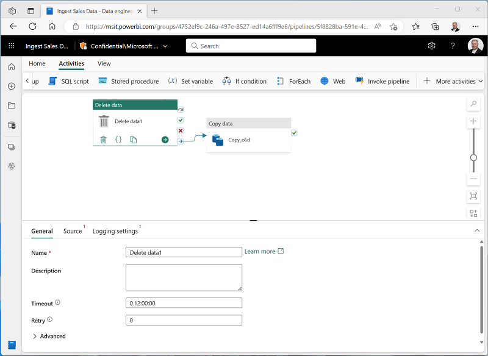
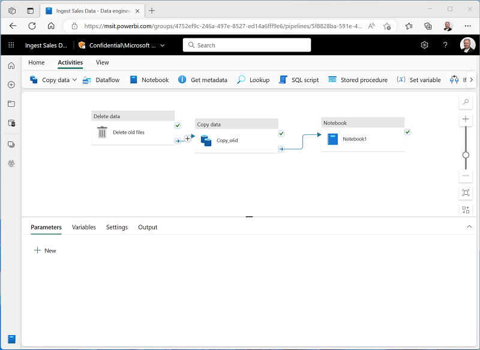
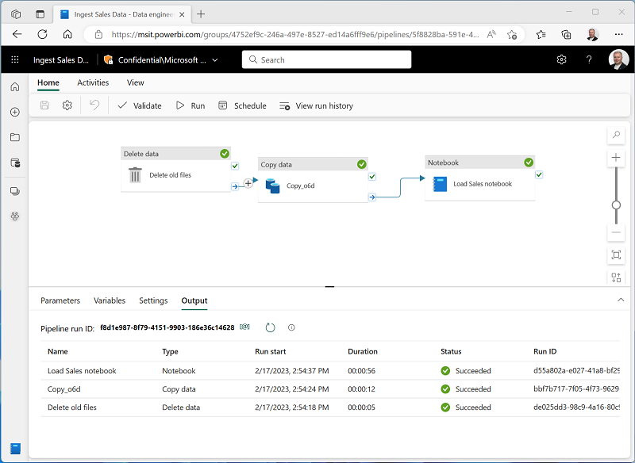

---
lab:
    title: 'Use a Spark notebook in a pipeline'
    module: 'Use Apache Spark in Microsoft Fabric'
---

# Use a Spark notebook in a pipeline

A data lakehouse is a common analytical data store for cloud-scale analytics solutions. One of the core tasks of a data engineer is to implement and manage the ingestion of data from multiple operational data sources into the lakehouse. In Microsoft Fabric, you can implement *extract, transform, and load* (ETL) or *extract, load, and transform* (ELT) solutions for data ingestion through the creation of *pipelines*.

Fabric also supports Apache Spark, enabling you to write and run code to process data at scale. By combining the pipeline and Spark capabilities in Fabric, you can implement complex data ingestion logic that copies data from external sources into the OneLake storage on which the lakehouse is based, and then uses Spark code to perform custom data transformations before loading it into tables for analysis.

This lab will take approximately **60** minutes to complete.

## Before you start

You'll need a Power BI Premium subscription with access to the Microsoft Fabric preview.

## Create a workspace

Before working with data in Microsoft Fabric, you should create a workspace with support for premium features.

1. Sign into your Power BI service at [https://app.powerbi.com](https://app.powerbi.com).
2. In the menu bar on the left, select **Workspaces** (the icon looks similar to &#128455;).
3. Create a new workspace with a name of your choice, selecting the **Premium per user** licensing mode.
4. When your new workspace opens, it should be empty, as shown here:

    

## Create a lakehouse

Now that you have a workspace, it's time to switch to the *Data engineering* experience in the portal and create a data lakehouse into which you will ingest data.

1. At the bottom left of the Power BI portal, select the **Power BI** icon and switch to the **Data engineering** experience, as shown here:

    

2. In the **Data engineering** home page, create a new **Lakehouse** with a name of your choice.

    After a minute or so, a new lakehouse with no **Tables** or **Files** will be created.

3. On the **Lake view** tab in the pane on the left, in the **...** menu for the **Files** node, select **New subfolder** and create a subfolder named **new_data**.

## Create a pipeline

A simple way to ingest data is to use a **Copy Data** activity in a pipeline to extract the data from a source and copy it to a file in the lakehouse.

1. On the **Home** page for your lakehouse, select **New data pipeline**.

    The pipeline editor opens in a new browser tab (if you are prompted to allow pop-ups, do so).

2. If the **Copy Data** wizard doesn't open automatically, select **Copy Data** in the pipeline editor page.
3. In the **Copy Data** wizard, on the **Choose a data source** page, in the **data sources** section, select the **File** tab and then select **HTTP**.

    

4. Select **Next** and then select **Create new connection** and enter the following settings for the connection to your data source:
    - **URL**: `https://raw.githubusercontent.com/MicrosoftLearning/dp-data/main/sales.csv`
    - **Connection**: Create new connection
    - **Connection name**: web_sales_data
    - **Authentication kind**: Anonymous

5. Select **Next**. Then ensure the following settings are selected:
    - **Relative URL**: *Leave blank*
    - **Request method**: GET
    - **Additional headers**: *Leave blank*
    - **Binary copy**: <u>Un</u>selected
    - **Request timeout**: *Leave blank*
    - **Max concurrent connections**: *Leave blank*
6. Select **Next**, and then ensure that the following settings are selected:
    - **File format**: DelimitedText
    - **Column delimiter**: Comma (,)
    - **Row delimiter**: Line feed (\n)
    - **First row as header**: Selected
    - **Compression type**: None
7. Select **Preview data** to see a sample of the data that will be ingested. Then close the data preview and select **Next**.
8. On the **Choose data destination** page, select your existing lakehouse. Then select **Next**.
9. Set the following data destination options, and then select **Next**:
    - **Root folder**: Files
    - **Folder path name**: new_data
    - **File name**: sales.csv
    - **Copy behavior**: None
10. Set the following file format options and then select **Next**:
    - **File format**: DelimitedText
    - **Column delimiter**: Comma (,)
    - **Row delimiter**: Line feed (\n)
    - **Add header to file**: Selected
11. On the **Copy summary** page, review the details of your copy operation and then select **OK**

    A new pipeline containing a **Copy Data** activity is created, as shown here:

    

12. Use the **&#128427;** (*Save*) icon to save the pipeline as **Ingest Sales Data**.
12. Use the **&#9655; Run** button to run the pipeline.

    When the pipeline starts to run, you can monitor its status in the **Output** pane under the pipeline designer. Wait until it has succeeeded.
13. Close the browser tab containing the pipeline designer and return to the tab containing your lakehouse.
14. On the **Home** page, in the **Lake view** tab, select the **new_data** folder and verify that the **sales.csv** file has been copied.

## Create a notebook

1. On the **Home** page, in the **Open notebook** menu, select **New notebook**.

    After a few seconds, a new notebook containing a single *cell* will open. Notebooks are made up of one or more cells that can contain *code* or *markdown* (formatted text).

2. Select the existing cell in the notebook, which contains some simple code, and then replace the default code with the following variable declaration.

    ```python
    table_name = "sales"
    ```

3. In the **...** menu for the cell (at its top-right) select **Toggle parameter cell**. This configures the cell so that the variables declared in it are treated as parameters when running the notebook from a pipeline.

4. Under the parameters cell, use the **+ Code** button to add a new code cell. Then add the following code to it:

    ```python
    from pyspark.sql.functions import *

    # Read the new sales data
    df = spark.read.format("csv").option("header","true").load("Files/new_data/*.csv")

    ## Add month and year columns
    df = df.withColumn("Year", year(col("OrderDate"))).withColumn("Month", month(col("OrderDate")))

    # Derive FirstName and LastName columns
    df = df.withColumn("FirstName", split(col("CustomerName"), " ").getItem(0)).withColumn("LastName", split(col("CustomerName"), " ").getItem(1))

    # Filter and reorder columns
    df = df["SalesOrderNumber", "SalesOrderLineNumber", "OrderDate", "Year", "Month", "FirstName", "LastName", "EmailAddress", "Item", "Quantity", "UnitPrice", "TaxAmount"]

    # Load the data into a table
    df.write.format("delta").mode("append").saveAsTable(table_name)
    ```

    This code loads the data from the sales.csv file that was ingested by the **Copy Data** activity, applies some transformation logic, and saves the transformed data as a table - appending the data if the table already exists.

5. Verify that your notebooks looks similar to this, and then use the **&#9655; Run all** button on the toolbar to run all of the cells it contains.

    

    > **Note**: Since this is the first time you've run any Spark code in this session, the Spark pool must be started. This means that the first cell can take a minute or so to complete.

6. When the notebook run has completed, in the pane on the left, select the **Table view** tab and verify that a **sales** table has been created.

7. Save the notebook as **Load Sales**.

8. In the navigation bar on the left edge of the portal, select **&#128447;** (*Browse*). Then, in the **Recent** category, select your lakehouse.
9. Select the **Table view** tab, and select the **sales** table to see a preview of the data it contains.

## Modify the pipeline

Now that you've implemented a notebook to transform data and load it into a table, you can incorporate the notebook into a pipeline to create a reusable ETL process.

1. In the navigation bar on the left edge of the portal, select the icon for your workspace. Then, in the list of artifacts in your workspace, select the **Ingest Sales Data** pipeline you created previously.
2. On the **Activities** tab, in the **More activities** list, select **Delete data**. Then position the new **Delete data**  activity to the left of the **Copy data** activity and connect its **On completion** output to the **Copy data** activity, as shown here:

    

3. Select the **Delete data** activity, and in the pane below the design canvas, set the following properties:
    - **General**:
        - **Name**: Delete old files
    - **Settings**
        - **Data store type**: Workspace
        - **Workspace data store**: *Your lakehouse*
        - **File path**: Files / **new_data** / **\*.csv**
        - **File path type**: Wildcard file path
        - **Recursively**: *Selected*
        - **Max concurrent connections**: *Leave blank*
    - **Logging settings**:
        - **Enable logging**: *Unselected*


    These settings will ensure that any existing .csv files are deleted before copying the **sales.csv** file.

4. In the pipeline designer, on the **Activities** tab, select **Notebook** to add a **Notebook** activity to the pipeline.
5. Select the **Copy data** activity and then connect its **On Completion** output to the **Notebook** activity as shown here:

    

6. Select the **Notebook** activity, and then in the pane below the design canvas, set the following properties:
    - **General**:
        - **Name**: Load Sales notebook
    - **Settings**:
        - **Notebook**: Load Sales
        - **Base parameters**: *Add a new parameter with the following properties:*
            
            | Name | Type | Value |
            | -- | -- | -- |
            | table_name | String | new_sales |

    The **table_name** parameter will be passed to the notebook and override the default value assigned to the **table_name** variable in the parameters cell.

7. On the **Home** tab, use the **&#128427;** (*Save*) icon to save the pipeline as **Ingest Sales Data**.
8. Use the **&#9655; Run** button to run the pipeline, and wait for it to complete.

    

9. In the navigation bar on the left edge of the portal, select **&#128447;** (*Browse*). Then, in the **Recent** category, select your lakehouse.
10. Select the **Table view** tab, and select the **new_sales** table to see a preview of the data it contains. This table was created by the notebook when it was run by the pipeline.

In this exercise, you implemented a data ingestion solution that uses a pipeline to copy data to your lakehouse from an external source, and then uses a Spark notebook to transform the data and load it into a table.
