# Exercise 3: Ingest data with a pipeline

### Estimated Duration: 90 Minutes

## Overview

In this exercise, you will learn how to ingest data into a Microsoft Fabric lakehouse using pipelines. You will implement ETL/ELT processes by building a pipeline that copies data from external sources into OneLake storage and leverages Apache Spark to transform and load it into structured tables for analysis—an essential skill for scalable cloud-based analytics solutions.

## Lab Objectives

In this exercise, you will complete the following tasks:

 - Task 1 : Create a pipeline
 - Task 2 : Create a notebook
 - Task 3 : Modify the pipeline

## Task 1 : Create a pipeline

In this task, you will create a pipeline in Microsoft Fabric to ingest data into your lakehouse. You will use the Copy Data activity to extract data from a source and copy it into a subfolder within the lakehouse, forming the foundation for an ETL or ELT process.

1. From the left navigation pane, select your workspace **fabri-<inject key="DeploymentID" enableCopy="false"/>** **(1)**, click **+ New item (2)**, and then choose **Data pipeline (3)** to begin creating a new pipeline.

    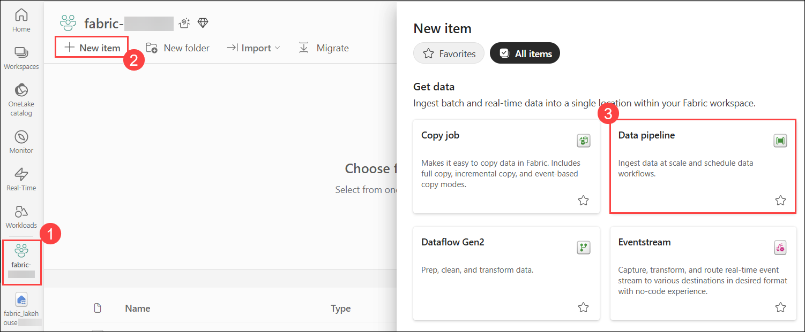

2. Create a new data pipeline by entering the name **Ingest Sales Data Pipeline (1)**, then click **Create (2)** to proceed.
   
    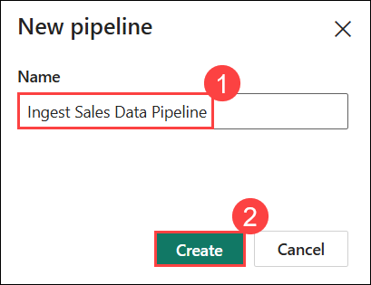
   
3. If the **Copy data** assistant doesn't open automatically, select **Copy data assistant** in the pipeline editor page.

    

4. In the **Copy Data** wizard, search for **Http (1)** in the search bar and select the **Http (2)** connector from the results.

    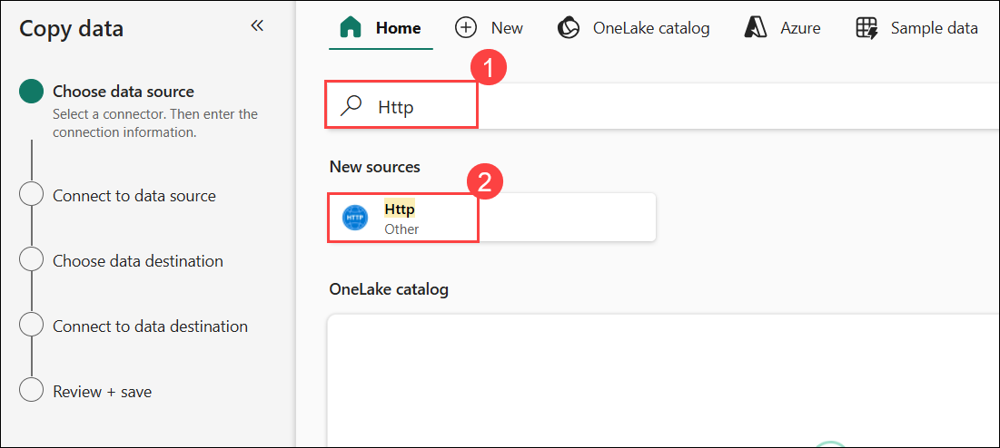

5. In the **Connection settings** pane, enter the following for your data source connection:
    
    - URL: **`https://raw.githubusercontent.com/MicrosoftLearning/dp-data/main/sales.csv`**  **(1)**
    - Connection: **Create new connection (2)**
    - Connection name: **Connection<inject key="DeploymentID" enableCopy="false"/> (3)**
    - Authentication kind : **Anonymous (4)**
    - Privacy Level : **None (5)**
    - Then, click **Next (6)**.

    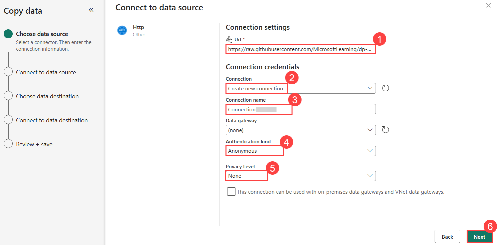
    
6. Leave all fields on the **Connect to data source** page as default and click **Next**.
  
    
   
7. After the data is sampled, ensure the following settings are selected:
    
    - File format: **DelimitedText (1)**
    - Column delimiter: **Comma (,) (2)**
    - Row delimiter: **Line feed (\n) (3)**
    - Click **Preview data (4)** to see a sample of the data.

    

8. After reviewing the sample data, click **Next** to proceed to the next step.

    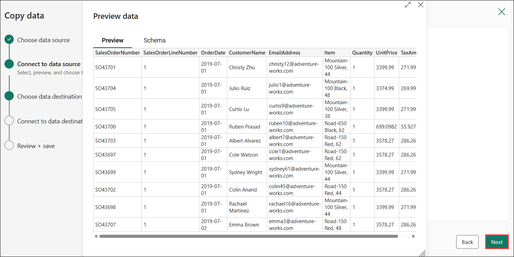

9. On the **Choose data destination** page, click on **OneLake catalog (1)** from the top menu bar, then select the lakehouse named **fabric_lakehouse_<inject key="DeploymentID" enableCopy="false"/> (2)**.


    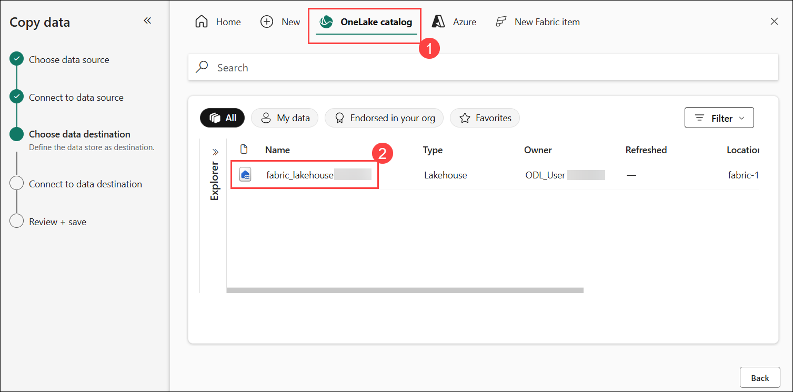

10. On the **Connect to data destination** page, configure the following settings, then click on **Next (4)**:

    - Root folder: **Files (1)**
    - Folder path: **new_data (2)**
    - File name: **sales.csv  (3)**
   
    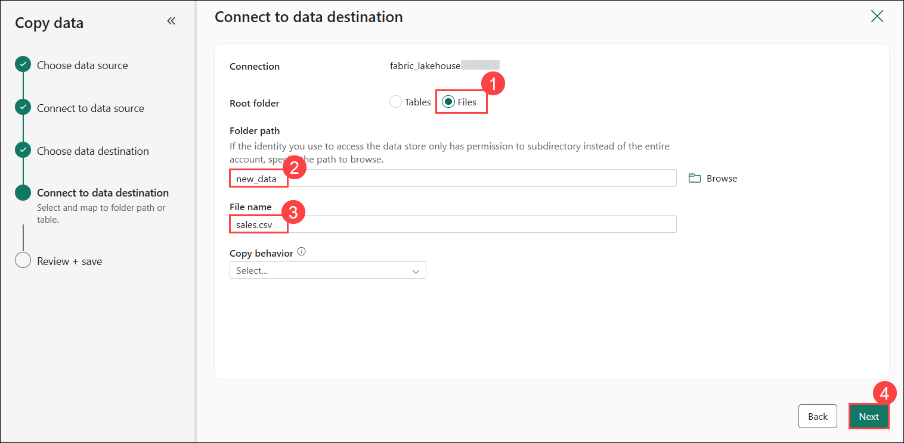

11. On the **Connect to data destination** page, configure the following file format settings, and then click on **Next (4)**:

    - File format: **DelimitedText (1)**
    - Column delimiter: **Comma (,) (2)**
    - Row delimiter: **Line feed (\n) (3)**
   
    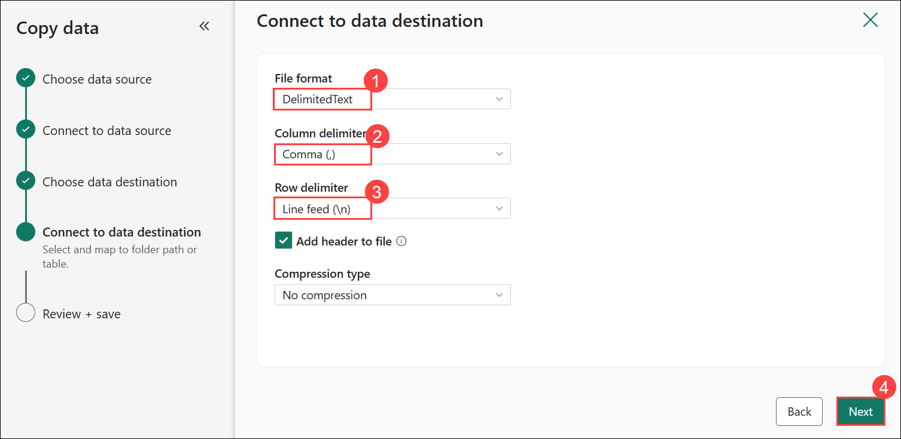

12. On the **Review + save** page, review the copy summary to verify all source and destination settings, and then click on **Save + Run** to initiate the data copy process.

    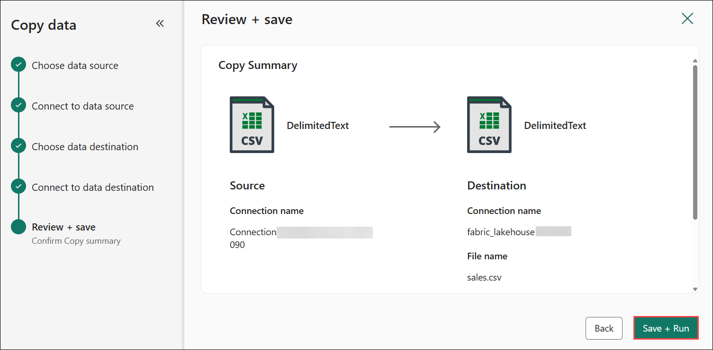

13. After executing the copy operation, a new pipeline containing the **Copy data** activity is automatically created, as shown in the diagram.

    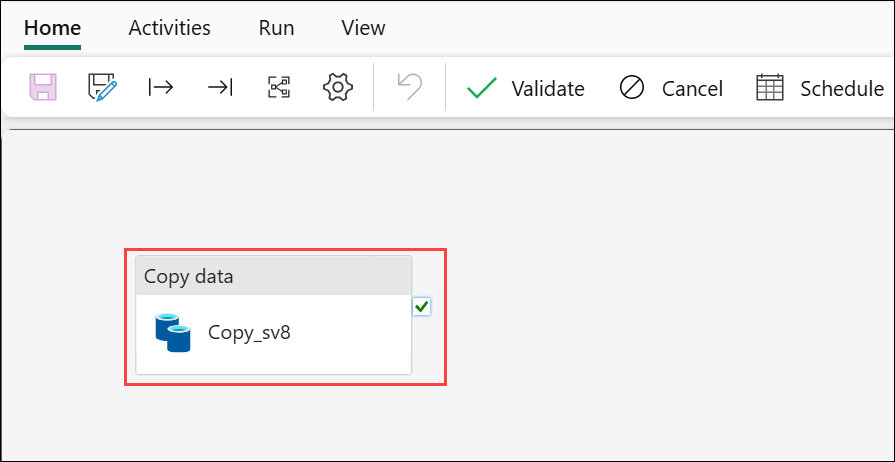

14. Once the pipeline is running, monitor its execution status by selecting the **Output (1)** tab below the pipeline designer. Click the refresh **↻ (2)** icon to update the status, and wait for the pipeline to show as Succeeded.

    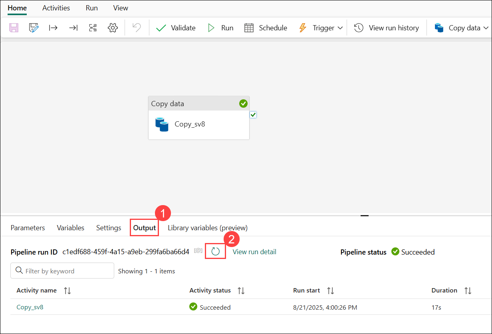

15. From the left pane, select **fabric_lakehouse_<inject key="DeploymentID" enableCopy="false"/> (1)**, click the **ellipsis (...) (2)** next to the **Files** folder, and select **Refresh (3)** to verify that the folder **new_data (4)** contains the copied file **sales.csv (5)**.

    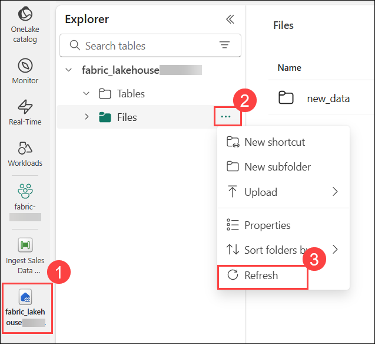

        

## Task 2 : Create a notebook

In this task, you will create a notebook in Microsoft Fabric to begin processing your ingested data using PySpark. You’ll write code to load sales data, apply transformations, and save the results as a table in the lakehouse—enabling further analysis or reporting through SQL or visualization tools.

1. From the lakehouse Home page, open the **Open notebook (1)** menu and select **New notebook (2)** to create a new notebook.

    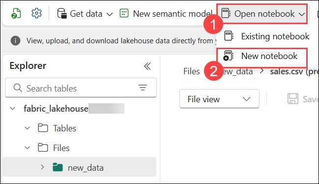

1. Select the existing cell in the notebook, replace the default code with the following **code (1)** and click on **&#9655; Run (2)**.

    ```python
   table_name = "sales"
    ```

    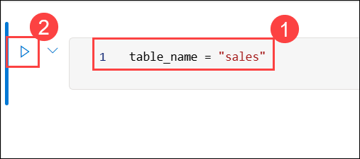

1. In the notebook cell, click the **ellipsis (...) (1)** menu from top-right corner of the cell, then select **Toggle parameter cell (2)** to set the cell’s variables as parameters for pipeline runs.

    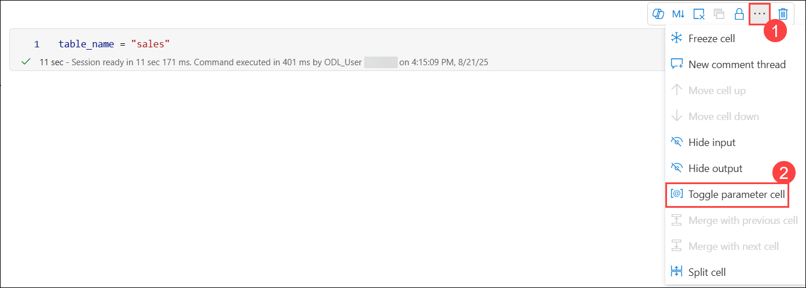

1. Under the parameters cell, use the **+ Code** button to add a new code cell. Then add the following code to it:

    

    ```python
    from pyspark.sql.functions import *
    
    # Read the new sales data
    df = spark.read.format("csv").option("header","true").option("inferSchema","true").load("Files/new_data/*.csv")

    ## Add month and year columns
    df = df.withColumn("Year", year(col("OrderDate"))).withColumn("Month", month(col("OrderDate")))

    # Derive FirstName and LastName columns
    df = df.withColumn("FirstName", split(col("CustomerName"), " ").getItem(0)).withColumn("LastName", split(col("CustomerName"), " ").getItem(1))

    # Filter and reorder columns
    df = df["SalesOrderNumber", "SalesOrderLineNumber", "OrderDate", "Year", "Month", "FirstName", "LastName", "EmailAddress", "Item", "Quantity", "UnitPrice", "TaxAmount"]

    # Load the data into a managed table
    #Managed tables are tables for which both the schema metadata and the data files are managed by Fabric. The data files for the table are created in the Tables folder.
    df.write.format("delta").mode("append").saveAsTable(table_name)
    ```

    This code loads data from the ingested **sales.csv** file, applies transformations, and saves it as a **managed table**, appending if the table already exists.

1. Verify your notebook matches the example and click **&#9655; Run all** on the toolbar to execute all cells.

    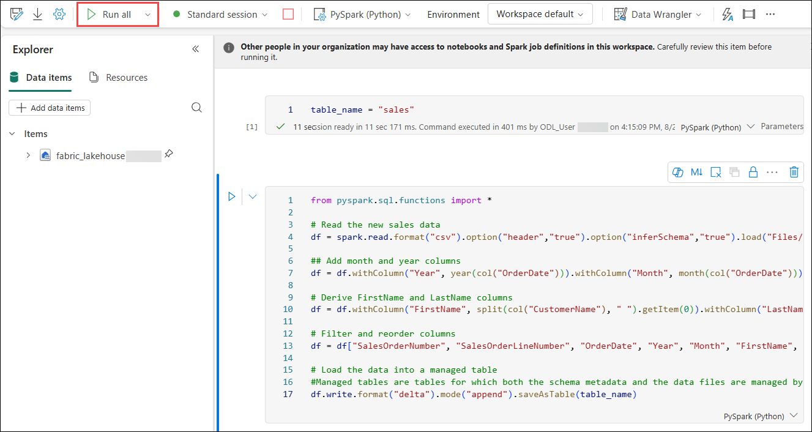

    > **Note**: Since this is the first time you've run any Spark code in this session, the Spark pool must be started. This means that the first cell can take a minute or so to complete.

1. After the notebook run completes, go to **fabric_lakehouse_<inject key="DeploymentID" enableCopy="false"/> (1)** expand Tables, click the **ellipsis (•••) (2)** menu, select **Refresh (3)**, and verify the **sales (4)** table is created.

    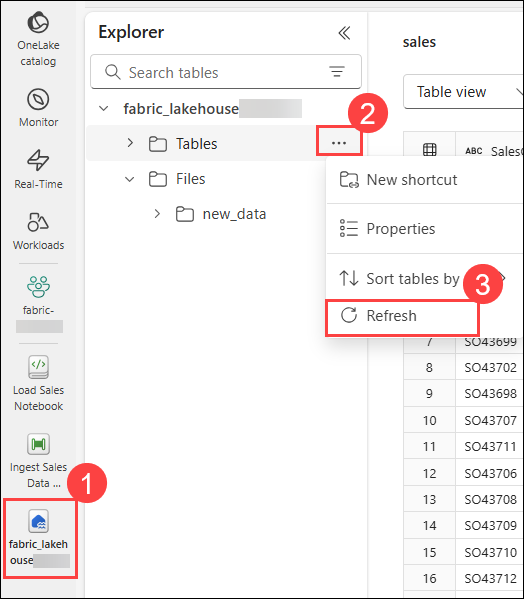

    

1. From the left pane, select the **Notebook (1)**, then click the **Settings (2)** icon in the notebook menu bar, set the Name to **Load Sales Notebook (3)**, and close the settings pane by clicking the **X (4)**.

    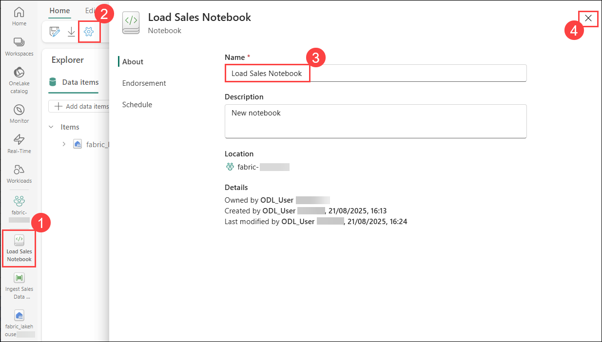

## Task 3 : Modify the pipeline

In this task, you will modify your existing pipeline to include the notebook you created for data transformation. By integrating the notebook into the pipeline, you’ll build a reusable and automated ETL process that extracts data, runs Spark-based transformations, and loads the results into a lakehouse table.

1. From the left navigation pane, select the previously created **Ingest Sales Data pipeline** to proceed.

    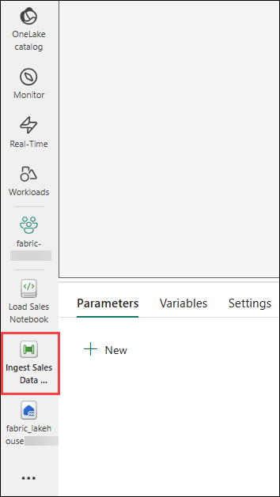
2. From the **Activities (1)** tab, click the **ellipsis (...) (1)** in the toolbar, select **Delete data (3)** from the list, then position the **Delete data** activity to the left of the **Copy data** activity and connect the **On completion** (blue arrow) output from **Delete data** to **Copy data**, as shown below:

    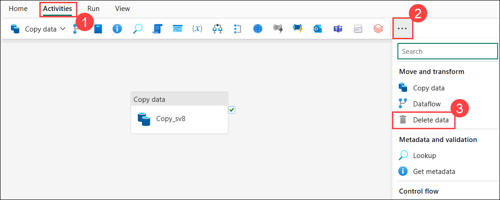

    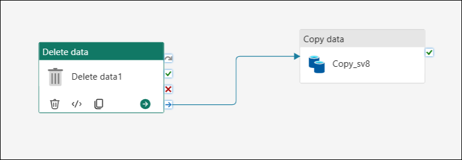

3. Select the **Delete data (1)** activity. In the pane below the design canvas, set the following properties:

    - **General (2)**:
        - **Name**: Delete old files **(3)**

          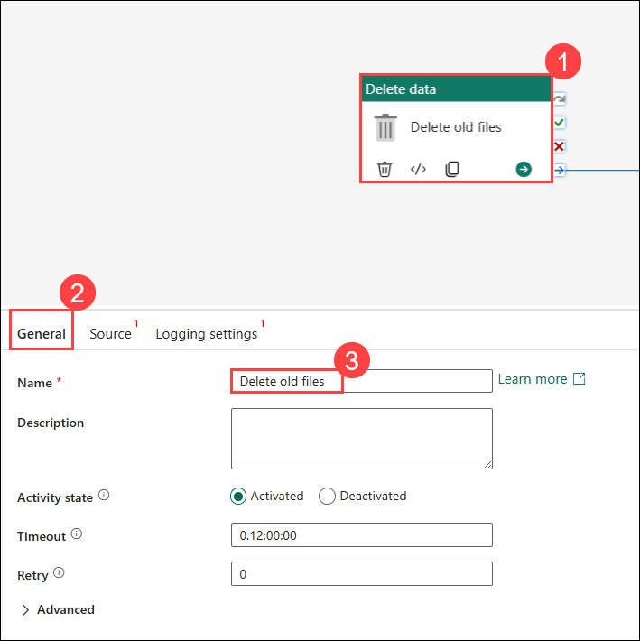

    - **Source (1)**
        - **Connection**: fabric_lakehouse_<inject key="DeploymentID" enableCopy="false"/> **(2)**
        - **File path type**: Wildcard file path **(3)**
        - **Folder path**: new_data **(4)**
        - **Wildcard file name**: *.csv **(5)**    
        - **Recursively**: Selected **(6)**

          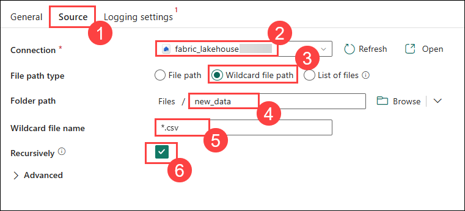

    - **Logging settings (1)**:
        - **Enable logging**: *Unselected* **(2)**

          

    These settings will ensure that any existing .csv files are deleted before copying the **sales.csv** file.

4. In the pipeline designer, navigate to the **Activities (1)** tab and select the **Notebook (2)** to add it to the pipeline.

    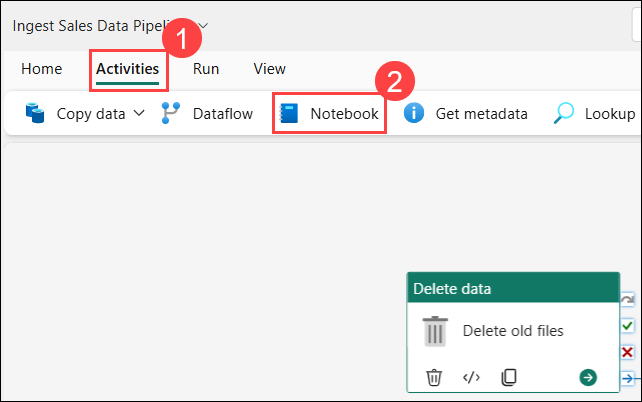

5. Select the **Copy data** activity, then link its **On completion** (blue arrow) output to the **Notebook** activity as illustrated below:

    

6. Select the **Notebook (1)** activity. In the pane below the design canvas, set the following properties:

    - **General (2)**:

        - **Name (3)**: Load Sales notebook

             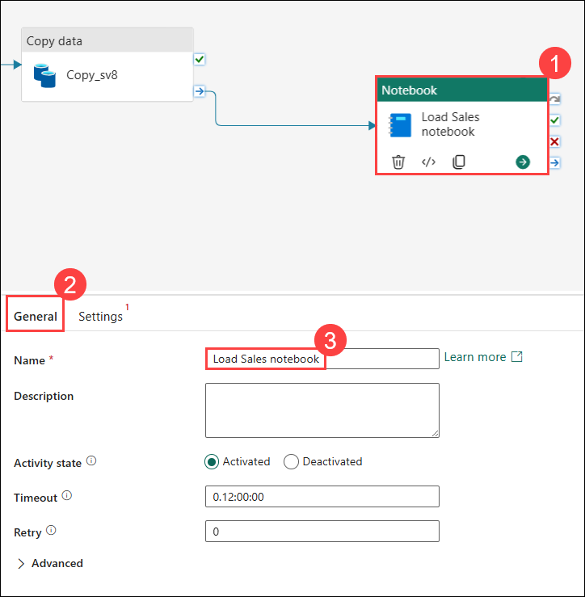 

    - **Settings (1)**:
        - **Notebook**: Load Sales Notebook  **(2)**
        - **Base parameters (3)**: Click on **New (4)** to add a new parameter with the following properties:
            
            | Name | Type | Value |
            | -- | -- | -- |
            | table_name **(5)** | String **(6)** | new_sales **(7)** |

             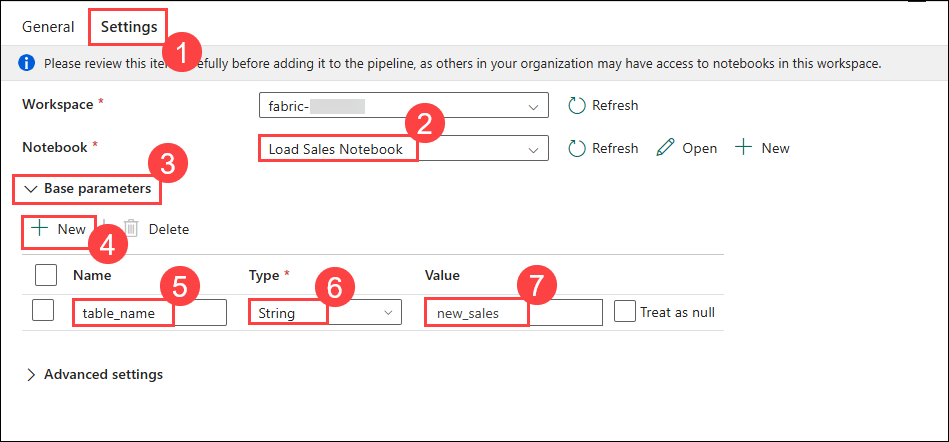 

    The **table_name** parameter will be passed to the notebook and override the default value assigned to the **table_name** variable in the parameters cell.

1. On the **Home (1)** tab, save the pipeline using the **Save (2)** icon, then execute it by clicking **Run (3)** and wait for all activities to complete.

    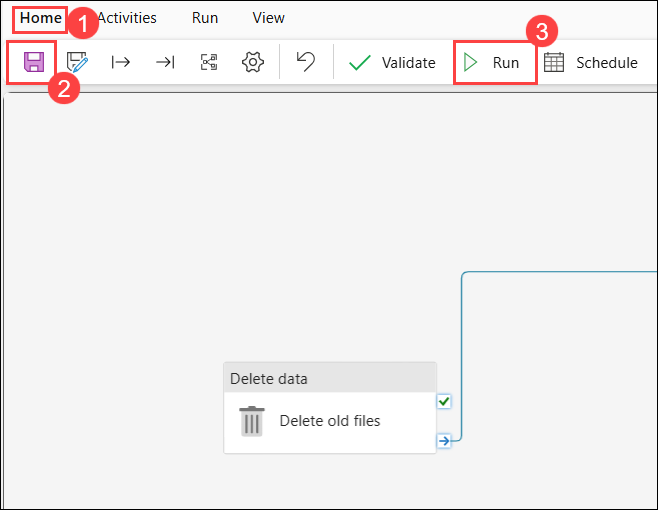

    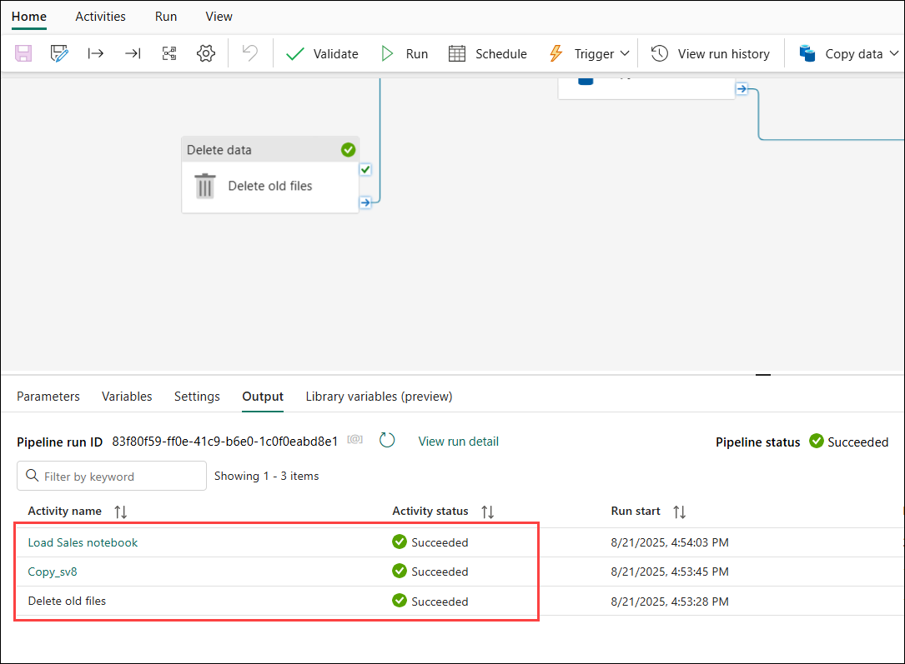

8. From the left navigation pane, select your **fabric_lakehouse_<inject key="DeploymentID" enableCopy="false"/> (1)**, then click the **ellipsis (...) (2)** next to the **Tables**, and choose **Refresh (3)**.

    

9. In the Explorer pane, expand **Tables (1)** and select the **new_sales (2)** table to view a **preview (3)** of its data, which was created by the notebook during the pipeline execution.

    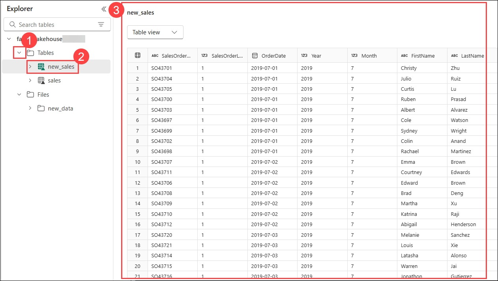

## Summary

In this exercise, you have completed the following:

- Created a pipeline to automate data processing.
- Developed a notebook to write and test pipeline logic.
- Modified the pipeline to refine and optimize its functionality.

## You have successfully completed the lab

By completing this hands-on lab on **How to use Apache Spark in Microsoft Fabric**, you have developed a comprehensive understanding of data engineering workflows within the Fabric environment. You created and managed lakehouses, performed data exploration and transformation using Spark notebooks, ingested data through Dataflows (Gen2), and orchestrated processes using pipelines. This end-to-end experience has equipped you with the practical skills required to build, automate, and optimize scalable data solutions in Microsoft Fabric.
