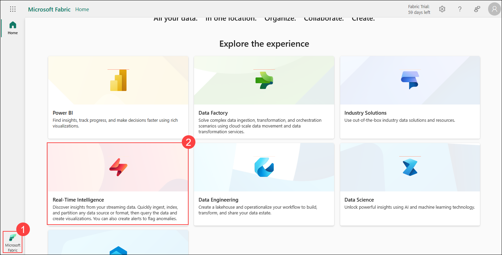
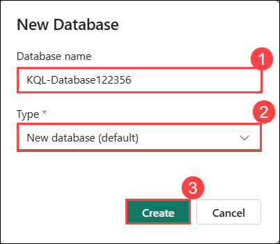
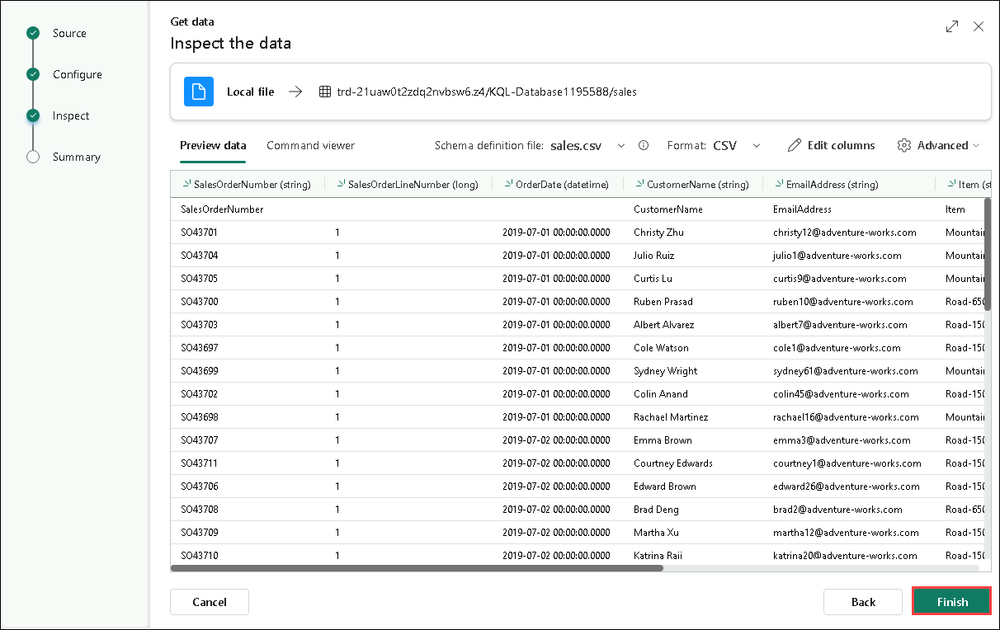
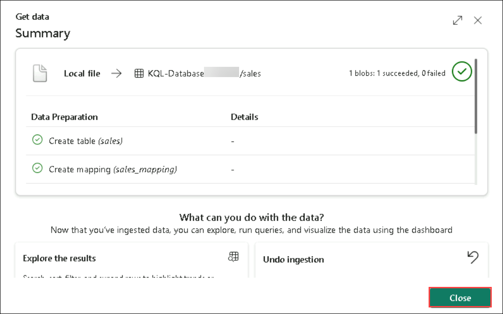
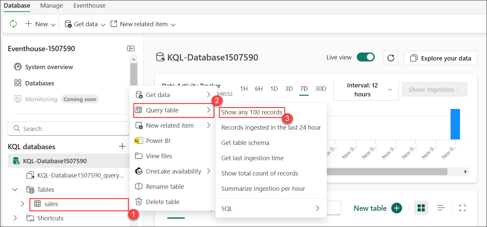
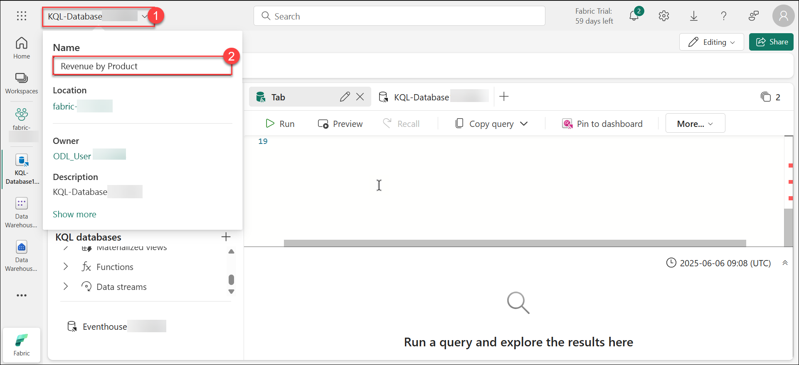
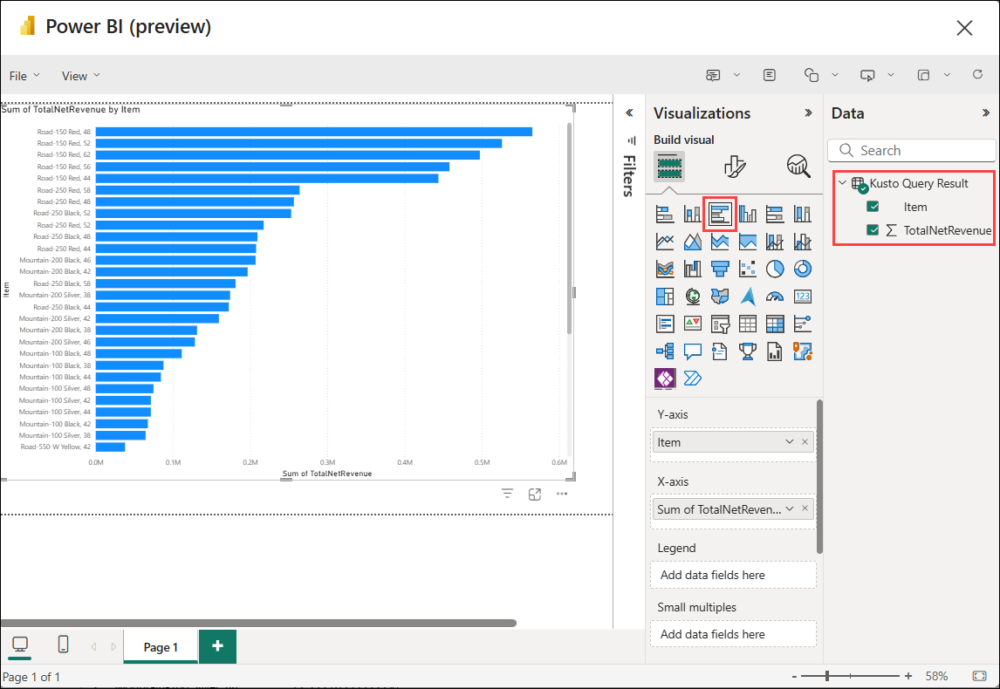

# Exercise 4: Get started with Real-Time Analytics in Microsoft Fabric

### Estimated Duration: 45 minutes

Microsoft Fabric provides a runtime that you can use to store and query data by using Kusto Query Language (KQL). Kusto is optimized for data that includes a time series component, such as real-time data from log files or IoT devices.

Now that you have created a workspace in the previous step, it's time to switch to the *Synapse Real-Time Analytics* experience in the portal.

## Lab objectives

You will be able to complete the following tasks:

- Task 1: Create a KQL database
- Task 2: Use KQL to query the sales table
- Task 3: Create a Power BI report from a KQL Queryset
- Task 4: Use delta tables for streaming data
  
### Task 1: Create a KQL database

In this task, you will create a KQL database to facilitate querying of static or streaming data. You will define a table within the KQL database and ingest sales data from a file to enable effective analysis using Kusto Query Language (KQL).

1. In the **Microsoft Fabric (1)** experience portal, select the **Real-Time Intelligence (2)** experience image as shown here:

    

2. Create a new **Eventhouse** with the name **Eventhouse-<inject key="DeploymentID" enableCopy="false"/>**.

    

3. Once the Eventhouse gets created, in the settings pane, create a **+ New Database** for the **KQL Databases**.

   - **Name:** Enter **KQL-Database<inject key="DeploymentID" enableCopy="false"/> (1)**.

   - Click on **Create (2)**.

     

4. When the new database has been created, select the option to **Get data (1)** from **Local file (2)**.

   

5. Use the wizard to import the data into a new table by selecting the following options:
    - **Source**:
        - **Database:** *The database you created is already selected*
        - **Table:** *Create a new table named* **sales**.
        - **Source type:** File
        - **Upload files:** Drag or Browse for the file from **C:\LabFiles\Files\sales.csv**

            

    - **Inspect:** Preview the data and click on **Finish**.

        

    - **Summary:**
        - *Review the preview of the table and close the wizard.*

            

            > **Note:** In this example, you imported a very small amount of static data from a file, which is fine for this exercise. In reality, you can use Kusto to analyze much larger volumes of data; including real-time data from a streaming source such as Azure Event Hubs.

### Task 2: Use KQL to query the sales table

In this task, you will use Kusto Query Language (KQL) to query the sales table in your KQL database. With the data now available, you can write KQL code to extract insights and perform analysis on the sales data.

1. Make sure you have the **sales** table highlighted. From the ellipses ... of **sales (1)** table, select the **Query table (2)** drop-down, and from there select **Show any 100 records (3)**.

    

2. A new pane will open with the query and its result. 

3. Modify the query as follows:

    ```kusto
   sales
   | where Item == 'Road-250 Black, 48'
    ```

4. Run the query. Then review the results, which should contain only the rows for sales orders for the *Road-250 Black, 48* product.

    
   
5. Modify the query as follows:

    ```kusto
   sales
   | where Item == 'Road-250 Black, 48'
   | where datetime_part('year', OrderDate) > 2020
    ```

6. Run the query and review the results, which should contain only sales orders for *Road-250 Black, 48* made after 2020.

7. Modify the query as follows:

    ```kusto
   sales
   | where OrderDate between (datetime(2020-01-01 00:00:00) .. datetime(2020-12-31 23:59:59))
   | summarize TotalNetRevenue = sum(UnitPrice) by Item
   | sort by Item asc
    ```

8. Run the query and review the results, which should contain the total net revenue for each product between January 1st and December 31st 2020 in ascending order of product name.

9. From the top left corner select the KQL Queryset and save the query as **Revenue by Product** in your workspace.

    

### Task 3: Create a Power BI report from a KQL Queryset

In this task, you will create a Power BI report using your KQL Queryset as the foundation for the analysis. This allows you to visualize and present the insights derived from your KQL queries in an interactive and user-friendly format within Power BI.

1. In the query workbench editor for your query set, run the query and wait for the results.

2. Select **Power BI** and wait for the report editor to open.

    

3. In the report editor, in the **Data** pane, expand **Kusto Query Result** and select the checkboxes of **Item** and **TotalNet Revenue** fields.

4. On the report design canvas, select the table visualization that has been added and then in the **Visualizations** pane, select **Clustered bar chart**.

    

5. In the **Power BI** window, in the **File** menu, select **Save**. Then save the report as **Revenue by Item** in the workspace where your lakehouse and KQL database are defined using a **Non-Business** sensitivity label.

6. Close the **Power BI** window, and in the bar on the left, select the icon for your workspace.

    >**Note**:Refresh the Workspace page if necessary to view all of the items it contains.

7. In the list of items in your workspace, note that the **Revenue by Item** report is listed.

### Task 4: Use delta tables for streaming data

In this task, you will use Delta tables to handle streaming data, leveraging their capabilities for real-time data processing. Specifically, you will implement a Delta table as a sink for streaming data in a simulated Internet of Things (IoT) scenario, utilizing the Spark Structured Streaming API.

1. Navigate back to your workspace and open **Load Sales Notebook**. Add a new code cell in the notebook. Then, in the new cell, add the following code and run it:

    ```python
   from notebookutils import mssparkutils
   from pyspark.sql.types import *
   from pyspark.sql.functions import *

   # Create a folder
   inputPath = 'Files/data/'
   mssparkutils.fs.mkdirs(inputPath)

   # Create a stream that reads data from the folder, using a JSON schema
   jsonSchema = StructType([
   StructField("device", StringType(), False),
   StructField("status", StringType(), False)
   ])
   iotstream = spark.readStream.schema(jsonSchema).option("maxFilesPerTrigger", 1).json(inputPath)

   # Write some event data to the folder
   device_data = '''{"device":"Dev1","status":"ok"}
   {"device":"Dev1","status":"ok"}
   {"device":"Dev1","status":"ok"}
   {"device":"Dev2","status":"error"}
   {"device":"Dev1","status":"ok"}
   {"device":"Dev1","status":"error"}
   {"device":"Dev2","status":"ok"}
   {"device":"Dev2","status":"error"}
   {"device":"Dev1","status":"ok"}'''
   mssparkutils.fs.put(inputPath + "data.txt", device_data, True)
   print("Source stream created...")
    ```

1. Ensure the message *Source stream created...* is printed. The code you just ran has created a streaming data source based on a folder to which some data has been saved, representing readings from hypothetical IoT devices.

1. In a new code cell, add and run the following code:

    ```python
   # Write the stream to a delta table
   delta_stream_table_path = 'Tables/iotdevicedata'
   checkpointpath = 'Files/delta/checkpoint'
   deltastream = iotstream.writeStream.format("delta").option("checkpointLocation", checkpointpath).start(delta_stream_table_path)
   print("Streaming to delta sink...")
    ```

1. This code writes the streaming device data in delta format to a folder named **iotdevicedata**. Because the path for the folder location is in the **Tables** folder, a table will automatically be created for it.

1. In a new code cell, add and run the following code:

    ```SQL
   %%sql

   SELECT * FROM IotDeviceData;
    ```

1. This code queries the **IotDeviceData** table, which contains the device data from the streaming source.

1. In a new code cell, add and run the following code:

    ```python
   # Add more data to the source stream
   more_data = '''{"device":"Dev1","status":"ok"}
   {"device":"Dev1","status":"ok"}
   {"device":"Dev1","status":"ok"}
   {"device":"Dev1","status":"ok"}
   {"device":"Dev1","status":"error"}
   {"device":"Dev2","status":"error"}
   {"device":"Dev1","status":"ok"}'''

   mssparkutils.fs.put(inputPath + "more-data.txt", more_data, True)
    ```

1. This code writes more hypothetical device data to the streaming source.

1. Re-run the cell containing the following code:

    ```SQL
   %%sql

   SELECT * FROM IotDeviceData;
    ```

1. This code queries the **IotDeviceData** table again, which should now include the additional data that was added to the streaming source.

1. In a new code cell, add and run the following code:

    ```python
   deltastream.stop()
    ```

    >**Note**:This code stops the stream.


### Summary

In this exercise, you have created a lakehouse, a KQL database to analyze the data uploaded into the lakehouse. You used KQL to query the data and create a query set, which was then used to create a Power BI report.

### You have successfully completed the lab. Click on Next >> to procced with next exercise.
