# Lab 05: Use notebooks to train a model in Microsoft Fabric
### 所要時間: 90分

## 概要

このラボでは、Microsoft Fabricを使用してノートブックを作成し、顧客の解約を予測する機械学習モデルをトレーニングします。Scikit-Learnを使用してモデルをトレーニングし、MLflowを使用してそのパフォーマンスを追跡します。
顧客の解約は多くの企業が直面する重要なビジネス問題であり、どの顧客が解約する可能性が高いかを予測することで、企業は顧客を維持し、収益を増加させることができます。このラボを完了することで、機械学習とモデル追跡の実践的な経験を得るとともに、Microsoft Fabricを使用してプロジェクトのためのノートブックを作成する方法を学びます。

## ラボの目的

次のタスクを完了できるようになります：

- タスク 1: レイクハウスを作成し、ファイルをアップロードする
- タスク 2: ノートブックを作成する
- タスク 3: データフレームにデータをロードする
- タスク 4: 機械学習モデルをトレーニングする
- タスク 5: MLflowを使用して実験を検索および表示する
- タスク 6: 実験を探索する
- タスク 7: モデルを保存する
 
### タスク 1: レイクハウスを作成し、ファイルをアップロードする

同じワークスペースを使用して、ポータルの*データサイエンス*エクスペリエンスに切り替えます。

1. レイクハウスに戻り、**エクスプローラー**ペインの **Files(1)** ノードのメニューで、**アップロード(2)** および **ファイルのアップロード(3)** を選択します。

    

2. **C:\LabFiles\Files\churn.csv**に移動し、**churn.csv**ファイルを選択してレイクハウスにアップロードします。

    

3. ファイルがアップロードされた後、**ファイル**を展開し、CSVファイルがアップロードされたことを確認します。

    

### タスク 2: ノートブックを作成する

モデルをトレーニングするために、*ノートブック*を作成します。ノートブックは、複数の言語でコードを記述および実行できるインタラクティブな環境を提供します。

1. ポータルの左下で、**Data Science** エクスペリエンスに切り替えます。

    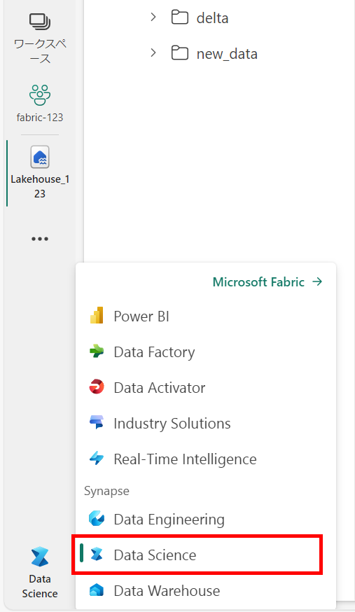

1. **データサイエンス**ホームページで、新しい**ノートブック**を作成します。

    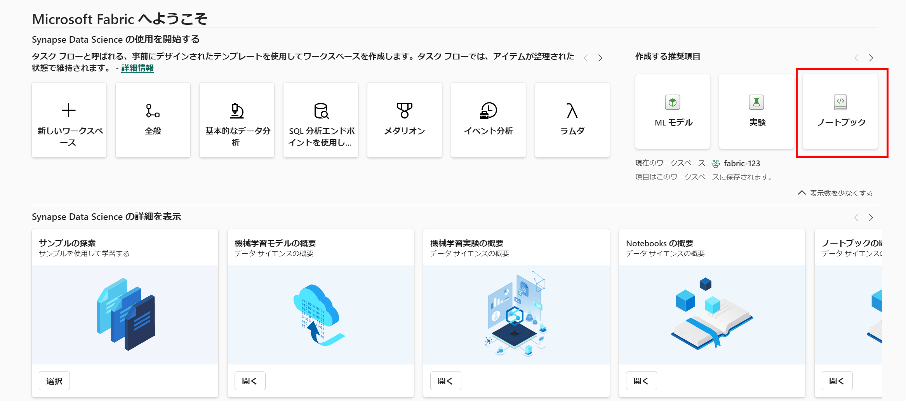

     数秒後、新しいノートブックが1つの*セル*を含んで開きます。ノートブックは、*コード*または*マークダウン*（フォーマットされたテキスト）を含む1つ以上のセルで構成されます。

1. 最初のセル（現在は **コード** セルになっています）を選択し、その右上の動的ツールバーで **M&#8595;** ボタンを使用してセルを **マークダウン** セルに変換します。

    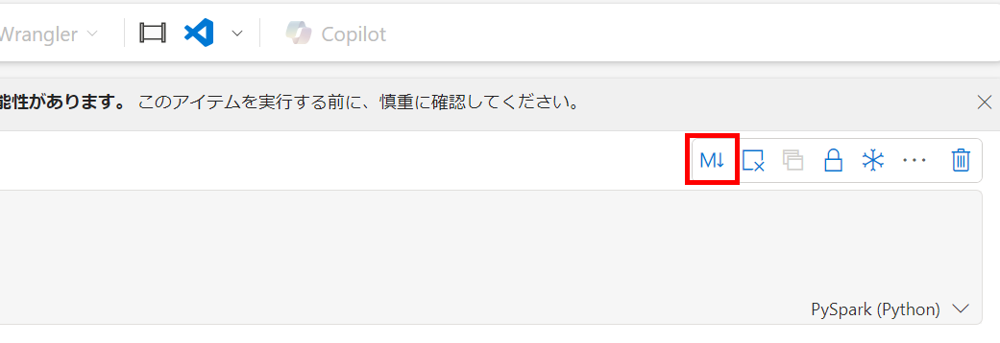
     セルがマークダウンセルに変わると、その内容がレンダリングされます。

2. **&#128393;**（編集）ボタンまたはダブルクリックを使用してセルを編集モードに切り替え、内容を削除して次のテキストを入力します：

     ```text
    # 機械学習モデルのトレーニングとMLflowでのトラッキング

    このノートブックのコードを使用してモデルをトレーニング、トラッキングします。
     ```    
    

### タスク 3: データをデータフレームにロードする

データを準備してモデルをトレーニングするコードを実行する準備ができました。データを操作するために、*データフレーム*を使用します。SparkのデータフレームはPythonのPandasデータフレームに似ており、行と列でデータを操作するための共通の構造を提供します。

1. 左ペインからレイクハウスを選択し、**レイクハウスの追加**ペインで**追加**を選択してレイクハウスを追加します。

    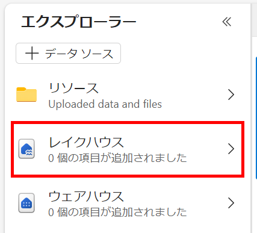
    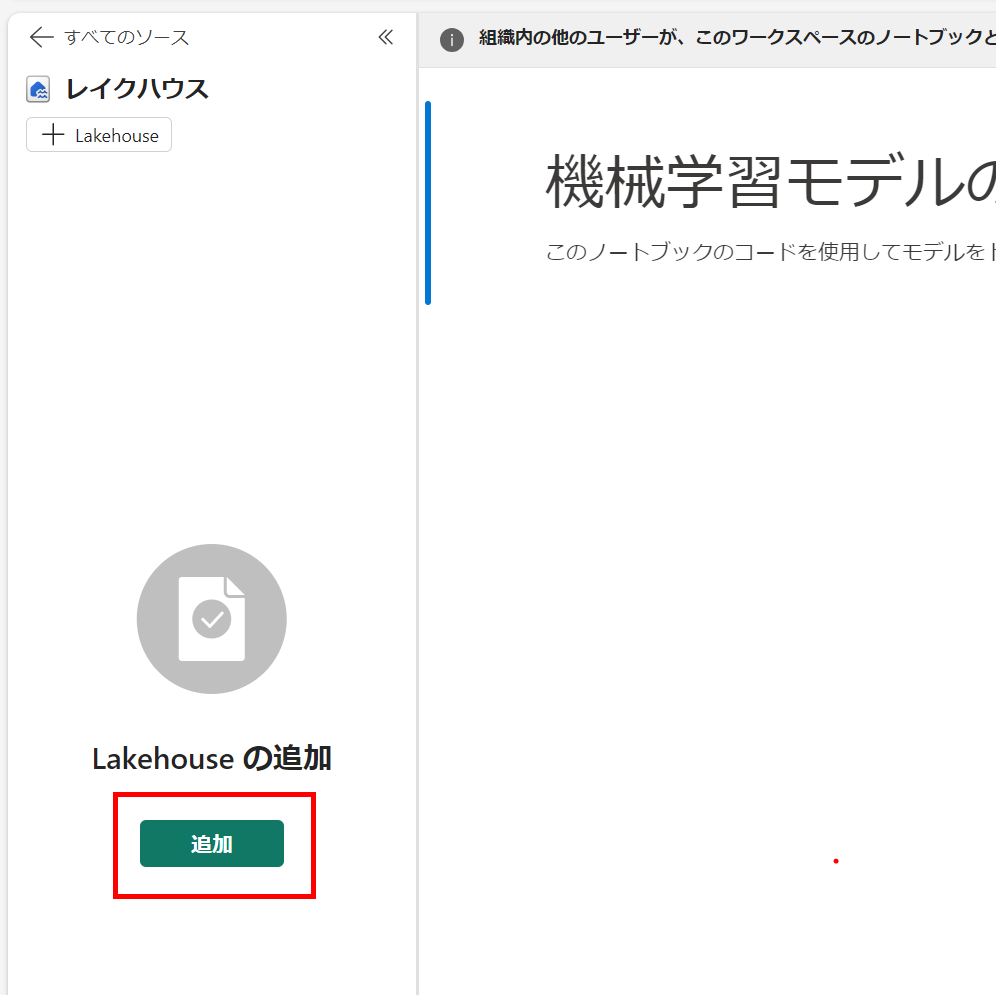

2. **既存の Lakehouse (1)** を選択し、**追加 (2)** を選択します。

    

3. 前のセクションで使用したレイクハウスを選択します。

    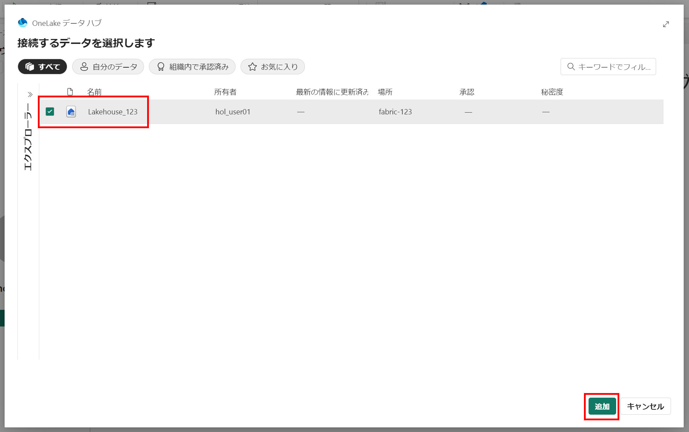

4. **Files (1)** フォルダーを展開し、 **churn.csv (2)** の **...** メニューで、**データの読み込み (3)** > **Pandas (4)** を選択します。

     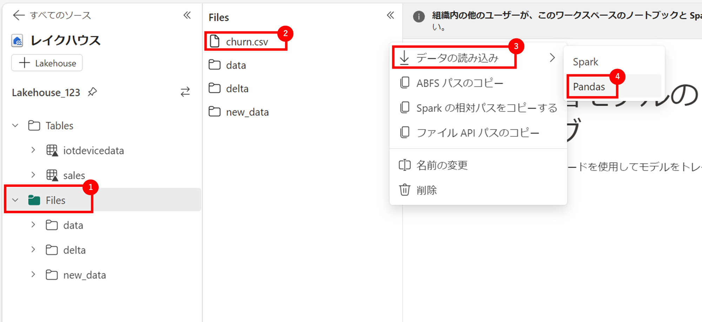

5. 次のコードを含む新しいコードセルがノートブックに追加されます：

     ```
    import pandas as pd
    # Load data into pandas DataFrame from "/lakehouse/default/" + "Files/churn.csv"
    df = pd.read_csv("/lakehouse/default/" + "Files/churn.csv")
    display(df)
    ```
     
     > **ヒント**: 左側のファイルを含むペインは **<<** アイコンを使用して非表示にできます。これにより、ノートブックに集中できます。

6. セルの左側にある **&#9655; セルの実行** ボタンを使用してセルを実行します。

     > **注意**: このセッションで初めてSparkコードを実行するため、Sparkプールを起動する必要があります。これにより、セッションの最初の実行には1分ほどかかることがあります。以降の実行はより迅速になります。

7. セルコマンドが完了したら、セルの下に表示される出力を確認します。出力は次のようになります：

    |Index|CustomerID|years_with_company|total_day_calls|total_eve_calls|total_night_calls|total_intl_calls|average_call_minutes|total_customer_service_calls|age|churn|
    | -- | -- | -- | -- | -- | -- | -- | -- | -- | -- | -- |
    |1|1000038|0|117|88|32|607|43.90625678|0.810828179|34|0|
    |2|1000183|1|164|102|22|40|49.82223317|0.294453889|35|0|
    |3|1000326|3|116|43|45|207|29.83377967|1.344657937|57|1|
    |4|1000340|0|92|24|11|37|31.61998183|0.124931779|34|0|
    | ... | ... | ... | ... | ... | ... | ... | ... | ... | ... | ... |

     出力には、churn.csvファイルからの顧客データの行と列が表示されます。

### タスク 4: 機械学習モデルをトレーニングする

データをロードしたので、これを使用して機械学習モデルをトレーニングし、顧客の離脱を予測できます。Scikit-Learnライブラリを使用してモデルをトレーニングし、MLflowでモデルをトラッキングします。

1. セル出力の下にある **+ コード** アイコンを使用してノートブックに新しいコードセルを追加し、次のコードを入力します：

    ```python
   from sklearn.model_selection import train_test_split

   print("データを分割中...")
   X, y = df[['years_with_company','total_day_calls','total_eve_calls','total_night_calls','total_intl_calls','average_call_minutes','total_customer_service_calls','age']].values, df['churn'].values
   
   X_train, X_test, y_train, y_test = train_test_split(X, y, test_size=0.30, random_state=0)
    ```

1. 追加したコードセルを実行し、データセットから'CustomerID'を省略し、データをトレーニングデータセットとテストデータセットに分割していることを確認します。
1. ノートブックに新しいコードセルを追加し、次のコードを入力して実行します：
     
    ```python
   import mlflow
   experiment_name = "experiment-churn"
   mlflow.set_experiment(experiment_name)
    ```
     
     このコードは、`experiment-churn`という名前のMLflow実験を作成します。モデルはこの実験でトラッキングされます。

1. ノートブックに新しいコードセルを追加し、次のコードを入力して実行します：

    ```python
   from sklearn.linear_model import LogisticRegression
   
   with mlflow.start_run():
       mlflow.autolog()

       model = LogisticRegression(C=1/0.1, solver="liblinear").fit(X_train, y_train)

       mlflow.log_param("estimator", "LogisticRegression")
    ```

     このコードは、ロジスティック回帰を使用して分類モデルをトレーニングします。パラメーター、メトリック、およびアーティファクトはMLflowで自動的にログされます。さらに、`estimator`というパラメーターを`LogisticRegression`という値でログしています。

1. ノートブックに新しいコードセルを追加し、次のコードを入力して実行します：

    ```python
   from sklearn.tree import DecisionTreeClassifier
   
   with mlflow.start_run():
       mlflow.autolog()

       model = DecisionTreeClassifier().fit(X_train, y_train)
   
       mlflow.log_param("estimator", "DecisionTreeClassifier")
    ```

      このコードは、決定木分類器を使用して分類モデルをトレーニングします。パラメーター、メトリック、およびアーティファクトはMLflowで自動的にログされます。さらに、`estimator`というパラメーターを`DecisionTreeClassifier`という値でログしています。   
    
    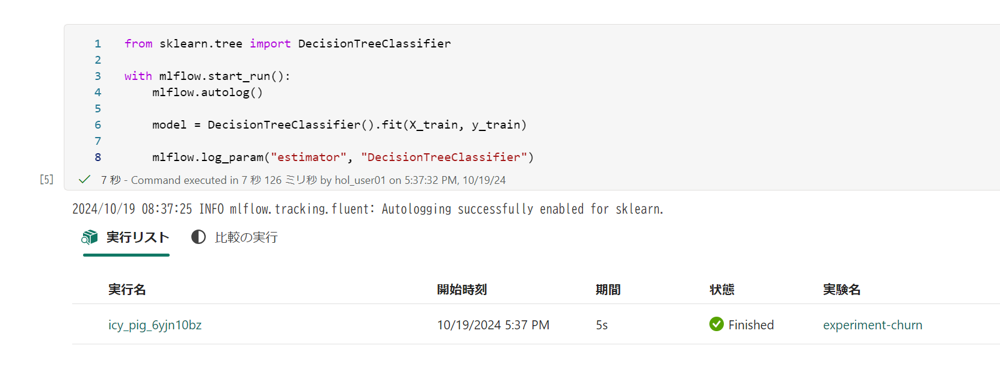

### タスク 5: MLflowを使用して実験を検索および表示する

MLflowでモデルをトレーニングおよびトラッキングした後、MLflowライブラリを使用して実験とその詳細を取得できます。

1. すべての実験をリストするには、次のコードを使用します：

    ```python
   import mlflow
   experiments = mlflow.search_experiments()
   for exp in experiments:
       print(exp.name)
    ```

1. 特定の実験を取得するには、その名前を使用します：

    ```python
   experiment_name = "experiment-churn"
   exp = mlflow.get_experiment_by_name(experiment_name)
   print(exp)
    ```

1. 実験名を使用して、その実験のすべてのジョブを取得できます：

    ```python
   mlflow.search_runs(exp.experiment_id)
    ```

1. ジョブの実行と出力をより簡単に比較するために、検索結果を並べ替えることができます。例えば、次のセルは結果を`start_time`で並べ替え、最大`2`件の結果のみを表示します：

    ```python
   mlflow.search_runs(exp.experiment_id, order_by=["start_time DESC"], max_results=2)
    ```

1. 最後に、複数のモデルの評価メトリックを並べてプロットし、モデルを簡単に比較できます：

    ```python
   import matplotlib.pyplot as plt
   
   df_results = mlflow.search_runs(exp.experiment_id, order_by=["start_time DESC"], max_results=2)[["metrics.training_accuracy_score", "params.estimator"]]
   
   fig, ax = plt.subplots()
   ax.bar(df_results["params.estimator"], df_results["metrics.training_accuracy_score"])
   ax.set_xlabel("Estimator")
   ax.set_ylabel("Accuracy")
   ax.set_title("Accuracy by Estimator")
   for i, v in enumerate(df_results["metrics.training_accuracy_score"]):
       ax.text(i, v, str(round(v, 2)), ha='center', va='bottom', fontweight='bold')
   plt.show()
    ```

    出力は次の画像のようになります：

    

### タスク 6: 実験を探索する

Microsoft Fabricはすべての実験をトラッキングし、視覚的に探索することができます。

1. **ワークスペース (1)** に移動し、画面をリロードすると、作成された**experiment-churn (2)** 実験が表示されます。

    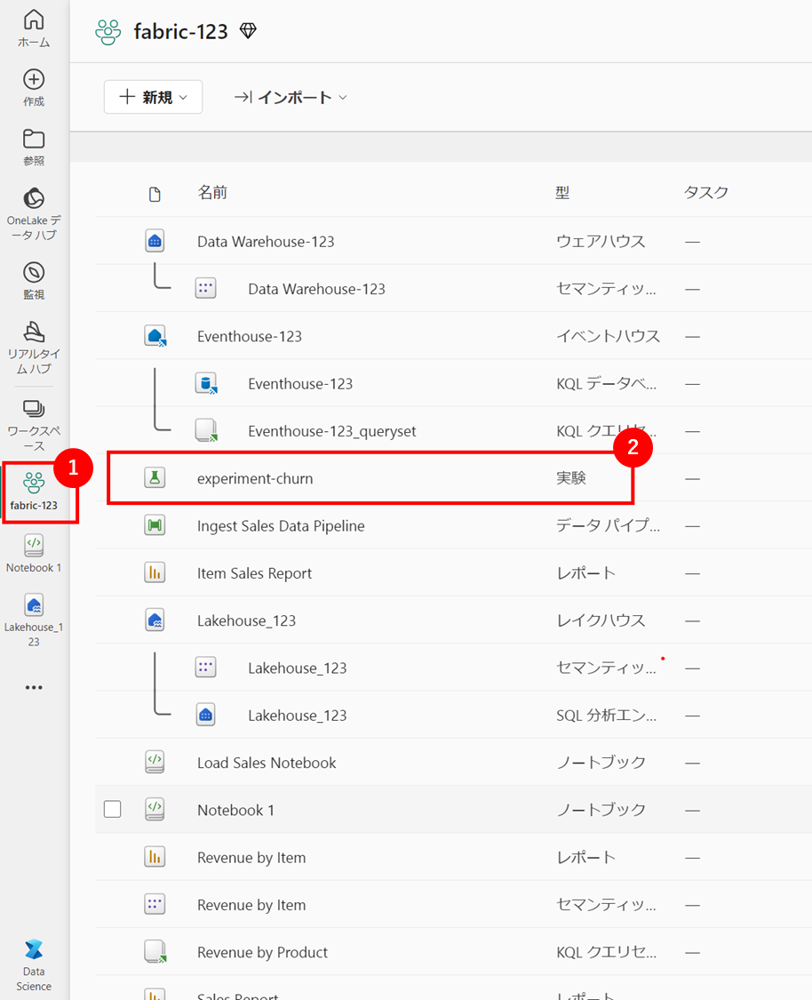

1. `experiment-churn`実験を選択して開きます。

    > **ヒント:**
    > ログされた実験の実行が表示されない場合は、ページを更新してください。

1. **表示** タブから、**実行リスト** を選択します。

    

1. 最新の2つの実行を選択し、それぞれのボックスにチェックをつけると、**メトリック比較**ペインで2つの最新の実行が比較されます。各実行の精度を視覚化するグラフの**&#128393;**（編集）ボタンを選択します。
    > **ヒント**: デフォルトでは、メトリックは実行名でプロットされます。

    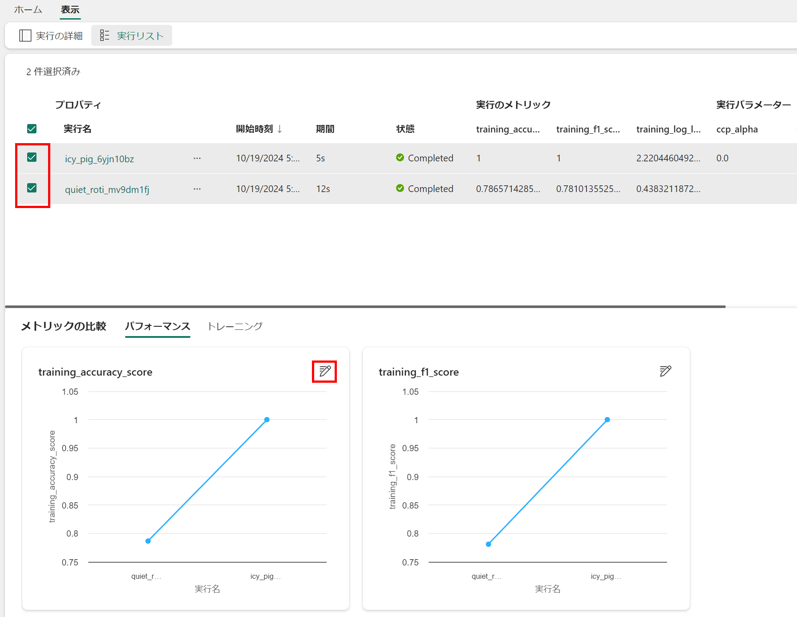

1. **視覚化タイプ**を`bar`に変更します。

1. **X軸**を`estimator`に変更します。

1. **置換**を選択し、新しいグラフを確認します。

ログされた推定器ごとの精度をプロットすることで、どのアルゴリズムがより良いモデルを生成したかを確認できます。

### タスク 7: モデルを保存する

実験の実行間でトレーニングした機械学習モデルを比較した後、最も性能の良いモデルを選択できます。最も性能の良いモデルを使用するには、モデルを保存し、予測を生成するために使用します。

1. 実験の概要で、**表示 (1)** から **実行の詳細 (2)** を選択し、最も高い精度を持つ実行を選択された状態で、**保存 (3)** を選択します。

    

3. 新しく開いたポップアップウィンドウで**新しいモデルを作成 (1)** をチェックし、 **フォルダーを選択**で**model (2)** を選択し、モデルに**model-churn (3)** という名前を付け、**保存 (4)** を選択します。

   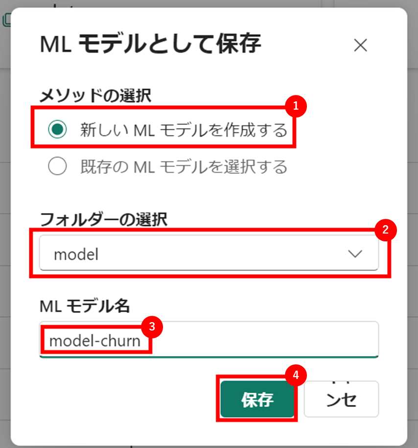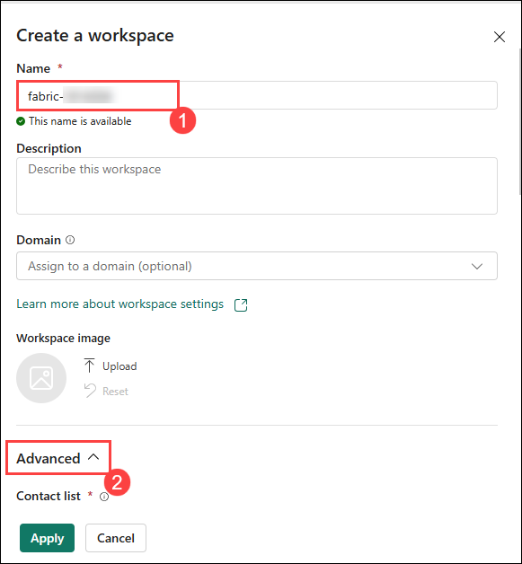

5. モデルが作成されたときに画面の右上に表示される通知で**MLモデルの表示**を選択します。または、ウィンドウを更新します。保存されたモデルは**登録されたバージョン**の下にリンクされています。

モデル、実験、および実験の実行がリンクされているため、モデルがどのようにトレーニングされたかを確認できます。

### タスク 8: ノートブックを保存し、Sparkセッションを終了する

モデルのトレーニングと評価が完了したので、意味のある名前でノートブックを保存し、Sparkセッションを終了できます。

1. 左ペインから**notebook 1**に戻り、ノートブックメニューバーの⚙️ **設定** アイコンを使用してノートブックの設定を表示します。

   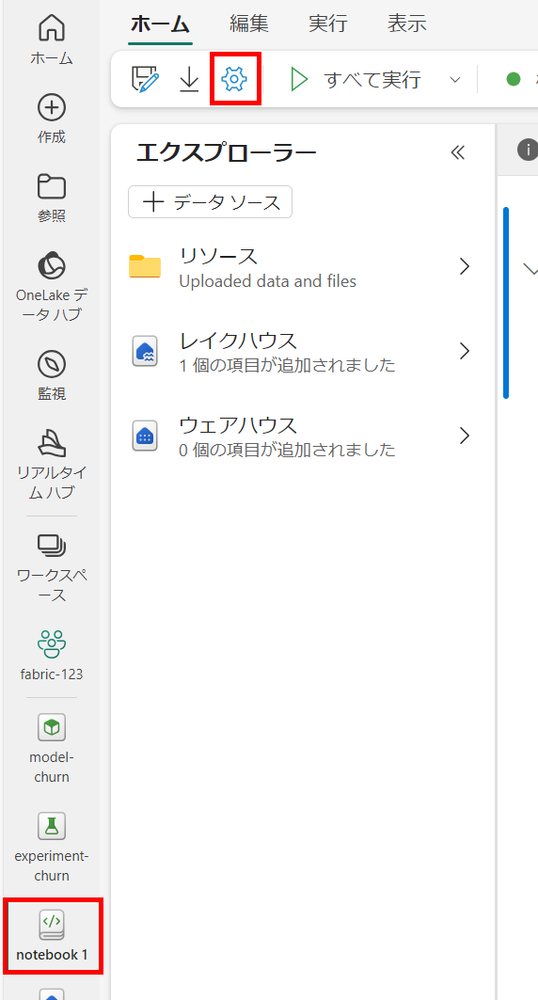

2. ノートブックの**名前**を**Train and compare models notebook**に設定し、設定ペインを閉じます。

3. ノートブックメニューで**セッションを停止**を選択してSparkセッションを終了します。

    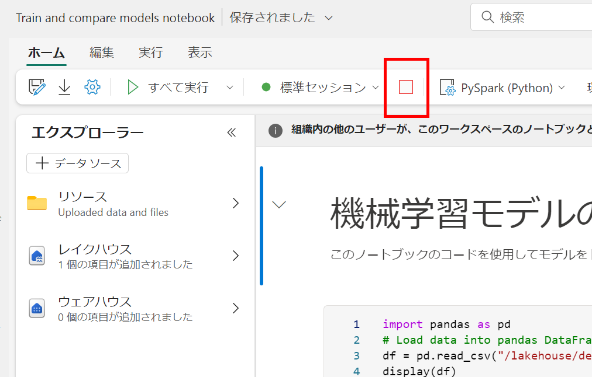

    <validation step="67d8cbeb-e9b6-495c-8631-ae0dfe4775fa" />

    > **おめでとうございます**、タスクを完了しました！次の手順で検証してください：
    > - 対応するタスクの検証ボタンを押します。
    > - 成功メッセージが表示されたら、次のタスクに進むことができます。エラーメッセージが表示された場合は、ラボガイドの指示に従ってステップを再試行してください。
    > - サポートが必要な場合は、labs-support@spektrasystems.comまでご連絡ください。24時間365日対応しています。

## まとめ

このラボでは、ノートブックを作成し、機械学習モデルをトレーニングしました。Scikit-Learnを使用してモデルをトレーニングし、MLflowを使用してそのパフォーマンスをトラッキングしました。

### ラボを正常に完了しました
