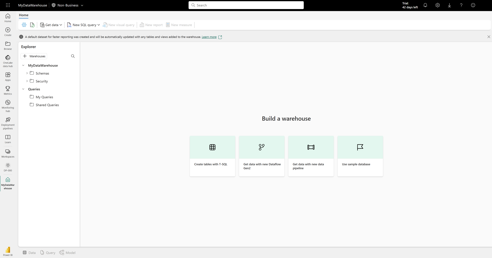
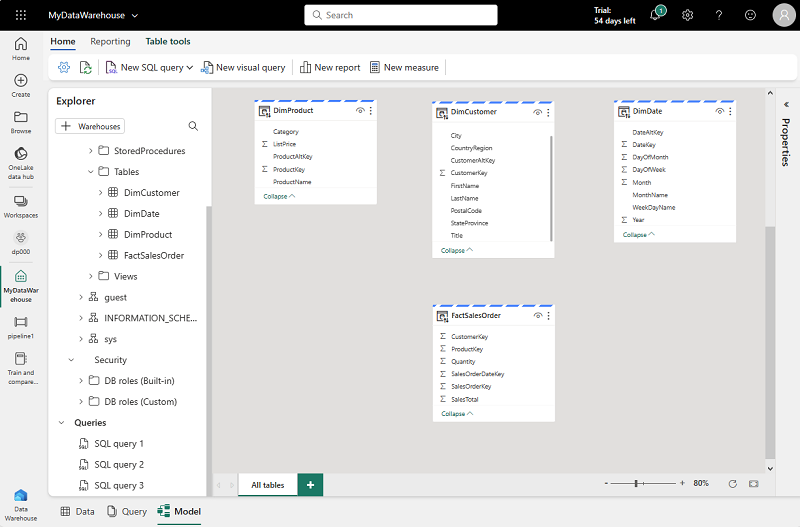
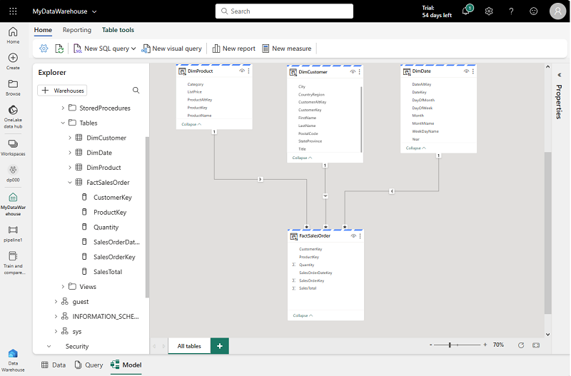

---
lab:
    title: 'Analyze data in a data warehouse'
    module: 'Data warehousing'
---

---
*The UI is changing frequently -we'll need to update (or remove) screenshots prior to release.*

---

# Analyze data in a data warehouse

In Microsoft Fabric, a data warehouse is an artifact in a workspace that provides a relational database for large-scale analytics. Unlike the default read-only SQL endpoint for tables defined in a lakehouse, a data warehouse provides full SQL semantics; including the ability to insert, update, and delete data in the tables.

This lab will take approximately **30** minutes to complete.

## Before you start

You'll need a Power BI Premium subscription with access to the Microsoft Fabric preview.

## Create a workspace

Before working with data in Fabric, you should create a workspace with support for premium features.

1. Sign into your Power BI service at [https://app.powerbi.com](https://app.powerbi.com).
2. In the menu bar on the left, select **Workspaces** (the icon looks similar to &#128455;).
3. Create a new workspace with a name of your choice, selecting the **Premium per user** licensing mode.
4. When your new workspace opens, it should be empty, as shown here:

    

## Create a data warehouse

Now that you have a workspace, it's time to switch to the *Data Warehouse* experience in the portal and create a data warehouse.

1. At the bottom left of the Power BI portal, switch to the **Data Warehouse** experience.

    The Data Warehouse home page includes a shortcut to create a new warehouse:

    

2. In the **Data Warehouse** home page, create a new **Warehouse** with a name of your choice. Don't specify a *sensitivity* level.

    After a minute or so, a new warehouse will be created:

    

## Create tables and insert data

A warehouse is a relational database in which you can define tables and other objects.

1. In your new warehouse, select the **Create table with T-SQL** tile, and replace the default SQL code with the following CREATE TABLE statement:

    ```sql
    CREATE TABLE dbo.DimProduct
    (
        ProductKey INTEGER NOT NULL,
        ProductAltKey VARCHAR(25) NULL,
        ProductName VARCHAR(50) NOT NULL,
        Category VARCHAR(50) NULL,
        ListPrice DECIMAL(5,2) NULL
    );
    GO
    ```

2. Use the **&#9655; Run** button to run the SQL script, which creates a new table named **DimProduct** in the **dbo** schema of the data warehouse.
3. Use the **Sync data** button on the toolbar to refresh the view. Then, in the **Explorer** pane, expand **Schemas** > **dbo** > **Tables** and verify that the **DimProduct** table has been created.
4. Use the **New SQL Query** button to create a new query, and enter the following INSERT statement:

    ```sql
    INSERT INTO dbo.DimProduct
    VALUES
    (1, 'RING1', 'Bicycle bell', 'Accssories', 5.99),
    (2, 'BRITE1', 'Front light', 'Accessories', 15.49),
    (3, 'BRITE2', 'Rear light', 'Accessories', 15.49);
    GO
    ```

5. Run the new query to insert three rows into the **DimProduct** table.
6. When the query has finished, in the **Explorer** pane, select the **DimProduct** table and verify that the rows have been added to the table.
7. On the **Home** menu tab, use the **New SQL Query** button to create a new query. Then copy and paste the Transact-SQL code from [https://raw.githubusercontent.com/MicrosoftLearning/dp-data/main/create-dw.txt](https://raw.githubusercontent.com/MicrosoftLearning/dp-data/main/create-dw.txt) into the new query pane.
8. Run the query, which creates a simple data warehouse schema and loads some data. The script should take around 30 seconds to run.
9. Use the **Sync data** button on the toolbar to refresh the view. Then in the **Explorer** pane, verify that the **dbo** schema in the data warehouse now contains the following four tables:
    - **DimCustomer**
    - **DimDate**
    - **DimProduct**
    - **FactSalesOrder**

    > **Tip**: If the schema takes a while to load, just refresh the browser page.

## Define a data model

A relational data warehouse typically consists of *dimension* and *fact* tables. The fact tables contain numeric measures you can aggregate to analyze business performance (for example, sales revenue), and the dimension tables contain attributes of the entities by which you can aggregate the data (for example, product, customer, or time). In a Microsoft Fabric data warehouse, you can use these keys to define a data model that encapsulates the relationships between the tables.

1. At the bottom of the page for your data warehouse, select the **Model** tab.
2. In the model designer pane, rearrange the tables in your data warehouse so that the **FactSalesOrder** table is in the middle, like this:

    

3. Drag the **ProductKey** field from the **FactSalesOrrder** table and drop it on the **ProductKey** field in the **DimProduct** table. Then confirm the following relationship details:
    - **Table 1**: FactSalesOrder
    - **Column**: ProductKey
    - **Table 2**: DimProduct
    - **Column**: ProductKey
    - **Cardinality**: Many to one (*:1)
    - **Cross filter direction**: Single
    - **Make this relationship active**: Selected
    - **Assume referential integrity**: Unselected

4. Repeat the process to create many to one relationships between the following tables:
    - **FactOrderSales.CustomerKey** &#8594; **DimCustomer.CustomerKey**
    - **FactOrderSales.SalesOrderDateKey** &#8594; **DimDate.DateKey**

    When all of the relationships have been defined, the model should look like this:

    


---

    *Should we add steps to create hierarchies as well?*

---

## Query data warehouse tables

Since the data warehouse is a relational database, you can use SQL to query its tables.

### Query fact and dimension tables

Most queries in a relational data warehouse involve aggregating and grouping data (using aggregate functions and GROUP BY clauses) across related tables (using JOIN clauses).

1. Create a new SQL Query, and run the following code:

    ```sql
    SELECT  d.[Year] AS CalendarYear,
            d.[Month] AS MonthOfYear,
            d.MonthName AS MonthName,
            SUM(so.SalesTotal) AS SalesRevenue
    FROM FactSalesOrder AS so
    JOIN DimDate AS d ON so.SalesOrderDateKey = d.DateKey
    GROUP BY d.[Year], d.[Month], d.MonthName
    ORDER BY CalendarYear, MonthOfYear;
    ```

    Note that the attributes in the time dimension enable you to aggregate the measures in the fact table at multiple hierarchical levels - in this case, year and month. This is a common pattern in data warehouses.

2. Modify the query as follows to add a second dimension to the aggregation.

    ```sql
    SELECT  d.[Year] AS CalendarYear,
            d.[Month] AS MonthOfYear,
            d.MonthName AS MonthName,
            c.CountryRegion AS SalesRegion,
            SUM(so.SalesTotal) AS SalesRevenue
    FROM FactSalesOrder AS so
    JOIN DimDate AS d ON so.SalesOrderDateKey = d.DateKey
    JOIN DimCustomer AS c ON so.CustomerKey = c.CustomerKey
    GROUP BY d.[Year], d.[Month], d.MonthName, c.CountryRegion
    ORDER BY CalendarYear, MonthOfYear, SalesRegion;
    ```

3. Run the modified query and review the results, which now include sales revenue aggregated by year, month, and sales region.

## Create a view

A data warehouse in Microsoft Fabric has many of the same capabilities you may be used to in relational databases. For example, you can create database objects like *views* and *stored procedures* to encapsulate SQL logic.

1. Modify the query you created previously as follows to create a view (note that you need to remove the ORDER BY clause to create a view).

    ```sql
    CREATE VIEW vSalesByRegion
    AS
    SELECT  d.[Year] AS CalendarYear,
            d.[Month] AS MonthOfYear,
            d.MonthName AS MonthName,
            c.CountryRegion AS SalesRegion,
            SUM(so.SalesTotal) AS SalesRevenue
    FROM FactSalesOrder AS so
    JOIN DimDate AS d ON so.SalesOrderDateKey = d.DateKey
    JOIN DimCustomer AS c ON so.CustomerKey = c.CustomerKey
    GROUP BY d.[Year], d.[Month], d.MonthName, c.CountryRegion;
    ```

2. Run the query to create the view. Then refresh the data warehouse schema and verify that the new view is listed in the **Explorer** pane.
3. Create a new SQL query and run the following SELECT statement:

    ```SQL
    SELECT CalendarYear, MonthName, SalesRegion, SalesRevenue
    FROM vSalesByRegion
    ORDER BY CalendarYear, MonthOfYear, SalesRegion;
    ```

### Visualize query results

---

    *Add steps to select a query and visualize the results a'la Power BI*

---

### Create a visual query

Instead of writing SQL code, you can use the graphical query designer to query the tables in your data warehouse.

1. On the **Home** menu tab, select **New visual query**.

---
    *Add steps to create a Visual Query with the Power Query interface*

---

## Use the dataset for the warehouse

When you create a warehouse, a dataset is automatically created for it.

---

    *Add steps to create an Auto-report from the dataset*

---