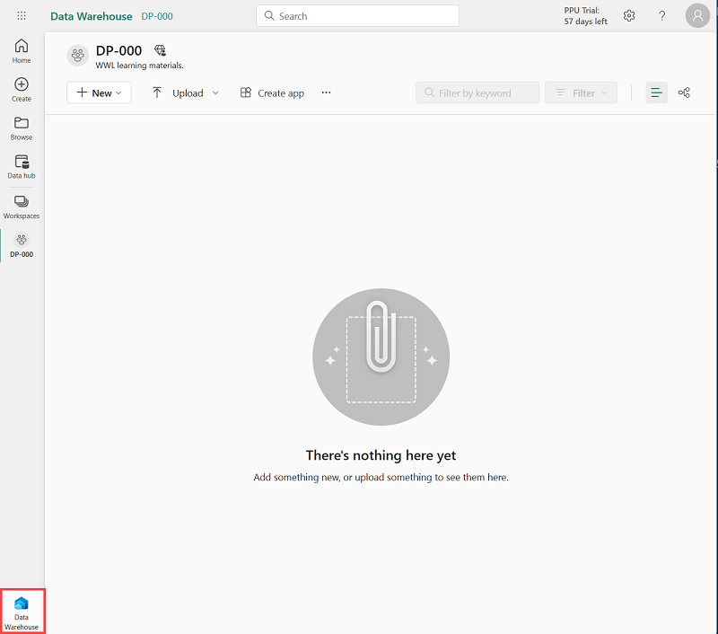

---
lab:
    title: 'Analyze data in a data warehouse'
    module: 'Data warehousing'
---

---
*The UI is changing frequently -we'll need to update (or remove) screenshots prior to release.*

---

# Analyze data in a data warehouse

In Microsoft Fabric, a data warehouse is an artifact in a workspace that provides a relational database for large-scale analytics. Unlike the default read-only SQL endpoint for tables defined in a lakehouse, a data warehouse provides full SQL semantics; including the ability to insert, update, and delete data in the tables.

This lab will take approximately **30** minutes to complete.

## Before you start

You'll need a Power BI Premium subscription with access to the Microsoft Fabric preview.

## Create a workspace

Before working with data in Fabric, you should create a workspace with support for premium features.

1. Sign into your Power BI service at [https://app.powerbi.com](https://app.powerbi.com).
2. In the menu bar on the left, select **Workspaces** (the icon looks similar to &#128455;).
3. Create a new workspace with a name of your choice, selecting the **Premium per user** licensing mode.
4. When your new workspace opens, it should be empty, as shown here:

    

## Create a data warehouse

Now that you have a workspace, it's time to switch to the *Data Warehouse* experience in the portal and create a data warehouse.

1. At the bottom left of the Power BI portal, switch to the **Data Warehouse** experience.

    The Data Warehouse home page includes a shortcut to create a new warehouse:

    

2. In the **Data Warehouse** home page, create a new **Warehouse** with a name of your choice. Don't specify a *sensitivity* level.

    After a minute or so, a new warehouse will be created:

    

## Create a table

A warehouse is a relational database in which you can define tables and other objects.

1. In your new warehouse, select the **Create table with T-SQL** tile, and replace the default SQL code with the following CREATE TABLE statement:

    ```sql
    CREATE TABLE dbo.DimProduct
    (
        ProductID INTEGER NOT NULL,
        ProductName VARCHAR(50) NOT NULL,
        Category VARCHAR(50) NULL,
        ListPrice DECIMAL(5,2) NULL
    );
    GO
    ```

2. Use the **&#9655; Run** button to run the SQL script, which creates a new table named **DimProduct** in the **dbo** schema of the data warehouse.
3. Use the **Sync data** button on the toolbar to refresh the view. Then, in the **Explorer** pane, expand **Schemas** > **dbo** > **Tables** and verify that the **DimProduct** table has been created.
4. Use the **New SQL Query** button to create a new query, and enter the following INSERT statement:

    ```sql
    INSERT INTO dbo.DimProduct
    VALUES
    (1, 'Bicycle bell', 'Accssories', 5.99),
    (2, 'Front light', 'Accessories', 15.49),
    (3, 'Rear light', 'Accessories', 15.49);
    GO
    ```

5. Run the new query to insert three rows into the **DimProduct** table.

## Load data from a lakehouse into a table

As you've seen, you can use Transact-SQL INSERT statements to insert data into a warehouse table. However, in most real data warehousing scenarios you'll typically load data into the data warehouse from files in a data lake.

1. Download the data file for this exercise from [https://github.com/MicrosoftLearning/dp-data/raw/main/products.csv](https://github.com/MicrosoftLearning/dp-data/raw/main/products.csv), saving it as **products.csv** on your local computer.
2. In the menu bar on the left, select **&#128320; Create**. Then, in the **Data Engineering** section, select **Lakehouse** and create a new lakehouse with a name of your choice.
3. In your new lakehouse, in the **lake view** pane, in the **...** menu for the **Files** node, select **New subfolder** and create a folder named **products**.
4. In the **...** menu for the **products** folder, select **Upload** > **Upload files** and then upload the **products.csv** file you downloaded to your computer previously.
5. Select the **products** folder and verify that the **products.csv** file has been uploaded as shown here:

    

6. In the menu bar on the left, select the **Home** page, and then find and select your data warehouse to return to it.
7. Create a new SQL query, and enter the following SQL code:


    ```sql
    COPY INTO dbo.DimProduct
        (ProductID, ProductName, ProductCategory, ListPrice)
    FROM 'Files/products/products.csv'
    WITH
    (
        FILE_TYPE = 'CSV',
        MAXERRORS = 0,
        FIRSTROW = 2 --Skip header row
    );
    ```

> Code fails with the following error:
>
> ```
> File 'Files/products/products.csv' cannot be opened because it does not exist or it is used by another process.
> ```
>
> If I try using the **abfs** or **URL** path (obtained from the file properties), I get the following error:
>
> ```
> Path 'https://msit-onelake.pbidedicated.windows.net/294a8b41-375e-4c72-9a7f-bdf373ef86f2/d825ea29-6f1b-47ca-b653-8871b18a75f5/Files/products/products.csv' has URL suffix which is not allowed.
> ```
>