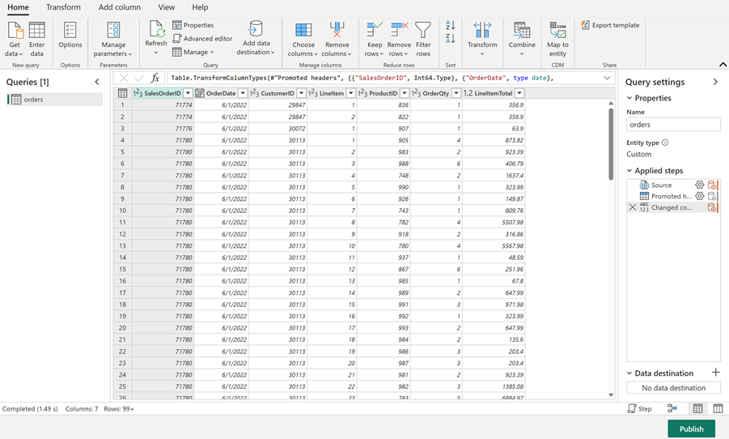
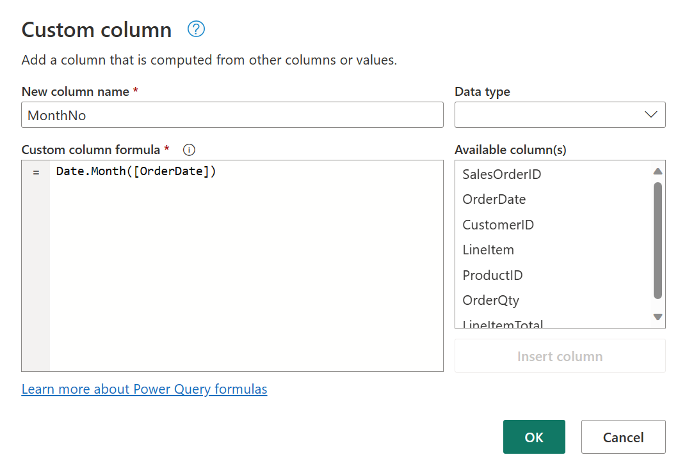
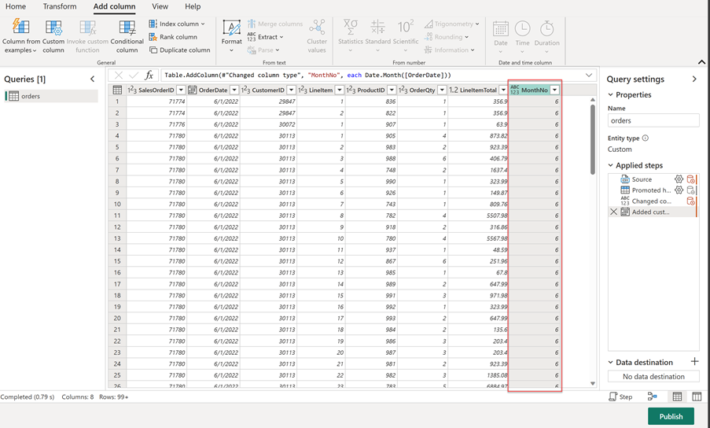
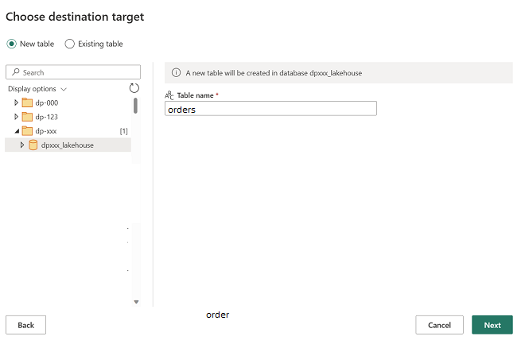
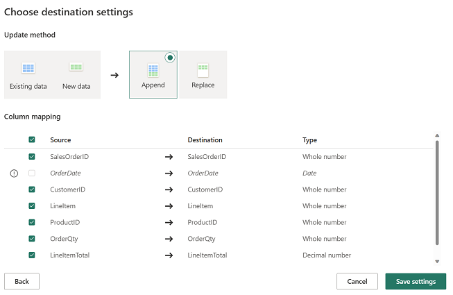
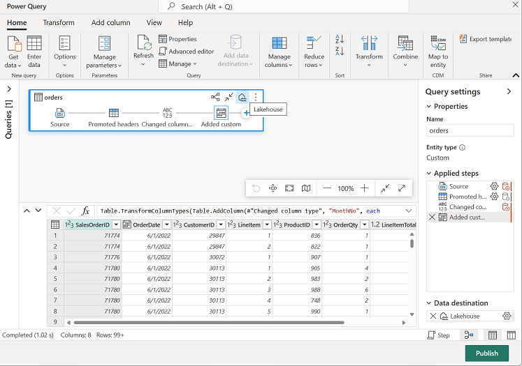
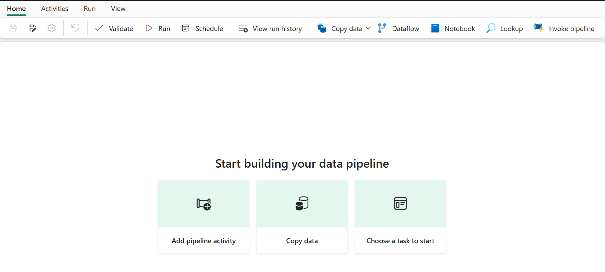

---
lab:
    title: 'Create and use Dataflows (Gen2) in Microsoft Fabric'
    module: 'Use Dataflows (Gen2) in Microsoft Fabric'
---

# Create a Dataflow (Gen2) in Microsoft Fabric

In Microsoft Fabric, Dataflows (Gen2) connect to various data sources and perform transformations in Power Query Online. They can then be used in Data Pipelines or Power BI report development to ingest data into a lakehouse or other analytical store, or to define a dataset for a Power BI report.

## Before you start

You'll need a Power BI Premium subscription with access to the Microsoft Fabric preview.

## Create a workspace

Before working with data in Microsoft Fabric, you should create a workspace with support for premium features.

1. Sign into your Power BI service at [https://app.powerbi.com](https://app.powerbi.com).
2. In the menu bar on the left, select **Workspaces** (the icon looks similar to &#128455;).
3. Create a new workspace with a name of your choice, selecting the **Premium per user** licensing mode.
4. When your new workspace opens, it should be empty, as shown here:

    

## Create a lakehouse

Now that you have a workspace, it's time to switch to the *Data engineering* experience in the portal and create a data lakehouse into which you will ingest data.

1. At the bottom left of the Power BI portal, select the **Power BI** icon and switch to the **Data engineering** experience, as shown here:

    

2. In the **Data engineering** home page, create a new **Lakehouse** with a name of your choice.

    After a minute or so, a new empty lakehouse will be created.

	

## Create a dataflow to ingest data

Now that you have a lakehouse, you need to ingest some data into it. One way to do this is to define a dataflow that encapsulates an *extract, transform, and load* (ETL) process.

1. In the home page for your lakehouse, select **New Dataflow Gen2**. After a few seconds, the Power Query editor for your new dataflow opens as shown here.

	

2. Select **Import from a Text/CSV file**, and create a new data source with the following settings:
	- **Link to file**: *Selected*
	- **File path or URL**: `https://raw.githubusercontent.com/MicrosoftLearning/dp-data/main/orders.csv`
	- **Connection**: Create new connection
	- **data gateway**: (none)
	- **Authentication kind**: Anonymous

3. Select **Next** to preview the file data, and then create the data source. The Power Query editor will show the data source and an initial set of query steps to format the data, as shown here:

	

4. On the toolbar ribbon, select the **Add column** tab. Then select **Custom column** and create a new column named **MonthNo** that contains a whole number based on the formula `Date.Month([OrderDate])` - as shown here:

	

	The step to add the custom column is added to the query and the resulting column is displayed in the data pane:

	

	You can use the Power Query editor to create additional data transformations until you have all the steps you need to generate the desired data structure. For this exercise, we'll assume we only need to add the **MonthNo** column, and go ahead and define a destination into which to load the transformed data.

5. On the toolbar ribbon, select the **Home** tab. Then in the **Add data destination** drop-down menu, select **Lakehouse**.
6. In the **Connect to data destination** dialog box, edit the connection and sign in using your Power BI organizational account to set the identity that the dataflow will use to access the lakehouse.

	

7. Select **Next** and in the list of available workspaces, find your workspace and select the lakehouse you created in it at the start of this exercise. Then specify a new table named **orders**:

	

8. on the **Destination settings** page, select **Append**, and then save the settings.

	

	The **Lakehouse** destination is indicated as an icon in the query in the Power Query editor.

	

9. Select **Publish** to publish the dataflow. Then wait for the **Dataflow 1** dataflow to be created in your workspace.

## Add a dataflow to a pipeline

You can include a dataflow as an activity in a pipeline. Pipelines are used to orchestrate data ingestion and processing activities, enabling you to combine dataflows with other kinds of operation in a single, scheduled process.

1. In the page for your workspace, on the **New** menu, select **Data pipeline**. Then, when prompted, create a new pipeline named **Load data**.

	The pipeline editor opens.

	

	> **Tip**: If the Copy Data wizard opens automatically, close it!

2. Select **Add pipeline activity**, and add a **Dataflow** activity to the pipeline.

3. With the new **Dataflow1** activity selected, on the **Settings** tab, in the **Dataflow** drop-down list, select **Dataflow 1** (the data flow you created previously)

	

4. On the **Home** tab, use the **&#128427;** (*Save*) icon to save the pipeline as **Ingest Sales Data**.
5. Use the **&#9655; Run** button to run the pipeline, and wait for it to complete. It may take a few minutes.

	

6. In the menu bar on the left edge, select the page for your workspace. Then in the list of items in your workspace, select your lakehouse.
7. In the **...** menu for **Tables**, select **refresh**. Then expand **Tables** and select the **sales** table, which has been created by your dataflow.

	

## Clean up resources

If you've finished exploring dataflows in Microsoft Fabric, you can delete the workspace you created for this exercise.

1. In the bar on the left, select the icon for your workspace to view all of the items it contains.
2. In the **...** menu on the toolbar, select **Workspace settings**.
3. In the **Other** section, select **Delete this workspace**.
