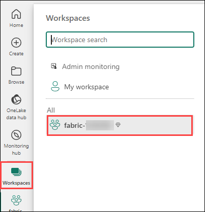
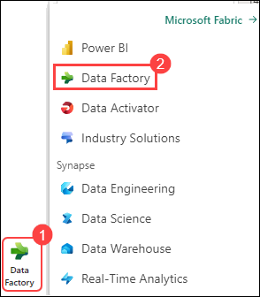
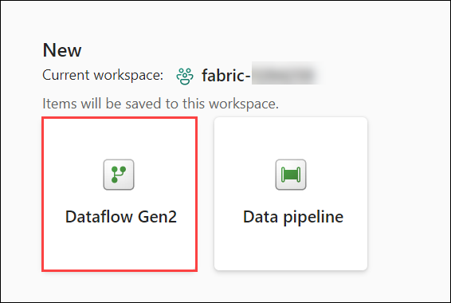
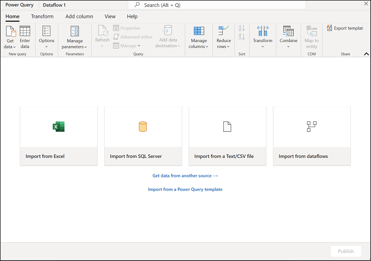
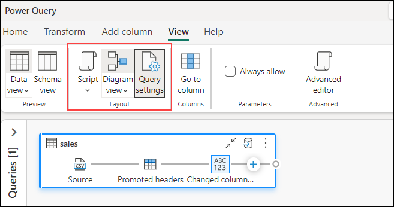
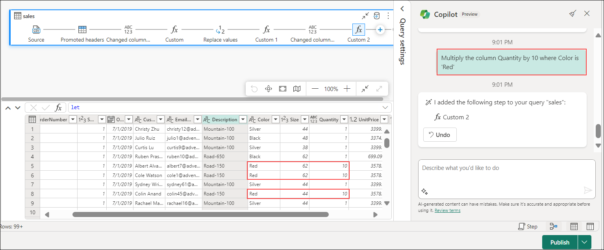

# Data Engineering Ingest Data in Fabric

 In the labs, you'll create a simple data pipeline to bring in customer sales data. You are using the KiZAN Fabric Tenant - where we have Copilot enabled, demonstrate doing the same thing, but by using a new Data Flow Gen2 And leveraging the native integration of Copilot to use natural language to ingest and transform your data.
 
# Create New - Dataflow Gen2

1. Select the workspace **fabric-<inject key="DeploymentID" enableCopy="false"/>** (this is the workspace that mimics the lab environment)

   

1. Select **Data Factory** Object in the workspace.

    

1. In the home page for your workspace, select **New Dataflow Gen2**. 

   

1. After a few seconds, the Power Query editor for your new dataflow opens as shown here.

   

1. Select **Import from a Text/CSV file**, and create a new data source with the following settings:

    - **Create new connection**
    - **Link to file**: *Selected*
    - **File path or URL**: `https://raw.githubusercontent.com/MicrosoftLearning/dp-data/main/sales.csv`
    - **Connection**: Create new connection
    - **data gateway**: (none)
    - **Authentication kind**: Anonymous
    - Click on **Next**.

      

1. On **Preview file data** page, Click on **Create**.

   

1. Click **Copilot** button on Ribbon. 

    

1. To better illustrate all that Copilot is doing for you, let me expand the UI a little to see what's going on behind the scenes.

1. Expand **Query Settings** (these are the steps in the query that bring in the data)

1. **View menu**: Look for the option or menu labeled "View" in the toolbar or menu bar. Click on it to reveal a dropdown menu.

1. **Diagram View**: From the dropdown menu, select "Diagram View." This will switch your view to a visual representation of your code.

1. **Script View**: Once you're in Script View, you should be able to see the M-Code that Copilot has generated. This is the underlying code representation of the actions or commands depicted in the Diagram View.

   

1. Looking at the data… Notice the Item Column.

1. This is really three different fields -- It contains a short description of the item, a color and a size.

1.	The fields are not consistently delimited (' ' and then ',')

1. Let's use Copilot to clean this up:

    ```
   	Add a step that
    ```
    

1. Type the following into Copilot:
 
    ```
    In the Item column, remove the ','
    ```
 
1. The Item column now consistently has a delimiter of **' '**.

   

1. Show the m-code and new query step that the copilot generated.
 
   ```
   Add a step that
   ```
   

1. Type the following into Copilot:
 
    ```
    Split the Item column on the ' ', creating three new fields called Description, Color and Size
    ```
 
1. Three new fields are now created to replace the Item Column.

   
 
1. Show the m-code and new query step that the copilot generated
 
   >**Note:** Copilot can do more than transform the table, we can actually change data as well.

1. Scenario: think Red bikes are going to be a big seller, so increase the quantity in Inventory
Call out that the quantities for all items are 1.
 
1. Add a step to the query:

   ```
   Add a step that
   ```
   

1. Type the following into Copilot:
 
    ```
    Multiply the Quantity column by 10 for all rows where the Color column equals 'Red'. Make sure that the Color column is treated as text and the Quantity column as a number.
    ```
 
1. Show that the quantity field for Red bikes is now 10 instead of 1.

   
 
1. Here is a concise summary highlighting the impacts of Visual Query and M-Query/M-Code scripting:

1. Close the Report.

1. **Visual Query**:
   - **Streamlines data exploration**: Visual Query tools offer intuitive interfaces, enabling users to interact with data visually, and facilitating quicker insights without extensive coding.
   - **Enhances accessibility**: With Visual Query, users with varying technical expertise can extract insights from data, reducing reliance on specialized programming skills and promoting broader data utilization across teams.

2. **M-Query/M-Code scripting**:
   - **Enables advanced data manipulation**: M-Query/M-Code scripting provides a robust framework for performing intricate data transformations and analysis, empowering users to tailor processes to specific requirements beyond the capabilities of visual tools.
   - **Facilitates automation and customization**: Through M-Query/M-Code scripting, users can automate repetitive tasks, build custom functions, and create tailored solutions, increasing efficiency and flexibility in data workflows.

---
Continue to page 10 ...
