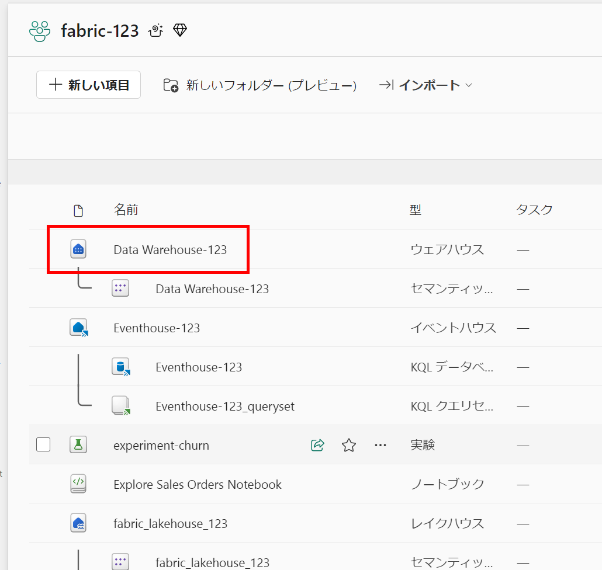
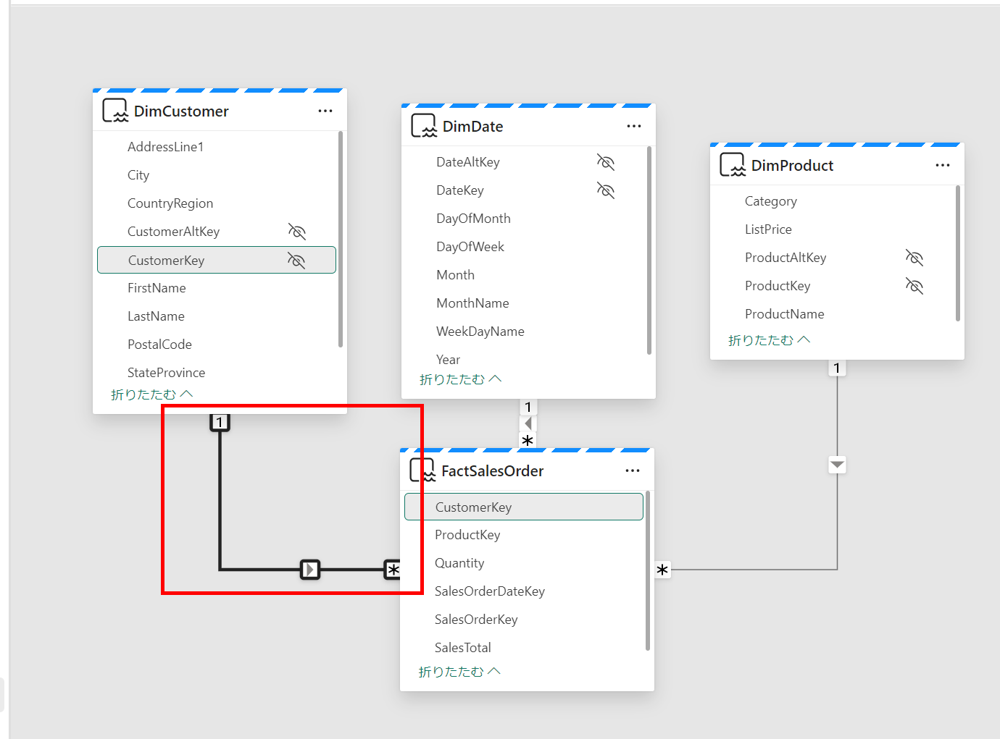
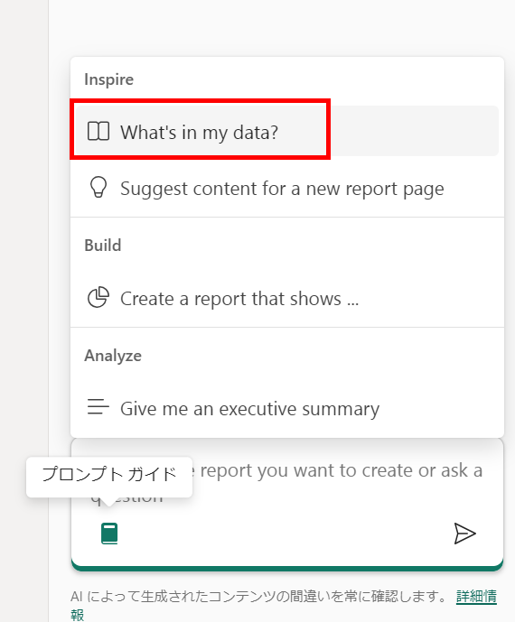
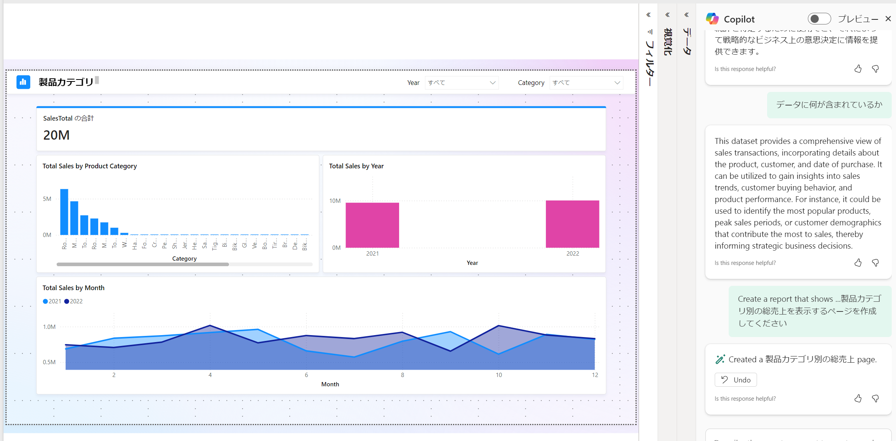
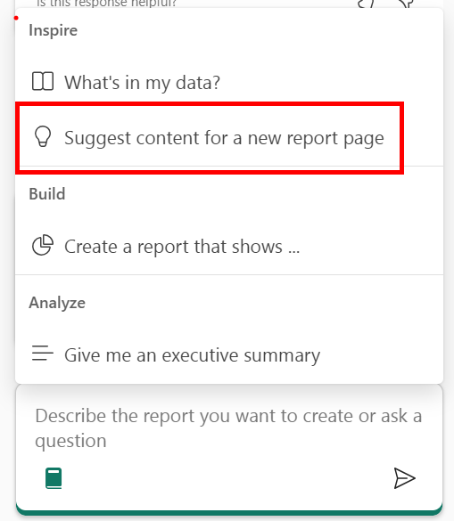
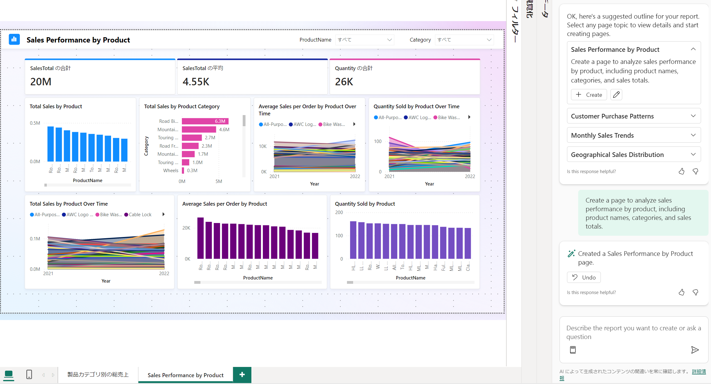
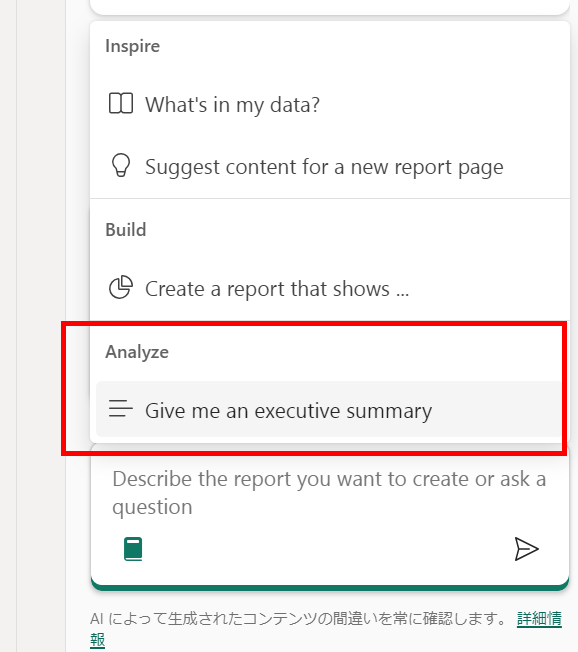

# 演習 07: Fabric Copilot を使用して データウェア内のデータを分析する

### 所要時間: 60分

このラボでは、Fabric Copilotを使用してデータウェアハウス内のデータを分析します。データソースに接続し、クエリを実行し、インサイトを視覚化して情報に基づいた意思決定を行います。

## ラボの目的

次のタスクを完了できるようになります：

- データウェアハウスへの接続  
- データソースの探索  
- データクエリの実行  
- データインサイトの視覚化  
- レポートの生成  
- 調査結果の共有  

1. ワークスペース **fabric-<inject key="DeploymentID" enableCopy="false"/>** を選択します（これはラボ環境を模倣するワークスペースです）

   
 
1. リストから **Data Warehouse<inject key="DeploymentID" enableCopy="false"/>** を選択します。

   

1. **Explorer** ペインで、データウェアハウスの **dbo** スキーマに次の4つのテーブルが含まれていることを確認します：
   
    - **DimCustomer**

    - **DimDate**

    - **DimProduct**

    - **FactSalesOrder**

        

    > **ヒント**: スキーマの読み込みに時間がかかる場合は、ブラウザページをリフレッシュしてください。
 
1. **モデルレイアウト** をクリックすると、データウェアハウス内の異なるテーブル間の関係を表示できます。

    

1. **FactSalesOrder** と **DimCustomer** のリレーションシップをクリックしてそのプロパティにアクセスすると、これら2つのテーブルがどのようにリンクされているかを調べることができます。この関係は、Power BIでクエリや視覚化を行う際に、これらのテーブルのデータをどのように組み合わせたり関連付けたりするかを定義します。

     

    - このリレーションシップは、「FactSalesOrder」テーブルの各レコードが「DimCustomer」テーブルに表される特定の顧客に関連付けられていることを示しています。例えば、「FactSalesOrder」に特定の取引の販売記録がある場合、このリレーションシップを使用して対応する顧客の追加情報を「DimCustomer」テーブルから参照できます。

    - リレーションシップは、Power BIで使用されるセマンティックモデルを定義するために重要です。セマンティックモデルは、データ要素がどのように相互に接続され、Power BI内でどのように解釈されるべきかを概説する設計図として機能します。テーブル間のリレーションシップを確立および定義することで、Power BIにデータを効果的にナビゲートおよび分析する方法を指示しています。
 
1. **レポートタブ** から **新しいレポート** をクリックすると、Power BI内で新しいレポートを作成できます。このレポートは、データウェアハウスで定義されたセマンティックモデルを利用します。
 
   
   

1. データウェアハウスで定義されたセマンティックモデルは、Power BIインターフェイスに反映されます。これには、レポート作成に使用できるデータペイン内のテーブルとそれぞれのフィールドが含まれます。

2. メニュー内で **Copilot** ボタンを見つけてクリックします。

   
    

1. **Welcome to Copilot in Power BI** というポップアップが表示されたら、**Get started** を選択して進みます。

   

2. プロンプトガイドを見つけてクリックし、サンプルとなるプロンプトメニューにアクセスします。(必要に応じてブラウザの翻訳を使用してください。)

   

3. Copilotが提案を提供したり、指示した内容のレポートを生成したり、説明を提供したりする機能を持っていることを確認します。ただし、特定の視覚化を作成したり、ページレイアウトを直接変更したりすることはできない場合があります。

4. **What's in my data(データに何が含まれているか)** を選択すると、Copilotが現在使用しているセマンティックモデルまたはデータセットを分析します。

   
    

   - Copilotの分析によると、データセットには **販売パフォーマンス**、**顧客詳細**、**製品情報**、**クエリパフォーマンス** が含まれており、ビジネス運営の全体像を提供します。これにより、販売トレンド分析、地域パフォーマンス評価、顧客セグメンテーション、製品評価、クエリ最適化などの潜在的なアプリケーションが示唆されます。これは、データセットのコンポーネントと分析技術に対するCopilotの熟練した理解を示しており、戦略的意思決定、顧客エンゲージメント戦略、製品改良、システム強化のための貴重なインサイトを提供します。
    
   - Copilotは、コード生成やデータ操作を超えたAI利用の重要な進展を示しています。特にデータセットの分析を支援する能力は注目に値し、インテリジェントなインサイトと提案を提供してデータ分析プロセス全体を強化します。Copilotを活用することで、ユーザーはデータセット内の貴重なパターンを発見し、得られたインサイトに基づいて情報に基づいた意思決定を行うことができます。これは、AIが人間の能力を拡張し、データ分析手法に革新をもたらす変革の可能性を強調しています。
 
5. 再度プロンプトガイドを見つけてクリックします。
  
   

6. **Create a page that shows(～のレポートページを作成)** をクリックします。

    
    
7. 現時点では、ページやレポートの作成を依頼することしかできません。特定の視覚化を依頼することはできません。
 
8. 次のコマンドをCopilotに入力します：
  
    ```
    製品カテゴリ別の総売上を表示するページを作成してください
    ```
 
9. **コマンドを実行** してCopilotにレポートを生成させます。AI生成の結果は異なる場合があり、何が得られるかは完全には予測できません。

    

   - レポートは、製品カテゴリ全体の総売上の包括的な分析を提供し、39カテゴリ全体で総売上が19.59百万に達する一貫したパターンを示しています。同様に、各カテゴリの販売数量は25.98千ユニットで均一です。平均総売上は4.55千であり、すべてのカテゴリで均等な販売パフォーマンスの分布を示唆しています。この均一性は、多様な製品カテゴリ全体でバランスの取れた販売状況を強調しており、今後のビジネス戦略における情報に基づいた意思決定のための貴重なインサイトを提供します。
   
10.  **Suggest Content for this Report (このレポートのコンテンツを提案してください)** という指示をCopilotに入力します：

   ```
    Suggest Content for this Report
   ```
 
   

11. 各提案を展開して、プロンプトのテキストと作成される内容を確認します。これにより、Copilotが提供できる提案の範囲が示されます。
 
12. 通常、作業に適したレポートである **販売パフォーマンス分析** レポートを選択します。生成されるレポートは異なる場合があります。
 
   
  
    >**注:** **編集ボタン** をクリックして、指示を調整することができます。
   
   
13. **Give me an executive summary (エグゼクティブサマリーをください)** を選択します：

   ```
    Give me an executive summary
   ```

   

14. サマリーは、2021年から2022年の売上収益データの概要を提供し、年々の増加を強調し、収益成長を牽引する主要な月と地域を特定します。2022年は、米国の強力なパフォーマンスにより、総収益に大きく貢献しています。

15. レポートを **サンプル** として保存します。

## まとめ

このラボでは、Fabric Copilotを使用してデータウェアハウスに接続し、利用可能なデータセットを探索しました。インサイトを抽出するためにクエリを実行し、効果的な分析のために視覚化を作成しました。最後に、調査結果をレポートにまとめ、チームメンバーに共有できるように保存しました。

### ラボを正常に完了しました。次の演習に進むには「次へ >>」をクリックしてください。

