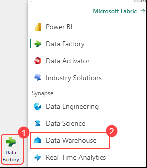

# Data Warehouse Analyze Data in a Warehouse

1. Select the workspace **fabric-2024001** (this is the workspace that mimics the lab environment)

1. Select **Data Warehouse** Object in the workspace (this is the same data warehouse students will create)

    
 
1. Briefly show tables and data

   -	These are tables you will create in the labs
 
1. Click Model and show Relationships
 
1. Right click relationship between **FactSalesOrder** and **DimCustomer** - Properties.

   -	Explain relationships and what's going on
   -	This helps defines the Semantic Model used by Power BI
 
1. Click  **New Report**
1. Call out the Semantic Model and Tables in the Data Pane
1. The PBI Semantic Model matches the model defined in Fabric.
1. Click Copilot.
1. Click Copilot Logo.
1. Explain the things Copilot can and can't do - can't create specific visual or change a page, etc., etc.

1. Click **"What's in my dataset"**
    -	Discuss the results from Copilot and how it has analyzed the Semantic model to understand what is possible
    -	This is a very simple model and it's fairly obvious what it could be used for
    -	Copilot analysis could be very valuable with a larger, complicated model
    
1. AI used not just on your data or to generate code, but to help Analyze you Data
 
1. Click on the **Copilot logo** in the text box to get an idea of the things you can do.
 
1. Click "Create a page that shows"
   
1. At this time, you can only ask for a page or report to be created. You can't ask for specific visuals.
 
1. Type the following into Copilot:
  
    ```
    Create a page that shows "Total Sales by Product Category"
    ```
 
1. This mimics a report that you will create shortly, but we're going to have Copilot do it for us 
Mention again that AI can generate different results and you're never sure what you're going to get
 
1. Hope you get a decent report and show it briefly and then undo/remove… 
1. Just want to show that Copilot can build a complete report, but not intended to go into depth on the report.
 
1. While this is helpful, at times its hard to even know where to start. Copilot can be especially useful as a way to examine the model and tell you what types of questions the model will answer
 
1. Click the copilot logo and select:

    ```
    Suggest Content for this Report - GO
    ```
 
1. Expand each suggestion to show the text of the prompt and what will be created.
 
1. Sales Orders Trends is usually a decent report you can work with (it can always  be different and you might not get a good report).
 
1. Click **Edit** to show you can adjust the query.

1. Show a few generated reports.

    >**Note:** This is a report that you can change just like you would any other report. Demonstrate this by changing one of the visuals.
 
1. Sales Order Trends Report - One of the visuals usually has a field that can be adjusted.

    - Delete the **DayName field** and add **MonthName**
    - Visual is not by month and not day
  
1. Delete a visual that isn't helpful to create space on the page
 
1. Add new **Narrative** Visualization in the space you just created
 
1. Click **Copilot** in the visual.

1. **Clear** input box.
1. Select - Executive Summary.

1. Click through the footnotes to show where the text in the narrative comes from in the report.

1. Bulleted List of Insights.
1. Click footnotes to show where in the report the item comes from.
 
Explain how Copilot is analyzing the visuals in the report to generate text to explain the report
This is true Generative AI building new content from existing data
