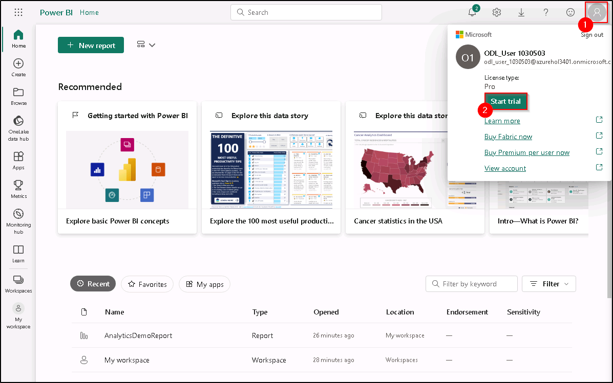
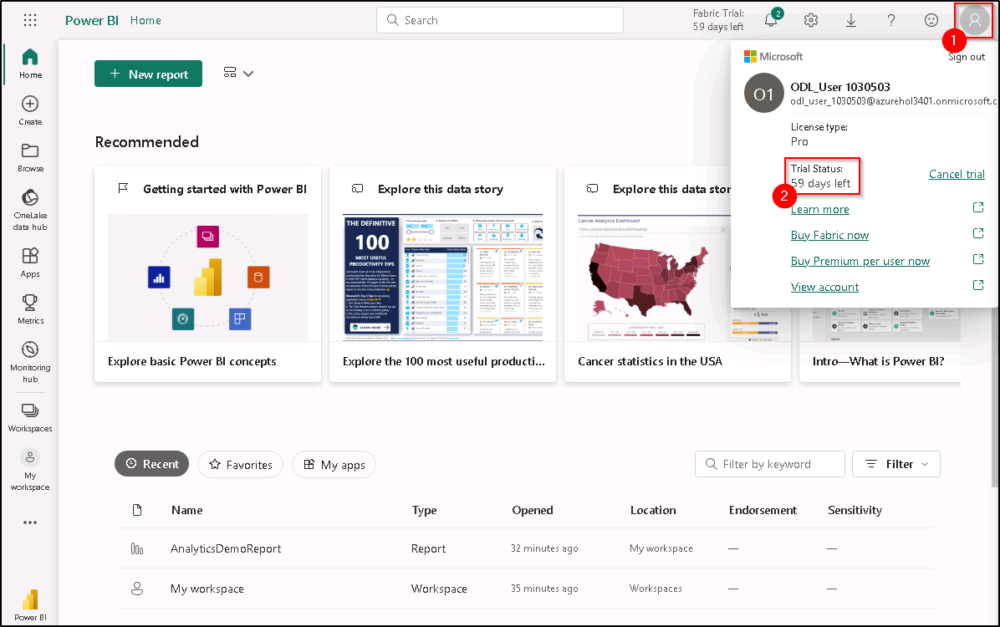
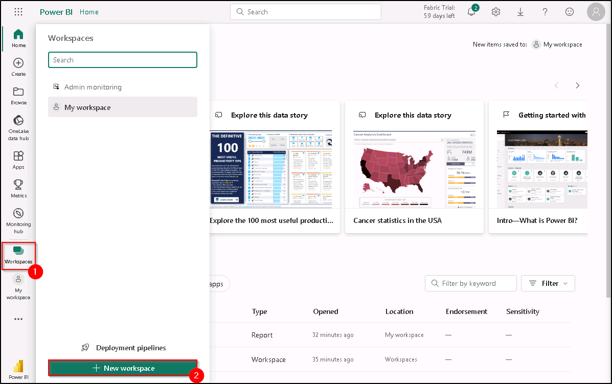
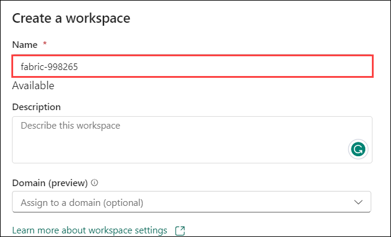
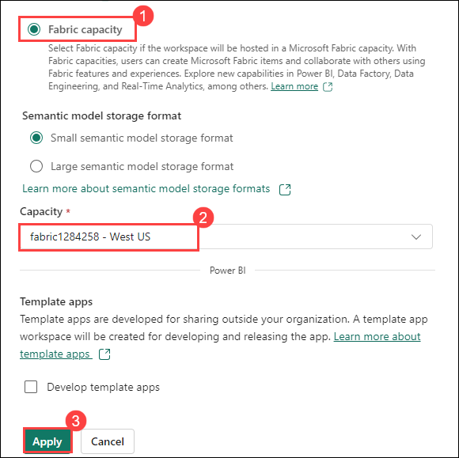

## Create a Fabric workspace

#### Task 1.1: Sign up for Microsoft Fabric Trial

1. Copy the **Power BI homepage link**, and open this link inside the VM in a new tab.

   ```
   https://powerbi.com
   ```

   >**Note**: In case a sign-up page asks for a phone number, you can enter a dummy phone number to proceed.

2. Select **Account manager (1)**, and click on **Start trial (2)**.

   

3. A new prompt will appear asking you to **Upgrade to a free Microsoft Fabric trial**, click on **Start trial (1)**.

   

4. Once your trial capacity is ready, you receive a confirmation message. Select **Got it (1)** to begin working in Fabric.

   

6. Now, open **Account manager (1)** again, and verify **Trial Status (2)**.

   

----

#### Task 1.2: Create a workspace

Here, you create a Fabric workspace. The workspace contains all the items needed for this lakehouse tutorial, which includes lakehouse, dataflows, Data Factory pipelines, notebooks, Power BI datasets, and reports.

1.  Now, select **Workspaces** and click on **+ New workspace**.

    

2. Fill out the **Create a workspace** form with the following details:

   - **Name:** Enter **Fabric-<inject key="DeploymentID" enableCopy="false"/>**

      

   - **Advanced:** Expand it and Under **License mode**, select **Frabric capacity (1)**, Under **Capacity** Select **Fabric<inject key="DeploymentID" enableCopy="false"/>-Microsoft fabric region (2)** and click on **Apply (3)** to create and open the workspace.

      

Congratulations! You have successfully learned to create a Fabric workspace.

----

*Continue to page 3 ...*
