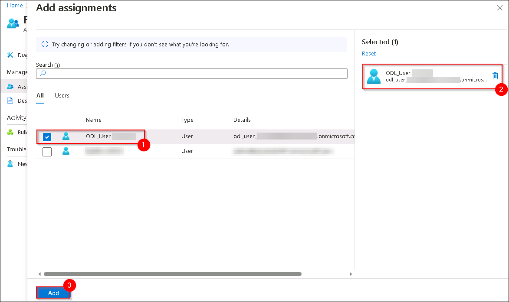
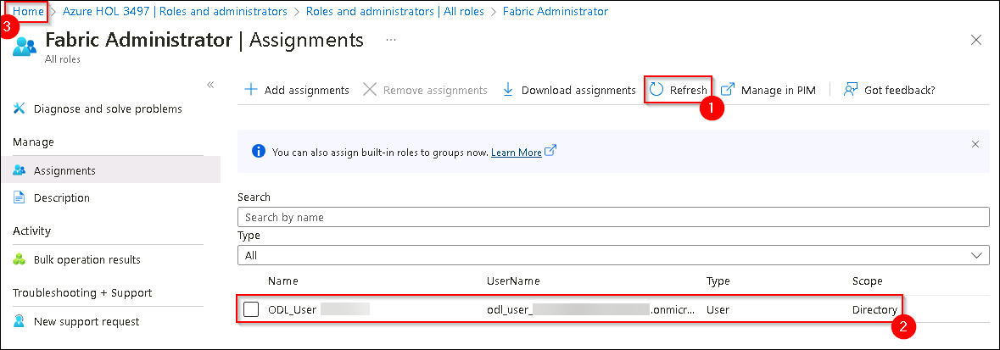
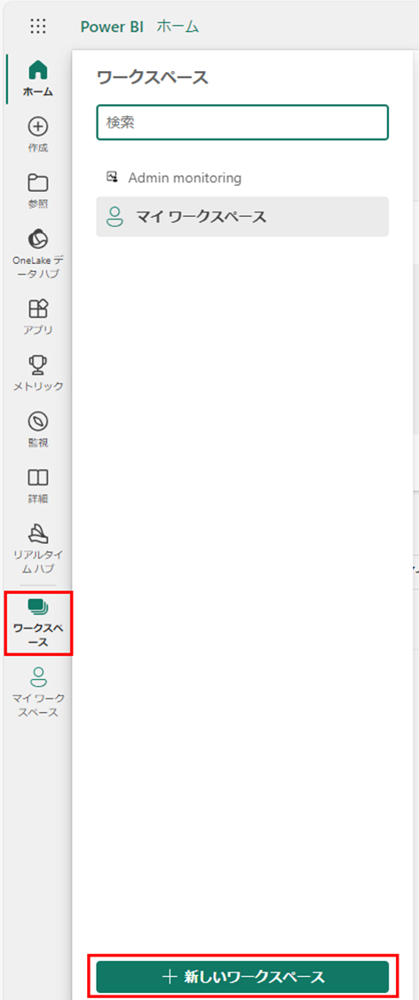
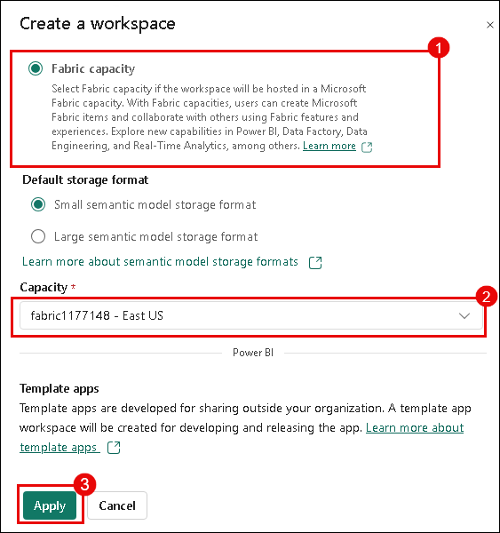

### Create a Fabric workspace


#### Task 1.1: Assign Fabric Administrator Role

1. Start by searching for **Microsoft Entra ID** in the search pane in Azure portal:

   

2. Navigate to **Roles and administrators**:

   

3. In the **Roles and administrators** page, search for **Fabric Administrator**, and click on it:

   

4. This will take you to the **Fabric Administrator | Assignments** page where you will have to assign yourself the **Fabric Administrator role**. Now, click on **+ Add Assignments (1)**:

   

5. Make sure to **check the box(1)** next to your username, confirm if it is **Selected(2)** and click on **Add(3)**:

   

6. You can confirm the **Fabric Administrator** role has been added successfully by **refreshing(1)** Fabric Administrators | Assignments page. After **confirming(2)** it has been added successfully, navigate back to **Home(3)**.

   

----

#### Task 1.2: Sign up for Microsoft Fabric Trial

1. Copy the **microsoft fabric homepage link**, and open this link inside the VM in a new tab:

   ```
   https://app.fabric.microsoft.com/
   ```


2. Select **Power BI**.

   

3. On the Microsoft Fabric page, enter your **Email**(1) and click on **SUBMIT**(2). This will check if you need to create a new account.

    

4. Now let’s get started by signing into Microsoft Fabric. Click on **Sign In**.

   

5. Once you’ve clicked on Sign in, a new window will appear asking you to enter your **Password** and then click on **Sign In**.

   

6. On the Stay Signed In window, click on **YES**.

   

7. In the Create Your Account section, enter the required fields **(1)** & **(2)** and click on **GET STARTED**(3). 

   

8. You have now successfully created your Microsoft Fabric account. Click on **GET STARTED**.

   

#### Task 1.3: Create a workspace

Here, you create a Fabric workspace. The workspace contains all the items needed for this lakehouse tutorial, which includes lakehouse, dataflows, Data Factory pipelines, the notebooks, Power BI datasets, and reports.

1.  Now, select **Workspaces** and click on **+ New workspace**:

    

2. Fill out the **Create a workspace** form with the following details:

   - **Name:** Enter **fabric-<inject key="DeploymentID" enableCopy="false"/>**.
   

   

   - **Advanced:** Expand it and Under **License mode**, select **Fabric capacity(1)**.

3. Select on exisitng **Capacity(2)** then click on **Apply(3)** to create and open the workspace.

   

    **Congratulations!** You have successfully learnt to create a Fabric workspace.

   ## Proceed to next exercise
