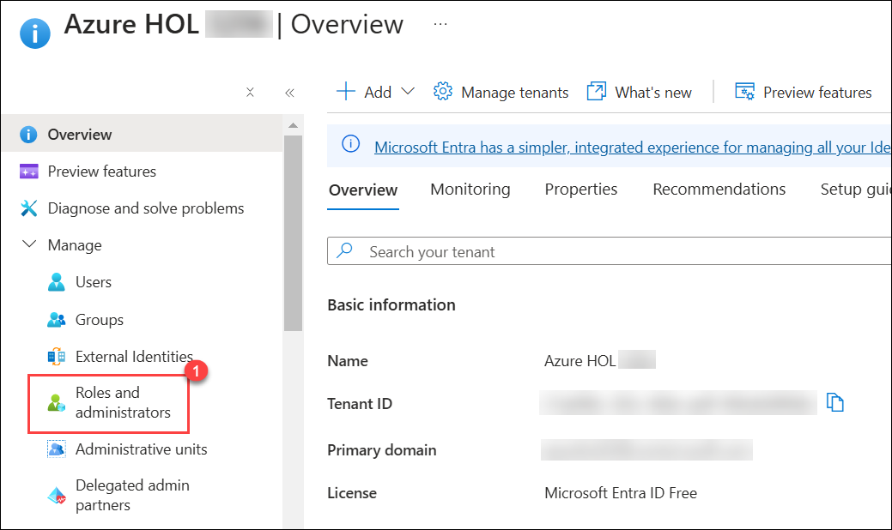
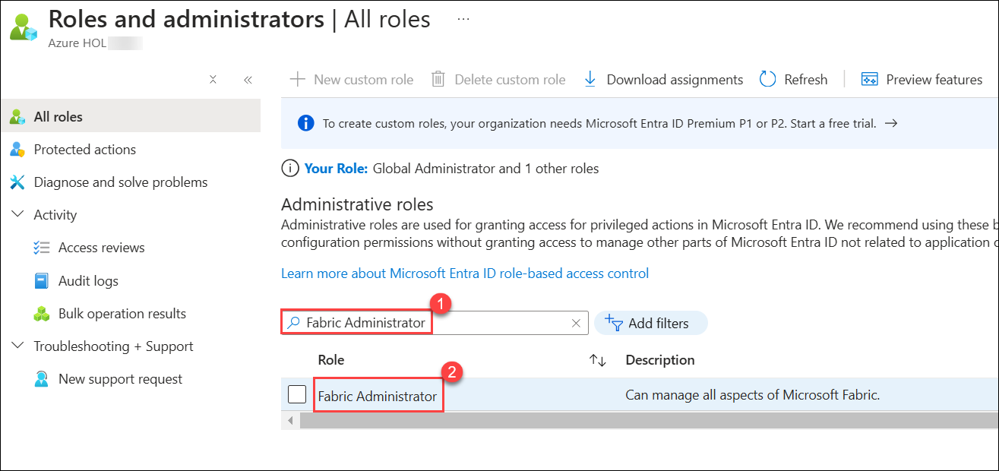
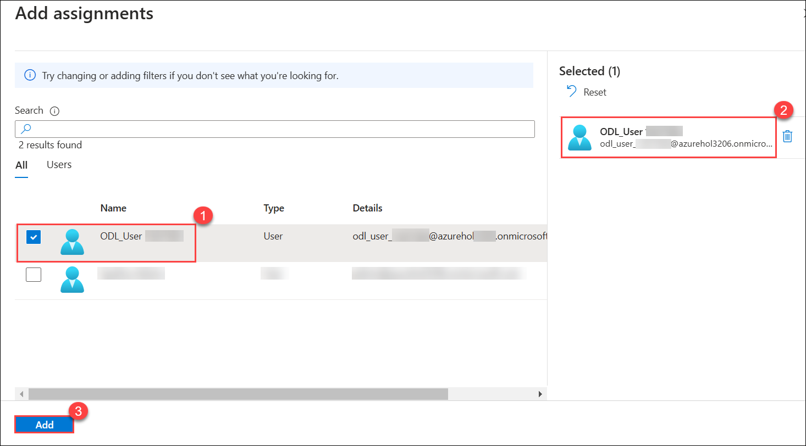
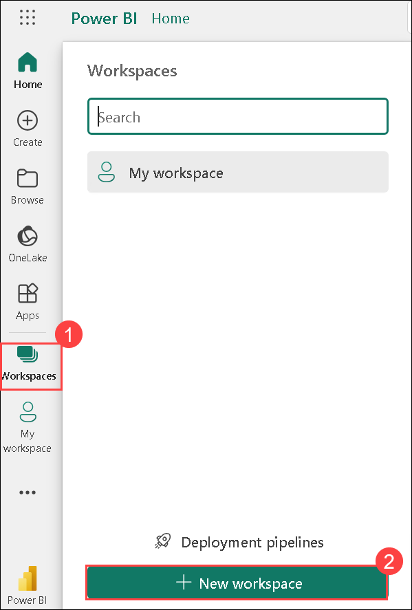

# Exercise 1: Create a Fabric workspace

### Estimated Duration: 40 minutes

Microsoft Fabric lets you set up workspaces depending on your workflows and use cases. A workspace is where you can collaborate with others to create reports, notebooks, lakehouses, etc. This lab will introduce you to creating a workspace in Microsoft Fabric. You will learn how to set up a workspace, which serves as a collaborative environment for organizing and managing your projects, data, and resources.

## Lab objectives

You will be able to complete the following tasks:

- Task 1: Assign Fabric Administrator Role
- Task 2: Sign up for Microsoft Fabric Trial
- Task 3: Create a workspace
  
### Task 1: Assign Fabric Administrator Role

1. In the Azure portal, type **Microsoft Entra ID (1)** in the search box and select **Microsoft Entra ID (2)** from the results.

   

2. Navigate to **Roles and administrators (1)** under the **Manage** section.

   

3. In the **Roles and administrators** page, type **Fabric Administrator (1)** in the search box and select **Fabric Administrators (2)** from the results.

   

4. This will take you to the **Fabric Administrator | Assignments** page where you will have to assign yourself the **Fabric Administrator role**. Now, click on **+ Add assignments (1)**.

   

5. Make sure to **check the box (1)** next to your username, confirm if it is **Selected (2)** and click on **Add (3)**.

   

6. You can confirm the **Fabric Administrator** role has been added successfully by **Refresh (1)** Fabric Administrators | Assignments page. After **confirming (2)** it has been added successfully, navigate back to **Home (3)**.

   

### Task 2: Sign up for Microsoft Fabric Trial

In this task, you will initiate your 60-day free trial of Microsoft Fabric by signing up through the Fabric app, providing access to its comprehensive suite of data integration, analytics, and visualization tools

1. Copy the **Power BI homepage link**, and open this link inside the VM in a new tab.

   ```
   https://powerbi.com
   ```

   >**Note**: In case a sign-up page asks for a phone number, you can enter a dummy phone number to proceed.

1. Select **Account manager (1)**, and click on **Free trial (2)**.

     

1. A new prompt will appear asking you to **Activate your 60-day free Fabric trial capacity**, click on **Activate**.

      

1. Click on **Stay on current page** when prompted.

      

1. Now, open **Account manager (1)** again, and verify **Trial Status (2)**.

      
      
### Task 3: Create a workspace

Here, you create a Fabric workspace. The workspace contains all the items needed for this lakehouse tutorial, which includes lakehouse, dataflows, Data Factory pipelines, notebooks, Power BI datasets, and reports.

1. Now, select **Workspaces (1)** and click on **+ New workspace (2)**.

    

1. Fill out the **Create a workspace** form with the following details:
 
   - **Name:** Enter **fabric-<inject key="DeploymentID" enableCopy="false"/>**
 
      
 
   - **Advanced:** Expand it and Under **License mode**, select **Fabric capacity (1)**, Under **Capacity** Select available **fabric<inject key="DeploymentID" enableCopy="false"/> - <inject key="Region"></inject>(2)** and click on **Apply (3)** to create and open the workspace.
 
      


### Summary

In this exercise, you have assigned Fabric Administrator Role, signed up for the for Microsoft Fabric Trial and created a workspace

### You have successfully completed the lab
