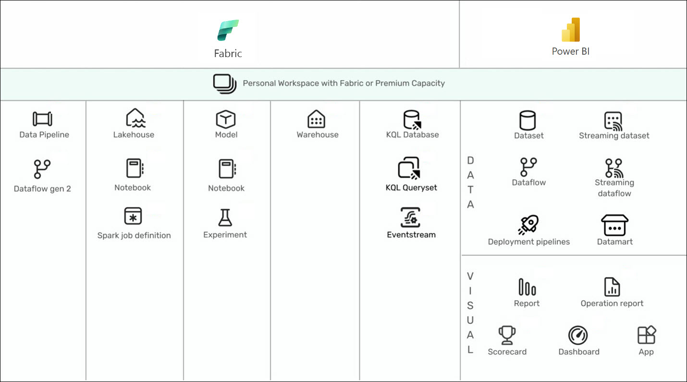
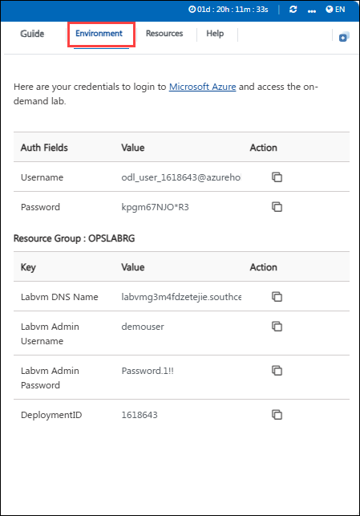
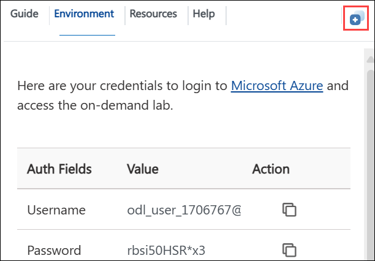
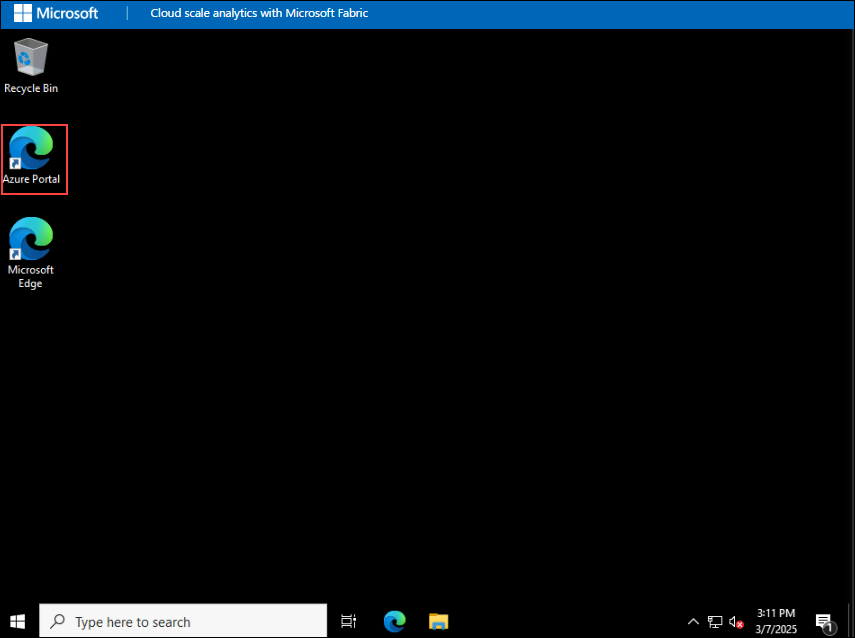
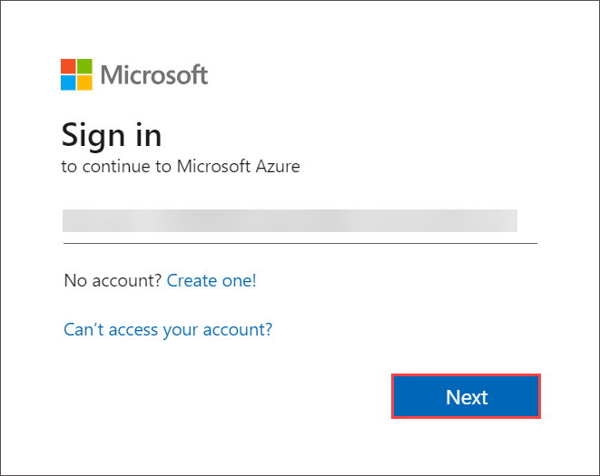
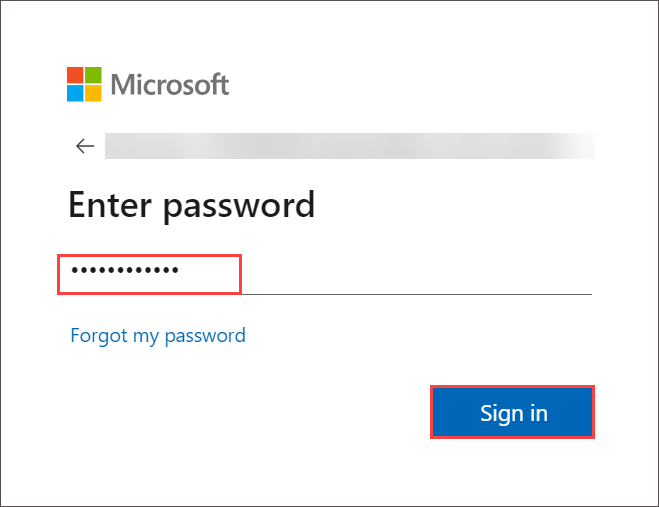

# Cloud scale analytics with Microsoft Fabric

### Overall Estimated Duration: 8 Hours

## Overview

This lab introduces you to creating a workspace in Microsoft Fabric, a collaborative environment for organizing and managing projects, data, and resources. You will learn how to set up a workspace, create data pipelines for ETL/ELT processes, and use Apache Spark for data processing. Additionally, you will create a notebook to train a machine-learning model to predict customer churn using Scikit-Learn and MLflow. You will also explore dataflows in Microsoft Fabric to connect to various data sources, perform transformations, and define datasets for Power BI reports.

## Objective

By the end of this lab, you will be able to:

- **Create a Fabric workspace** : Learn to create and configure a collaborative workspace in Microsoft Fabric to efficiently manage projects, data, and resources. As part of this exercise, you will successfully assign the Fabric Administrator role, sign up for a Microsoft Fabric trial, and create a workspace. This will enable you to manage your environment and start exploring Fabric's capabilities effectively.
- **Ingest data with a pipeline in Microsoft Fabric** : Implement and manage data ingestion in Microsoft Fabric using ETL/ELT pipelines and Apache Spark for scalable analytics. By completing the tasks in this exercise, users will enable Copilot inside a Codespace, explore shortcuts, create a pipeline and notebook, use SQL to query tables, create a visual query, and generate a report. This exercise builds proficiency in essential Microsoft tools and features.
- **Analyze data in a data warehouse** : Understand how Microsoft Fabric's data warehouse enables full SQL functionality, including insert, update, and delete operations, for large-scale analytics. By completing this exercise, you will have created a data warehouse, populated it with data, defined a model, queried tables, created a view, and visualized your data.
- **Get started with Real-Time Analytics in Microsoft Fabric** : Use Microsoft Fabric’s Kusto Query Language (KQL) for efficient storage and querying of time-series data, including real-time logs and IoT information. Upon completing this exercise, you will have created a KQL database, queried a sales table using KQL, generated a Power BI report from a KQL Queryset, and utilized delta tables for streaming data. This will enhance your skills in data querying, visualization, and real-time data management within Microsoft Fabric.
- **Use notebooks to train a model in Microsoft Fabric** : Discover how to use Microsoft Fabric’s Kusto Query Language (KQL) for efficient storage and querying of time-series data, including real-time logs and IoT information. In this exercise, you'll build a lakehouse, upload files, create a notebook, train a machine learning model, use MLflow to track experiments, and save your work, concluding with ending the Spark session.
- **Data Engineering Ingest Data in Fabric with Fabric Copilot** : Streamline the process of ingesting diverse data sources into Fabric using Fabric Copilot for efficient data management. In this exercise, you completed tasks to connect to data sources, configure ingestion settings, ingest data into Fabric, monitor the ingestion process, validate the ingested data, and document the entire process.
- **Analyze Data in a Warehouse with Fabric Copilot** : Leverage Fabric Copilot to enhance data analysis capabilities in a warehouse, enabling insightful decision-making through advanced analytics. In this exercise, you completed tasks to connect to the data warehouse, explore data sources, run data queries, visualize data insights, generate reports, and collaborate on findings.
- **Analyze data with Apache Spark** : Use Microsoft Fabric to train and track a customer churn prediction model with Scikit-Learn and MLflow. After completing this exercise, you will have set up a lakehouse, uploaded and explored data, used Spark for transformation and visualization, and effectively managed your notebook and Spark session. This will demonstrate your ability to integrate and analyze data through multiple stages using advanced tools and techniques.
- **Create a Dataflow (Gen2) in Microsoft Fabric** : Master Apache Spark for flexible, distributed data processing and analysis across platforms like Azure HDInsight and Databricks. Successfully created a Dataflow (Gen2) to ingest data, configured its destination, and integrated it into a pipeline. This streamlined the data ingestion and processing workflow within your environment.
  
## Pre-requisites

- **Fundamental Knowledge of Data Engineering**: Understanding ETL/ELT and data pipelines
- **Programming Skills**: Familiarity with Python, SQL, or similar languages
- **Basic Understanding of Data Visualization**: Experience with tools like Power BI

## Architecture

In Microsoft Fabric, the workflow begins with creating a Fabric workspace to manage projects, data, and resources collaboratively. Next, ingest data with a pipeline using ETL/ELT processes and Apache Spark for scalable data integration. Once data is ingested, it is stored in the data warehouse, which supports full SQL functionality for extensive analytics. For real-time data processing, get started with Real-Time Analytics using Kusto Query Language (KQL) to handle time-series data like real-time logs and IoT information. Use notebooks to train machine learning models, such as a customer churn prediction model, using Scikit-Learn and MLflow. Finally, create a Dataflow (Gen2) to leverage Apache Spark for distributed data processing and analysis across platforms like Azure HDInsight and Databricks.

## Architecture Diagram

  

## Explanation of Components

1. **Data Pipeline**: Orchestrates and automates data movement and transformation workflows using a visual interface. Ideal for building ETL (Extract, Transform, Load) processes across multiple data sources.

2. **Dataflow Gen 2**: A self-service data preparation tool that allows users to create reusable data transformation pipelines, optimized for performance and scalability within the Microsoft Fabric ecosystem.

3. **Lakehouse**: Combines the benefits of data lakes and data warehouses by supporting open data formats and structured querying, making it suitable for both analytics and machine learning workloads.

4. **Notebook** (under Lakehouse and Model): Interactive development environment that supports languages like PySpark, SQL, and others, enabling data exploration, transformation, and visualization.

5. **Spark Job Definition**: Defines distributed data processing tasks using Apache Spark, allowing for scalable data transformations and advanced analytics over large datasets.

6. **Model**: Semantic layer that organizes and defines business logic, relationships, and KPIs for your data, used for consistent analysis and reporting across tools.

7. **Experiment**: Enables tracking and managing of machine learning experiments, including metrics and model versions, facilitating reproducibility and performance comparison.

8. **Warehouse**: Provides scalable, high-performance storage and full SQL functionality for large-scale analytics. It supports complex queries, including insert, update, and delete operations, to efficiently handle extensive data sets.

9. **KQL Database**: Optimized for real-time telemetry and log data, it uses the Kusto Query Language (KQL) for fast, scalable analysis of time-series and event data.

10. **KQL Queryset**: A collection of saved KQL queries that users can organize and reuse, enabling collaborative analytics and faster insights on streaming or log data.

11. **Eventstream**: Captures, transforms, and routes real-time events from multiple sources for real-time processing, analytics, or storage in various destinations.

12. **Dataset**: A curated set of data ready for reporting and visualization, often used in Power BI to build interactive dashboards and reports.

13. **Streaming Dataset**: Allows real-time data to be pushed into Power BI dashboards, enabling up-to-the-second updates on live data feeds.

14. **Dataflow**: A tool for ETL operations in Power BI, enabling users to transform and load data into reusable tables using Power Query.

15. **Streaming Dataflow**: Enhances Dataflow with support for real-time streaming data, enabling transformation and analysis as data arrives.

16. **Deployment Pipelines**: Supports DevOps practices by enabling version control, testing, and promotion of Power BI content across development, test, and production environments.

17. **Datamart**: A self-service analytics solution that combines data storage, transformation, and querying capabilities with integrated Power BI for quick data insights.

18. **Report**: Visual representation of data using various charts and graphs, enabling users to interact with and analyze their data.

19. **Operation Report**: A specialized type of report focused on monitoring and tracking operational metrics and KPIs.

20. **Scorecard**: Tool to define, track, and visualize key performance indicators (KPIs) and business goals over time.

21. **Dashboard**: A single-pane view that aggregates visuals and reports from multiple datasets, offering quick insights and real-time monitoring.

22. **App**: A collection of related Power BI content (reports, dashboards, datasets) packaged for easy sharing and access across teams or organizations.

# Getting Started with the Lab

1. Once the environment is provisioned, a virtual machine (JumpVM) and lab guide will get loaded in your browser. Use this virtual machine throughout the workshop to perform the lab. You can see the number on the bottom of the **Lab guide** to switch to different exercises of the lab guide.

   

1. To get the lab environment details, you can select the **Environment** tab. Additionally, the credentials will also be emailed to your registered email address.

   

2. Utilizing the Split Window Feature: For convenience, you can open the lab guide in a separate window by selecting the **Split Window** button from the top right corner.

   

   > You will see the DeploymentID value on the **Environment** tab, use it wherever you see SUFFIX or DeploymentID in lab steps.

## Utilizing the Zoom In/Out Feature

To adjust the zoom level for the environment page, click the A↕ : 100% icon located next to the timer in the lab environment.

   

## Managing Your Virtual Machine
 
Feel free to start, stop, or restart your virtual machine as needed from the **Resources** tab. Your experience is in your hands!

   

## Login to Azure Portal

1. In the JumpVM, click on the **Azure portal** shortcut of the Microsoft Edge browser which is created on the desktop.

   
   
1. On the **Sign-in into Microsoft Azure** tab you will see the login screen, in that enter the following email/username and then click on **Next**. 
   * Email/Username: <inject key="AzureAdUserEmail"></inject>

     
     
1. Now enter the following password and click on **Sign in**.
   * Password: <inject key="AzureAdUserPassword"></inject>
   
     
     
1. If you see the pop-up **Stay Signed in?**, click **No**.

## Steps to Proceed with MFA Setup if "Ask Later" Option is Not Visible

1. At the **"More information required"** prompt, select **Next**.

1. On the **"Keep your account secure"** page, select **Next** twice.

1. **Note:** If you don’t have the Microsoft Authenticator app installed on your mobile device:

   - Open **Google Play Store** (Android) or **App Store** (iOS).
   - Search for **Microsoft Authenticator** and tap **Install**.
   - Open the **Microsoft Authenticator** app, select **Add account**, then choose **Work or school account**.

1. A **QR code** will be displayed on your computer screen.

1. In the Authenticator app, select **Scan a QR code** and scan the code displayed on your screen.

1. After scanning, click **Next** to proceed.

1. On your phone, enter the number shown on your computer screen in the Authenticator app and select **Next**.
       
1. If prompted to stay signed in, you can click **No**.

1. If a **Welcome to Microsoft Azure** popup window appears, click **Cancel** to skip the tour.
 
1. Now, click on the **Next** from the lower right corner to move to the next page.

This hands-on-lab demonstrates how to create and manage a workspace in Microsoft Fabric, including setting up data pipelines and using Apache Spark. You’ll also train a machine-learning model and explore dataflows for Power BI reports.

## Support Contact

The CloudLabs support team is available 24/7, 365 days a year, via email and live chat to ensure seamless assistance at any time. We offer dedicated support channels tailored specifically for both learners and instructors, ensuring that all your needs are promptly and efficiently addressed.

Learner Support Contacts:

- Email Support: cloudlabs-support@spektrasystems.com
- Live Chat Support: https://cloudlabs.ai/labs-support

    Now, click on Next from the lower right corner to move on to the next page.

## Happy Learning!!