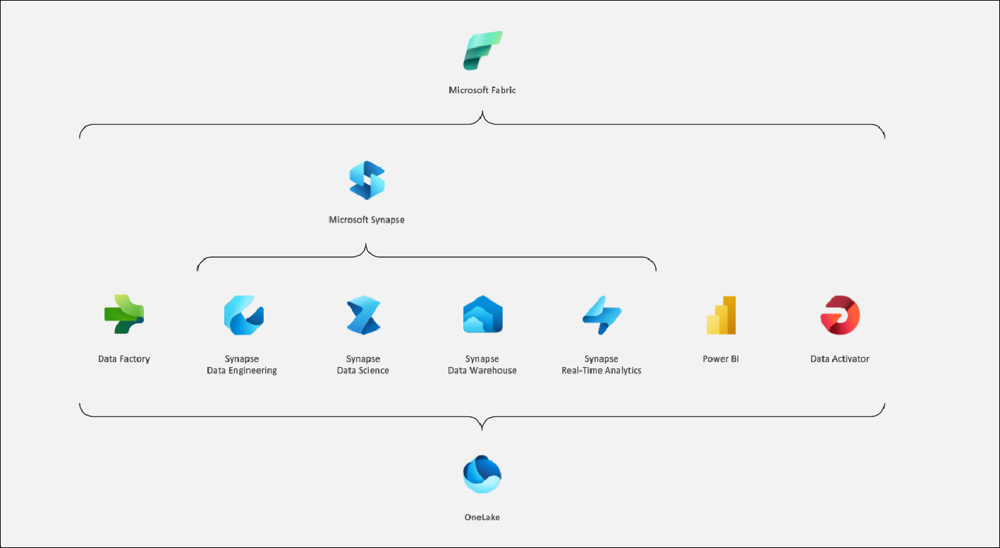
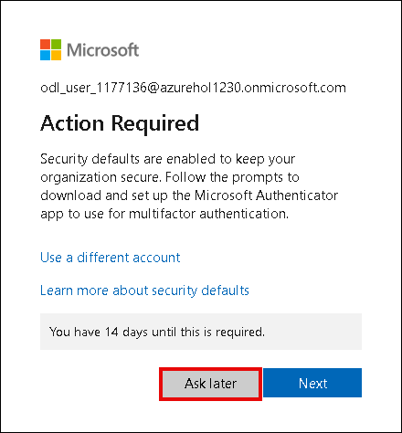

# Cloud scale analytics with Microsoft Fabric

### 全体の推定所要時間: 8時間

## 概要

あるグローバルなeコマース企業は、Microsoft Fabricを使用してクラウド規模の分析を行い、膨大な顧客取引データを処理および分析しています。彼らは、取引情報の継続的な取り込みのためにデータパイプラインを設定し、それをスケーラブルなデータウェアハウスに保存します。リアルタイム分析はライブデータストリームを監視して即時の洞察を提供し、Apache Sparkはデータに対して複雑な分析と機械学習を行います。Dataflows Gen2はデータのクリーンアップと変換に使用され、インタラクティブなノートブックはデータサイエンティストが動的にデータを探索しモデル化することを可能にします。この統合されたアプローチにより、企業はリアルタイムでデータ駆動の意思決定を行い、戦略を効果的に最適化することができます。

Microsoft Fabricを使用したクラウド規模の分析により、組織は膨大なデータを効率的かつ効果的に処理、分析、洞察を得ることができます。

## 目的

このラボは、参加者がデータを管理するためのワークスペースを作成し、パイプラインを介してデータを取り込み、データウェアハウスで分析し、リアルタイム分析を実行し、ノートブックを使用してモデルをトレーニングし、Apache Sparkを活用して複雑な分析を行い、Dataflow Gen2を使用して高度なデータ変換を設計する実践的な経験を提供することを目的としています。

1. **Fabric ワークスペースの作成:** Microsoft Fabricでデータプロジェクトを管理および共同作業するための集中環境を設定します。参加者はデータプロジェクトを管理および共同作業するための集中プラットフォームを確立します。

1. **Microsoft Fabricでパイプラインを使用してデータを取り込む:** データパイプラインを使用して、Microsoft Fabric内でデータをインポートおよび準備します。参加者は、後続の分析のためにデータのインポートと準備を自動化します。

1. **データウェアハウスでデータを分析する:** Microsoft Fabric内のデータウェアハウスに保存された大規模なデータセットに対して複雑なクエリと洞察を実行します。参加者は、大規模なデータセットから洞察を得るために複雑なクエリを実行します。

1. **Microsoft Fabric でリアルタイム分析を開始する:** ライブデータストリームから即時の洞察を得るためにリアルタイムデータ処理と分析を実装します。参加者は、ライブデータストリームから即時の洞察と意思決定を可能にします。

1. **Microsoft Fabric でノートブックを使用してモデルをトレーニングする:** インタラクティブなノートブックを使用して、Microsoft Fabric内で機械学習モデルを開発、トレーニング、およびテストします。参加者は、インタラクティブに機械学習モデルを開発および改良します。

1. **Apache Spark を使用してデータを分析する:** Apache Sparkの分散コンピューティング機能を活用して、Microsoft Fabric内で大規模なデータ分析を行います。参加者は、大量のデータに対してスケーラブルで高性能なデータ分析を行います。

1. **Microsoft Fabric で Dataflow (Gen2) を作成する:** Dataflow Gen2を使用して高度なデータ変換ワークフローを設計および実装し、データ統合と処理を強化します。参加者は、統合と処理のための高度なデータ変換プロセスを設計および実行します。

## 前提条件

参加者は以下の知識を持っている必要があります:

- クラウドコンピューティングの基本概念とMicrosoft Azureサービスに関する知識。
- データ統合の原則に関する知識とデータ形式およびソースに関する経験。
- SQLおよびリレーショナルデータベースの概念に関する理解とデータウェアハウスソリューションに関する知識。
- 機械学習の概念に関する理解とPythonやRなどのプログラミング言語の経験。
- 分散コンピューティングの原則に関する理解とApache Sparkなどのデータ処理フレームワークの経験。

## アーキテクチャ

Microsoft Fabricは、スケールでデータを管理および分析するための包括的なサービススイートを提供します。参加者は、プロジェクト管理のための中央ワークスペースを設定し、パイプラインを使用してデータの取り込みを自動化し、データウェアハウス機能を使用して複雑なクエリを実行します。リアルタイムデータ処理は専用の分析エンジンを通じてサポートされ、インタラクティブなノートブックは機械学習モデルの開発を促進します。Apache Sparkはスケーラブルなデータ処理を提供し、高度なデータ変換はDataflow Gen2によって処理されます。これらのツールを組み合わせることで、効率的なデータ管理、リアルタイムの洞察、および多様なデータシナリオにわたるスケーラブルな分析が可能になります。

## アーキテクチャ図

## コンポーネントの説明

このラボのアーキテクチャには、Microsoft Fabricのいくつかの主要なコンポーネントが含まれます:

- **Microsoft Fabric ワークスペース:** リソース、権限、および構成を含むすべてのデータ関連プロジェクトを管理するための主要な環境。
- **Microsoft Fabric Data Factory (またはデータパイプライン):** データ取り込みワークフローおよびETL（抽出、変換、ロード）プロセスを作成、スケジュール、および管理するためのサービス。
- **Microsoft Fabric Data Warehouse :** 複雑なデータ分析とSQLクエリの実行のためのスケーラブルなデータストレージおよびクエリサービス。
- **Microsoft Fabric Real-time Intelligence:** ストリーミングデータを処理および分析してリアルタイムの洞察を提供するためのサービス。
- **Microsoft Fabricノートブック:** PythonやRなどの言語を使用して機械学習モデルを開発、トレーニング、およびテストするためのインタラクティブなノートブック。
- **Microsoft Fabric上のApache Spark:** Sparkクラスターを使用して大規模なデータ処理および分析を行うための分散コンピューティングサービス。
- **Dataflow Gen2:** 高度なデータ変換ワークフローを設計および実行するためのサービスで、効率的なデータ統合および処理を可能にします。

# ラボの開始

1. 環境がプロビジョニングされると、仮想マシン（JumpVM）とラボガイドがブラウザに読み込まれます。この仮想マシンを使用してワークショップ全体でラボを実行します。ラボガイドの下部にある番号を参照して、ラボガイドの異なる演習に切り替えることができます。

   

1. ラボ環境の詳細を取得するには、**Environment Details**タブを選択します。さらに、資格情報は登録されたメールアドレスにも送信されます。**Split Window**を選択して、ラボガイドを別のフルウィンドウで開くこともできます。また、**Resources**タブから仮想マシンを開始、停止、および再起動することもできます。

   
 
    > **Environment Details**タブでDeploymentID値が表示されます。ラボの手順でSUFFIXまたはDeploymentIDが表示される場所で使用します。

## Azureポータルへのログイン

1. JumpVMで、デスクトップに作成されたMicrosoft EdgeブラウザのAzureポータルショートカットをクリックします。

   
   
1. **Microsoft Azureにサインイン**タブでログイン画面が表示されます。次のメール/ユーザー名を入力し、**次へ**をクリックします。
   * メール/ユーザー名: <inject key="AzureAdUserEmail"></inject>
   
     
     
1. 次に、次のパスワードを入力し、**サインイン**をクリックします。
   * パスワード: <inject key="AzureAdUserPassword"></inject>
   
     
     
   > ポップアップが表示された場合は、**後で確認**をクリックします。

      
  
1. **サインインを続けますか？** のポップアップが表示された場合は、**いいえ**をクリックします。

1. **無料のAzure Advisorの推奨事項があります！** のポップアップが表示された場合は、ウィンドウを閉じてラボを続行します。

1. **Microsoft Azureへようこそ** のポップアップウィンドウが表示された場合は、**後で確認**をクリックしてツアーをスキップします。
      
このラボの終了時には、参加者はMicrosoft Fabricのサービススイートを効果的に利用して包括的なデータ管理と分析を行う方法を学ぶことができます。Fabricワークスペースの設定と構成、パイプラインを使用したデータ取り込みプロセスの自動化、データウェアハウスでの複雑なデータクエリの実行に関する実践的な経験を得ることができます。参加者はまた、リアルタイム分析を実装して即時の洞察を得る方法、インタラクティブなノートブックを使用して機械学習モデルを開発およびトレーニングする方法、Apache Sparkを活用してスケーラブルなデータ処理を行う方法を学びます。さらに、Dataflow Gen2を使用して高度なデータ変換を設計および実行する方法を理解し、大規模なデータプロジェクトを管理および分析するための完全なツールキットを装備します。

## サポート連絡先
 
CloudLabsサポートチームは、365日24時間体制でメールおよびライブチャットを通じてシームレスな支援を提供します。学習者とインストラクターの両方に特化した専用のサポートチャネルを提供し、すべてのニーズに迅速かつ効率的に対応します。

学習者サポート連絡先:
- メールサポート: cloudlabs-support@spektrasystems.com
- ライブチャットサポート: https://cloudlabs.ai/labs-support

それでは、右下の**次へ**をクリックして次のページに進みましょう。

### 楽しい学習を!!

