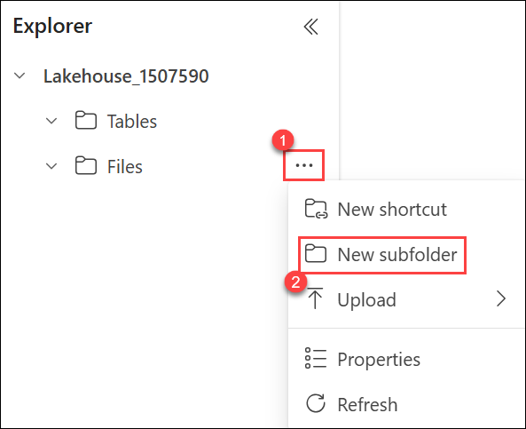
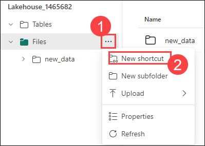
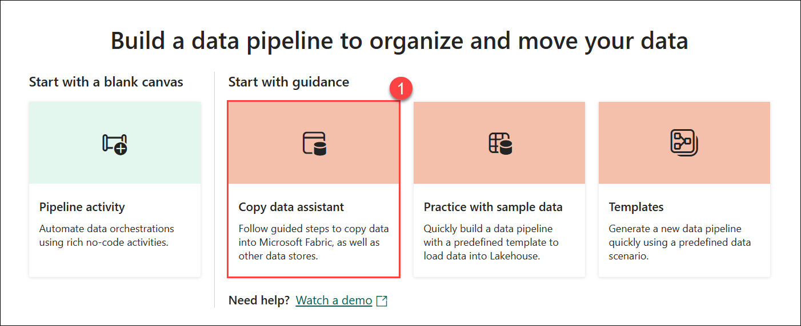
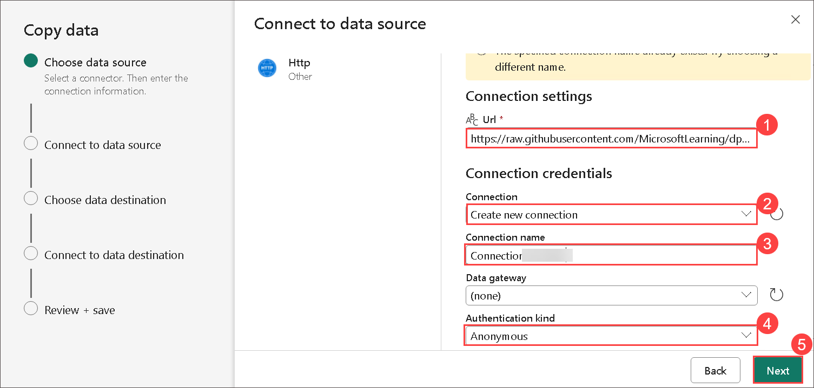
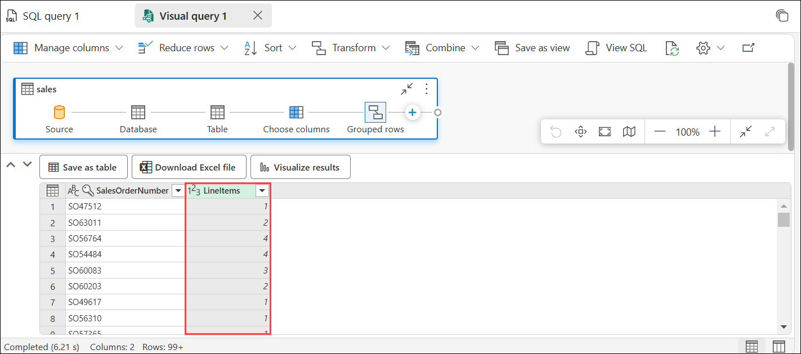
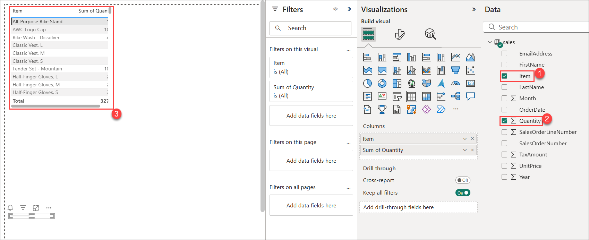
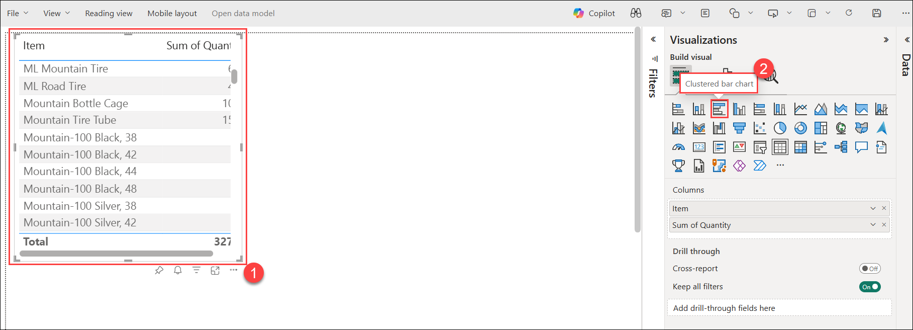

# Exercise 2: Ingest data with a pipeline in Microsoft Fabric

### Estimated Duration: 90 minutes

A data lakehouse is a common analytical data store for cloud-scale analytics solutions. One of the core tasks of a data engineer is to implement and manage the ingestion of data from multiple operational data sources into the lakehouse. In Microsoft Fabric, you can implement *extract, transform, and load* (ETL) or *extract, load, and transform* (ELT) solutions for data ingestion through the creation of *pipelines*.

Fabric also supports Apache Spark, enabling you to write and run code to process data at scale. By combining the pipeline and Spark capabilities in Fabric, you can implement complex data ingestion logic that copies data from external sources into the OneLake storage on which the lakehouse is based and then uses Spark code to perform custom data transformations before loading it into tables for analysis.

## Lab objectives

You will be able to complete the following tasks:

- Task 1: Enable Copilot inside a Codespace
- Task 2: Explore shortcuts
- Task 3: Create a pipeline
- Task 4: Create a notebook
- Task 5: Use SQL to query tables
- Task 6: Create a visual query
- Task 7: Create a report
  
### Task 1: Create a Lakehouse

Large-scale data analytics solutions have traditionally been built around a *data warehouse*, in which data is stored in relational tables and queried using SQL. The growth in "big data" (characterized by high *volumes*, *variety*, and *velocity* of new data assets) together with the availability of low-cost storage and cloud-scale distributed computing technologies has led to an alternative approach to analytical data storage; the *data lake*. In a data lake, data is stored as files without imposing a fixed schema for storage. Increasingly, data engineers and analysts seek to benefit from the best features of both of these approaches by combining them in a *data lakehouse*; in which data is stored in files in a data lake and a relational schema is applied to them as a metadata layer so that they can be queried using traditional SQL semantics.

In Microsoft Fabric, a lakehouse provides highly scalable file storage in a *OneLake* store (built on Azure Data Lake Store Gen2) with a metastore for relational objects such as tables and views based on the open source *Delta Lake* table format. Delta Lake enables you to define a schema of tables in your lakehouse that you can query using SQL.

Now that you have created a workspace in the previous step, it's time to switch to the *Data engineering* experience in the portal and create a data lakehouse into which you will ingest data.

1. At the bottom left of the Power BI portal, select the **Fabric (1)** icon and switch to the **Fabric (2)** experience.

   

   
   
3. Navigate to your workspace named as **fabric-<inject key="DeploymentID" enableCopy="false"/> (1)**, click on **+ New item (2)** to create a new lakehouse.

    

4. In the All items search for Lakehouse (1) and select Lakehouse (2) from the list.

    

6. Enter the **Name** as **Lakehouse_<inject key="DeploymentID" enableCopy="false"/> (1)** and Click on **Create (2)**.

    

7. After a minute or so, a new lakehouse with no **Tables** or **Files** will be created.

8. On the **Lakehouse_<inject key="DeploymentID" enableCopy="false"/>** tab in the pane on the left, click the **Ellipsis(...)** menu for the **Files (1)** node, select **New subfolder (2)**.

    

9. Create a subfolder named **new_data (1)** and click on **Create (2)**.

    

### Task 2: Explore shortcuts

In many scenarios, the data you need to work within your lakehouse may be stored in some other location. While there are many ways to ingest data into the OneLake storage for your lakehouse, another option is to instead create a *shortcut*. Shortcuts enable you to include externally sourced data in your analytics solution without the overhead and risk of data inconsistency associated with copying it.

1. In the **Ellipsis(...) (1)** menu for the **Files** folder, select **New shortcut (2)**.

   

2. View the available data source types for shortcuts. Then close the **New shortcut** dialog box without creating a shortcut.

### Task 3: Create a pipeline

In this task, you will create a pipeline to automate data processing workflows. You’ll define the sequence of data transformation steps, configure the necessary components, and set up triggers for execution. This will streamline your data integration processes and improve efficiency in handling data tasks. A simple way to ingest data is to use a **Copy data** activity in a pipeline to extract the data from a source and copy it to a file in the lakehouse.

1. Navigate back to the workspace, click on **+ New item** and select **Data pipeline**.

    

2. Create a new data pipeline named **Ingest Sales Data Pipeline (1)** and click on **Create (2)**. 
   
   
   
3. If the **Copy data** wizard doesn't open automatically, select **Copy data assistant (1)** in the pipeline editor page.

   

4. In the **Copy Data** wizard, on the **Choose a data source** page, search for **Http (1)** and select it.

   

5. In the **Connection settings** pane, enter the following settings for the connection to your data source:
    
    - URL: **`https://raw.githubusercontent.com/MicrosoftLearning/dp-data/main/sales.csv`**  **(1)**
    - Connection: **Create new connection (2)**
    - Connection name: **Connection<inject key="DeploymentID" enableCopy="false"/> (3)**
    - Authentication kind : **Anonymous (4)**
    - Click on **Next (5)**
  
   
    
6. Make sure the following settings are selected and click on **Next** :
    
    - Relative URL: **Leave blank**
    - Request method: **GET**
    - Additional headers: **Leave blank**
    - Binary copy: **Unselected**
    - Request timeout: **Leave blank**
    - Max concurrent connections: **Leave blank**
  
   
   
7. Wait for the data to be sampled and then ensure that the following settings are selected:
    
    - File format: **DelimitedText (1)**
    - Column delimiter: **Comma (,) (2)**
    - Row delimiter: **Line feed (\n) (3)**
    - Select **Preview data (4)** to see a sample of the data that will be ingested.

    - Group by: **SalesOrderNumber**
    - New column name: **LineItems**
    - Operation: **Count distinct values**
    - Column: **SalesOrderLineNumber**

        

6. When you're done, the results pane under the visual query shows the number of line items for each sales order.

    

### Task 7: Create a report

In this task, you will create a report to visualize and present your data findings. You'll gather relevant data, select appropriate visualizations, and structure the report for clarity and insight. This process will help you effectively communicate your analysis and support data-driven decision-making.

1. At the top of the SQL analytics endpoint page, select the **Model Layouts (1)** tab. Click on **sales (2)** and select the **insert into canvas (3)** , the data model schema for the dataset will be shown as **follows (4)**:

   

   > You might notice some additional tables appeared as shown below, please ignore the system tables which are shown ignore.

     

    > **Note**: In this exercise, the data model consists of a single table. In a real-world scenario, you would likely create multiple tables in your lakehouse, each of which would be included in the model. You could then define relationships between these tables in the model.

2. In the menu ribbon, select the **Reporting** tab. Then select **New report**. A new browser tab will open in which you can design your report.

    
   
3. Click on **Continue** for adding data to the default semantic model.

    

4. In the **Data** pane on the right, expand the **sales** table. Then select the following fields:

    - **Item (1)**

    - **Quantity (2)**

   Then, a **table visualization (3)** is added to the report.

     
   
5. Hide the **Data** and **Filters** panes to create more space. Then, make sure the **table visualization is selected (1)** and in the **Visualizations** pane, change the visualization to a **Clustered bar chart (2)** and resize it as shown here.

      

      

6. On the **File** menu, select **Save As**. Then, name the Report as **Item Sales Report (1)** and click **Save (2)** in the workspace you created previously.

      

7. Close the browser tab containing the report to return to the SQL endpoint for your lakehouse. Then, in the hub menu bar on the left, select your workspace to verify that it contains the following items:
    - Your lakehouse.
    - The SQL endpoint for your lakehouse.
    - A default dataset for the tables in your lakehouse.
    - The **Item Sales Report** report.

> **Congratulations** on completing the task! Now, it's time to validate it. Here are the steps:
      
   - If you receive an InProgress message, you can hit refresh to see the final status.
   - If you receive a success message, you can proceed to the next task.
   - If not, carefully read the error message and retry the step, following the instructions in the lab guide.
   - If you need any assistance, please contact us at cloudlabs-support@spektrasystems.com. We are available 24/7 to help you out.

   <validation step="b28817e6-75d8-40fd-9c33-0a408a962f8e" />

### Summary

In this exercise, you have created a lakehouse and imported data into it. You've seen how a lakehouse consists of files and tables stored in a OneLake data store. The managed tables can be queried using SQL and are included in a default dataset to support data visualizations.

### You have successfully completed the lab. Click on Next >> to proceed with the next exercise.
