# Exercise 4: Data Warehouse Analyze Data in a Warehouse with Fabric Copilot

### Estimated Duration: 60 minutes

## Overview

In this Exercise, you will analyze data in a warehouse using Fabric Copilot by connecting to your data source, running queries, and visualizing insights to drive informed decision-making.

## Lab objectives

You will be able to complete the following tasks:

- Task 1: Create a data warehouse
- Task 2: Create tables and insert data
- Task 3: Define a data model
- Task 4: Generate reports using Copilot

## Task 1: Create a data warehouse

In this task, you'll create a new data warehouse in the Data Warehouse experience of the Power BI portal.

Now that you already have a workspace, it's time to switch to the *Data Warehouse* experience in the portal and create a data warehouse.

1. At the bottom left of the Power BI portal, click on the **Data factory (1)** icon and select **Data Warehouse (2)** to switch to the **Data Warehouse** experience. 

   

1. The Data Warehouse home page includes a shortcut to create a new warehouse. Click on **Warehouse**.

   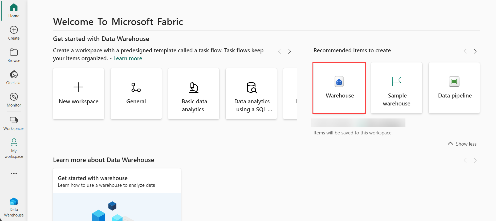

1. In the **Data Warehouse** home page, create a new **Warehouse** named **Data Warehouse-<inject key="DeploymentID" enableCopy="false"/> (1)** and click on **Create (2)**.

   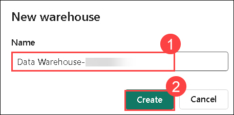   

> **Congratulations** on completing the task! Now, it's time to validate it. Here are the steps:

   - Hit the Validate button for the corresponding task. If you receive a success message, you can proceed to the next task. 
   - If not, carefully read the error message and retry the step, following the instructions in the lab guide.
   - If you need any assistance, please contact us at cloudlabs-support@spektrasystems.com. We are available 24/7 to help you out.

<validation step="0ef77b08-2998-4a99-ab87-d97b737e97d7" />

## Task 2: Create tables and insert data

In this task, you'll create and populate tables in your data warehouse using T-SQL, then verify that the tables have been created and data has been inserted successfully.

A warehouse is a relational database in which you can define tables and other objects.

1. In your new warehouse, select the Create tables with **T-SQL** tile.

   

1. Replace the default SQL code with the following CREATE TABLE statement and use the **&#9655; Run** button to run the SQL script.

   ```sql
   CREATE TABLE dbo.DimProduct
   (
       ProductKey INTEGER NOT NULL,
       ProductAltKey VARCHAR(25) NULL,
       ProductName VARCHAR(50) NOT NULL,
       Category VARCHAR(50) NULL,
       ListPrice DECIMAL(5,2) NULL
   );
   GO
   ```

   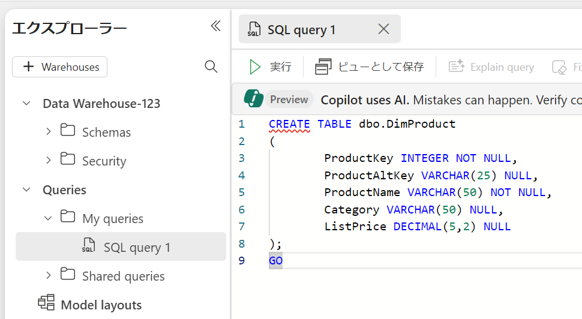

1. Use the **Refresh** button on the toolbar to refresh the view. Then, in the **Explorer** pane, expand **Schemas (1)** > **dbo (2)** > **Tables (3)** and verify that the **DimProduct (4)** table has been created.

   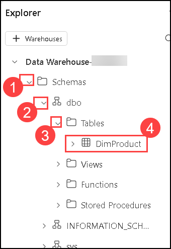

1. On the **Home** menu tab, use the **New SQL Query** button to create a new query.

   

1. Enter the following **INSERT** statement and click on **&#9655; Run** button to insert three rows into the **DimProduct** table.

    ```sql
   INSERT INTO dbo.DimProduct
   VALUES
   (1, 'RING1', 'Bicycle bell', 'Accessories', 5.99),
   (2, 'BRITE1', 'Front light', 'Accessories', 15.49),
   (3, 'BRITE2', 'Rear light', 'Accessories', 15.49);
   GO
    ```

    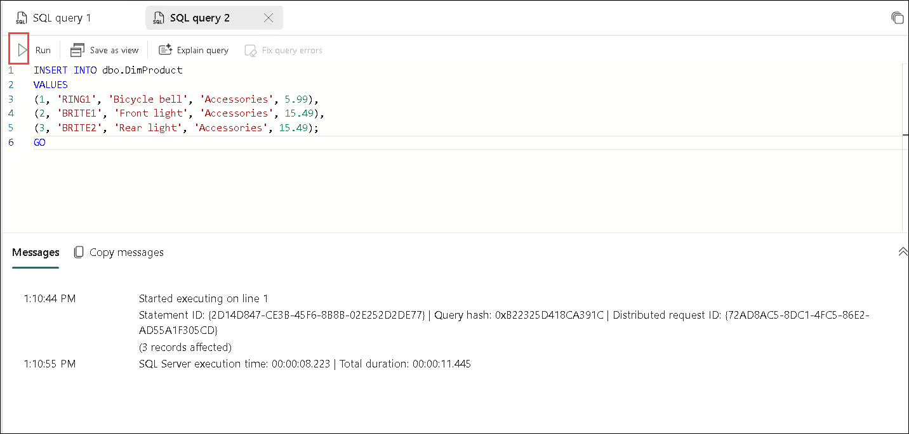

1. When the query has finished. Go to the **Explorer** pane, select the **DimProduct** table and verify that the **three** rows have been added to the table.

   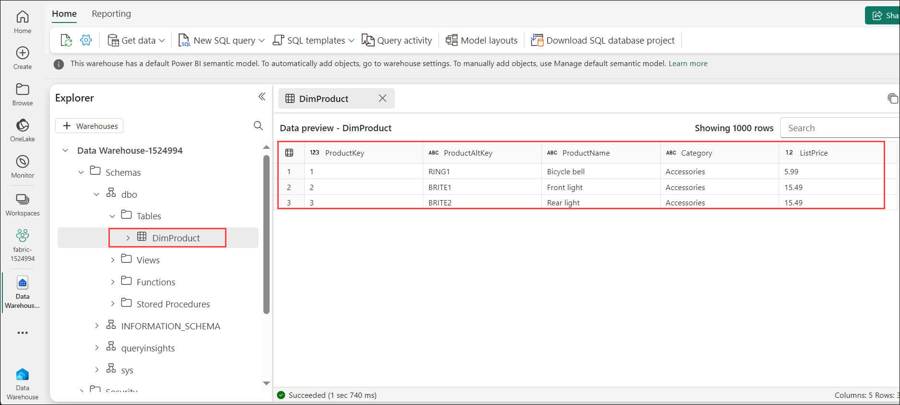

1. On the **Home (1)** menu tab, use the **New SQL Query (2)** button to create a new query for each table. 

   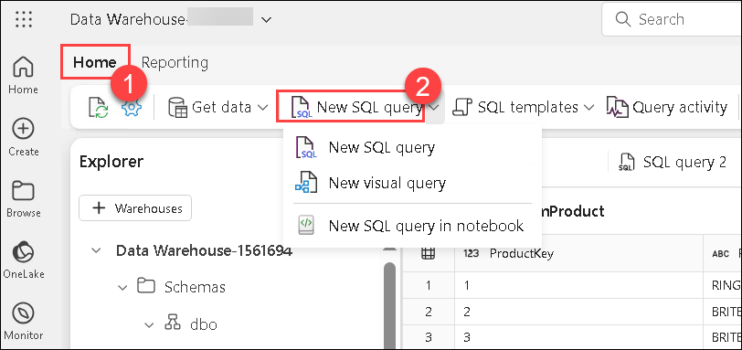

1. Open the **File explorer** from the bottom menu.

   

1. Open the first text file, located at **C:\LabFiles\Files\create-dw-01.txt,** and copy the Transact-SQL code related to the 'DimProduct' table. Paste the **DimProduct** table code into the query pane you created. Next, copy the code for the 'DimCustomer', 'DimDate', and 'FactSalesOrder' tables using the respective files, **C:\LabFiles\Files\create-dw-02.txt** and **C:\LabFiles\Files\create-dw-03.txt.** Place all the code sequentially and ensure that each query is executed in one query pane for the respective table.

   

1. **Run** the query, which creates a simple data warehouse schema and loads some data. The script should take around 30 seconds to run.

   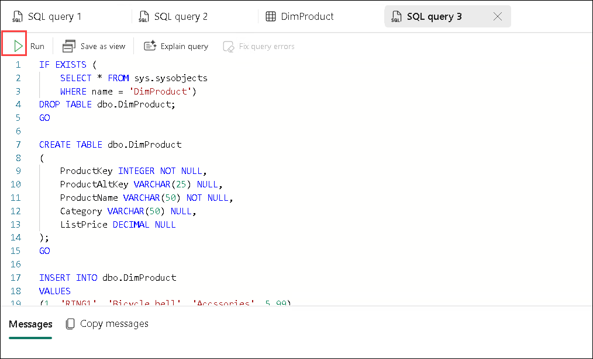

1. Use the **Refresh** button on the toolbar to refresh the view. Then in the **Explorer** pane, verify that the **dbo** schema in the data warehouse now contains the following four tables:

    - **DimCustomer**
    - **DimDate**
    - **DimProduct**
    - **FactSalesOrder**

      

    > **Tip**: If the schema takes a while to load, just refresh the browser page.

## Task 3: Define a data model

In this task, you'll define a data model in your data warehouse by creating relationships between fact and dimension tables. You'll establish many-to-one relationships between FactSalesOrder and DimProduct, DimCustomer, and DimDate using the Model tab.

A relational data warehouse typically consists of *fact* and *dimension* tables. The fact tables contain numeric measures you can aggregate to analyze business performance (for example, sales revenue), and the dimension tables contain attributes of the entities by which you can aggregate the data (for example, product, customer, or time). In a Microsoft Fabric data warehouse, you can use these keys to define a data model that encapsulates the relationships between the tables.

1. Scroll down the page and select **Model layouts**.

1. In the model pane, rearrange the tables in your data warehouse so that the **FactSalesOrder** table is in the middle, like this:

   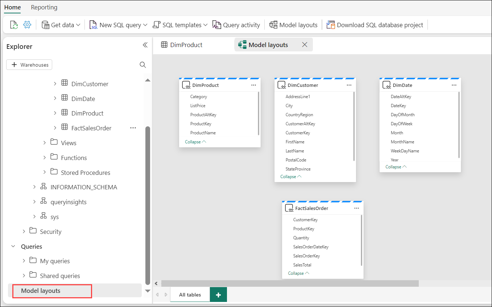

1. Drag the **ProductKey** field from the **FactSalesOrder** table and drop it on the **ProductKey** field in the **DimProduct** table. Then confirm the following relationship details:

    - **From table**: FactSalesOrder
    - **Column**: ProductKey
    - **To table**: DimProduct
    - **Column**: ProductKey
    - **Cardinality**: Many to one (*:1)
    - **Cross filter direction**: Single
    - **Make this relationship active**: Selected
    - **Assume referential integrity**: Unselected

    
    

1. Repeat the process to create many-to-one relationships between the following tables:

    - **FactSalesOrder.CustomerKey** &#8594; **DimCustomer.CustomerKey**

    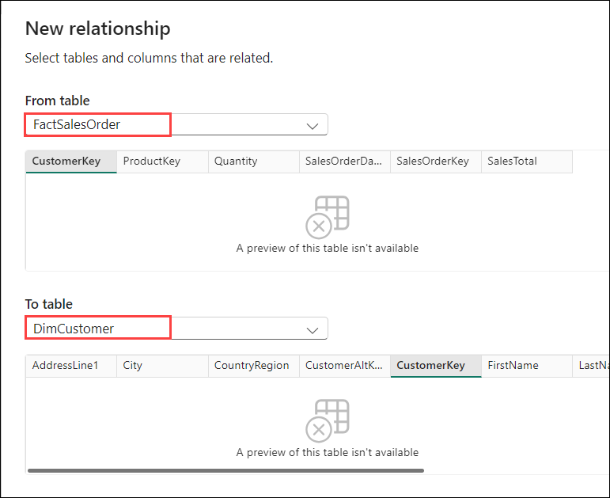
    

    - **FactSalesOrder.SalesOrderDateKey** &#8594; **DimDate.DateKey**

    
    

1. When all of the relationships have been defined, the model should look like this:

   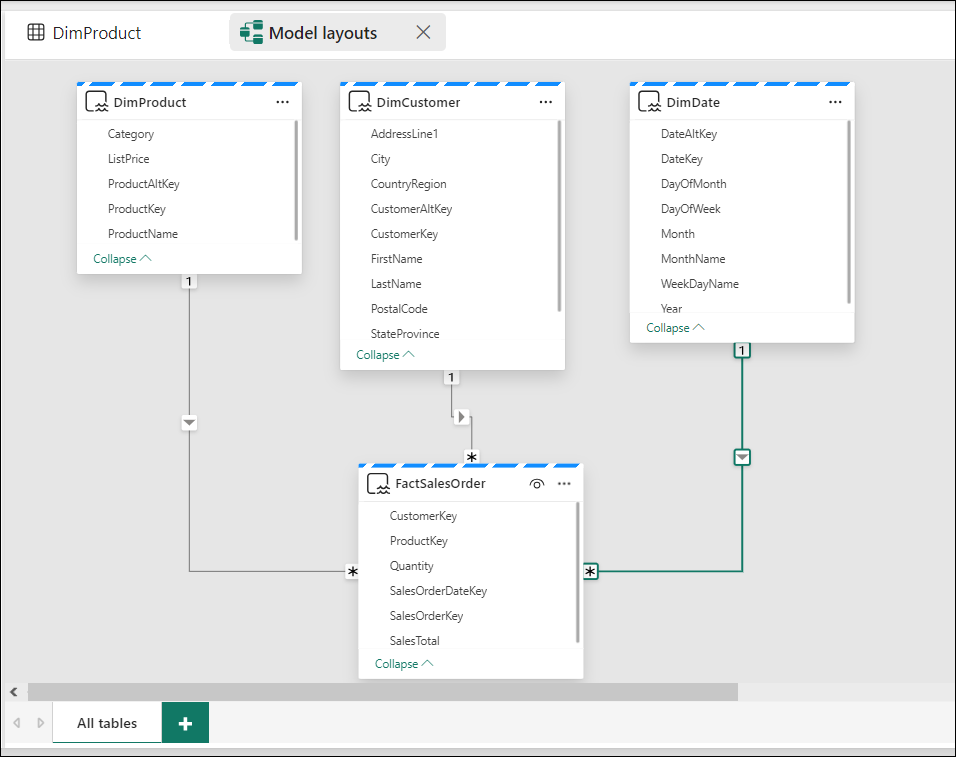

## Task 4: Generate reports using Copilot

In this task, you will utilize Microsoft Fabric's Copilot feature to generate comprehensive reports by leveraging natural language inputs. Copilot assists in transforming raw data into actionable insights, enabling you to create detailed reports efficiently. 

1. When you click on the relationship between **FactSalesOrder** and **DimCustomer** and access its properties, you're essentially examining how these two tables are linked together. This relationship defines how data from these tables can be combined or related when querying or visualizing in Power BI.

     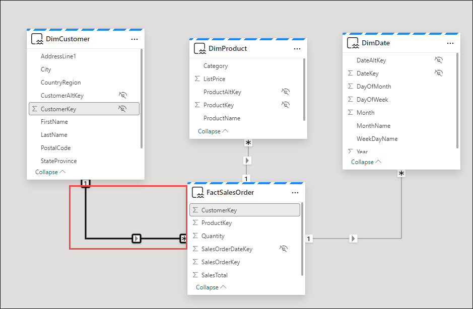

    - This relationship indicates that each record in the "FactSalesOrder" table is associated with a specific customer represented in the "DimCustomer" table. For example, if we have a sales record in "FactSalesOrder" for a particular transaction, we can use this relationship to look up additional details about the corresponding customer from the "DimCustomer" table.

    - This linkage is crucial for defining the Semantic Model used by Power BI. The Semantic Model essentially acts as a blueprint that outlines how data elements are interconnected and how they should be interpreted within Power BI. By establishing and defining relationships between tables, we're instructing Power BI on how to navigate and analyze the data effectively.
 
1. Clicking on **New Report (2)** from the **reporting tab (1)** allows you to create a new report within Power BI. This report will utilize the Semantic Model defined by the relationships established in the data warehouse.
 
   

1. The Semantic Model, as defined in the data warehouse, is reflected in the Power BI interface. This includes the tables and their respective fields visible in the Data Pane of Power BI, which you can use to build your reports.

1. Click on **Continue** for **New report with all available data**.

   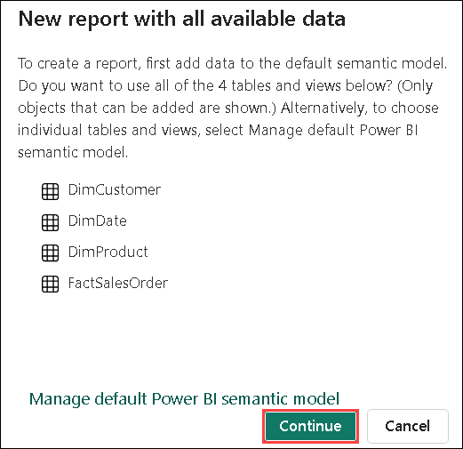

1. Locate and click on the **Copilot** feature within the tool or platform you're using.

   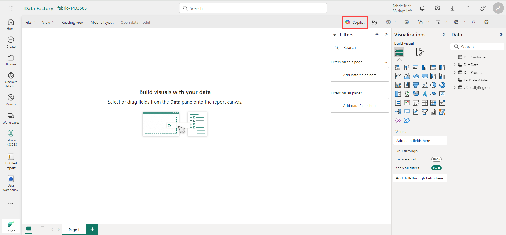

1. If the pop-up titled **Welcome to Copilot in Power BI** appears, proceed by selecting **Get Started**.

   

1. Locate the logo or icon associated with Copilot, then click on it to access its menu or interface.

   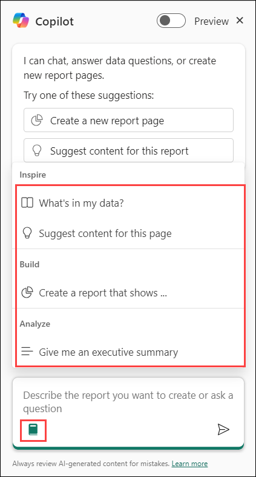

1. Recognize that Copilot offers functionalities such as providing suggestions, generating code snippets, and offering explanations. However, it's important to note its limitations, which may include the inability to create certain visualizations or directly modify page layouts.

1. Selecting **What's in my data** prompts Copilot to analyze the semantic model or dataset currently in use.

   

   - Copilot's analysis indicates that your dataset encompasses **sales performance**, **customer details**, **product information**, and **query performance**, offering a holistic view of your business operations. It suggests potential applications such as sales trend analysis, regional performance evaluation, customer segmentation, product evaluation, and query optimization. This highlights Copilot's adept understanding of dataset components and analytical techniques, providing valuable insights for strategic decision-making, customer engagement strategies, product refinement, and system enhancement.
    
   - Copilot represents a significant advancement in AI utilization, showcasing its capability beyond just generating code or manipulating data. Its capacity to assist in analyzing datasets is particularly noteworthy, as it offers intelligent insights and suggestions that enhance the entire data analysis process. By leveraging Copilot, users can gain a deeper understanding and uncover valuable patterns within their datasets, ultimately empowering them to make informed decisions based on the insights derived. This highlights the transformative potential of AI in augmenting human capabilities and driving innovation in data analysis methodologies.
 
1. Explore the capabilities of Copilot further by **clicking on its logo** within the text box. This will allow you to access additional features and functionalities that Copilot offers, providing a deeper understanding of its capabilities.
  
   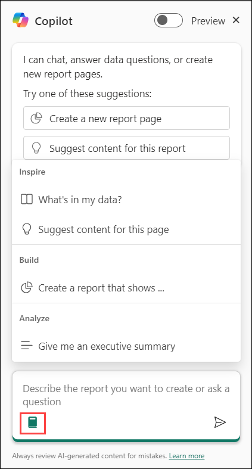

1. Click **Create a page that shows**.

    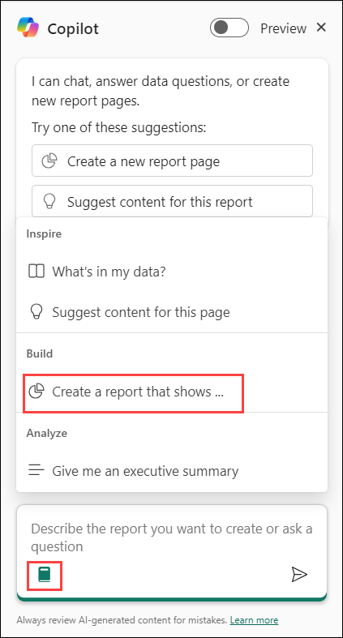
   
1. At this time, you can only ask for a page or report to be created. You can't ask for specific visuals.
 
1. Type the following command into Copilot:
  
    ```
    Create a page that shows "Total Sales by Product Category"
    ```
 
1. **Execute the command** and let Copilot generate the report. Note that AI-generated results may vary, and you're never entirely sure what you'll get.

    

   - The report provides a comprehensive analysis of total sales across a spectrum of product categories, revealing a consistent pattern of total sales summing up to 19.59 million across all 39 categories. Similarly, the quantity sold uniformly stands at 25.98 thousand units for each category. With an average total sales figure of 4.55 thousand, it suggests an even distribution of sales performance across all categories. This uniformity underscores a balanced sales landscape across diverse product categories, thereby offering valuable insights for informed decision-making in subsequent business strategies.
   
1. Type the following command into Copilot

    ```
    Suggest Content for this Report
    ```
 
1. **Expand each suggestion** to see the text of the prompt and what will be created. This helps illustrate the range of suggestions Copilot can provide.

    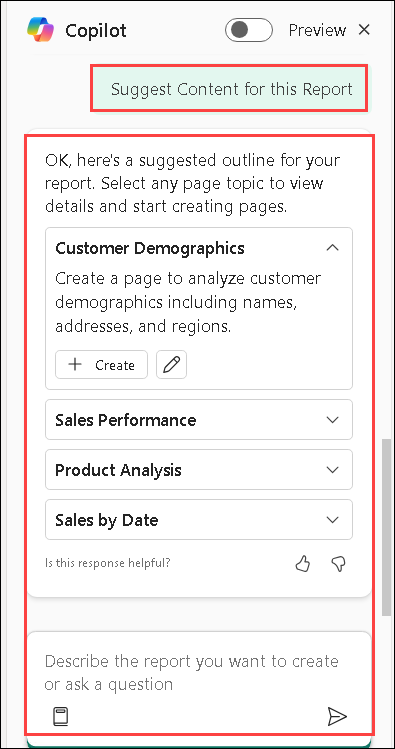

1. Click on **Create** on any suggestion **(1)**. You can see the report **(2)**.   

    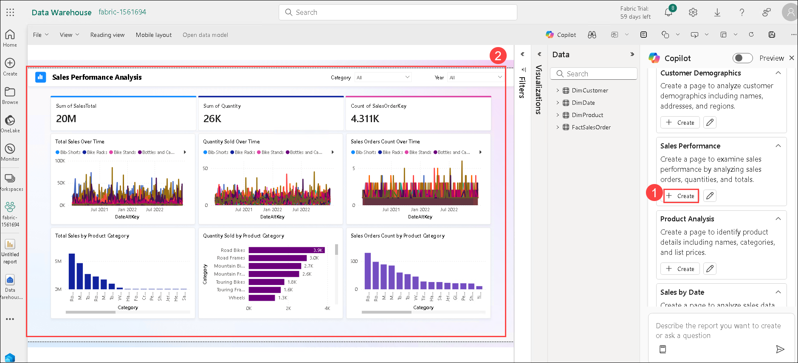
 
    >**Note:** Click **Edit** to demonstrate that you can adjust the query and customize the report.

   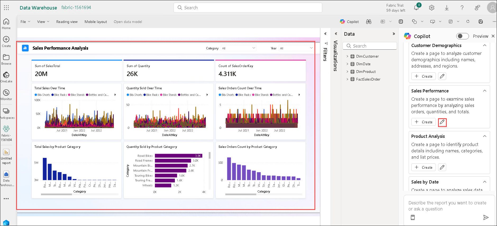

1. **Clear the input box** and select:

    ```
    Give me an executive summary
    ```
    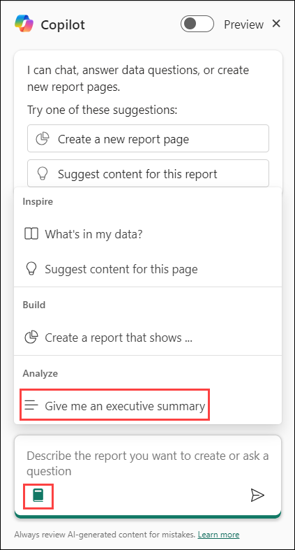

        

1. Click on **File -> Save** from the top left corner. Enter the report name as **Sample (1)** and click on **Save (2)**.

    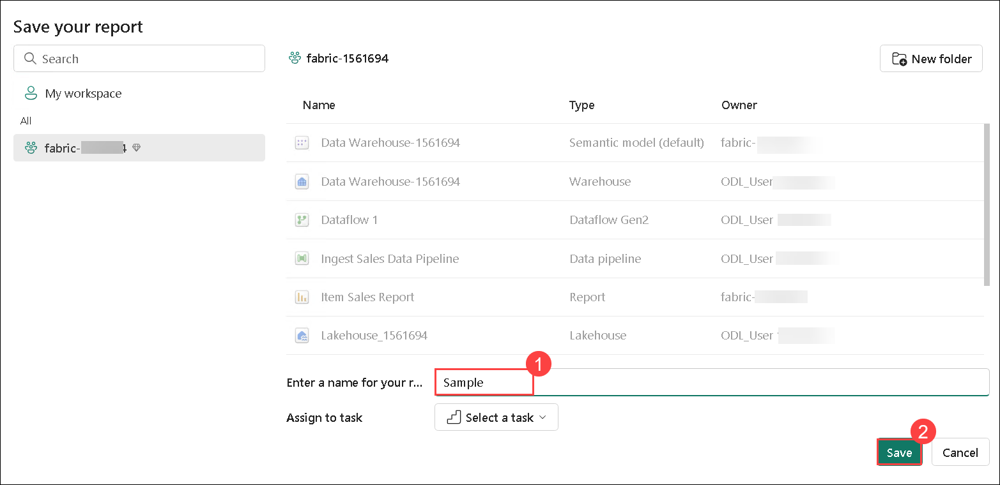

1. The summary provides an overview of sales revenue data from 2021 to 2022, highlighting increases year-over-year and identifying key months and regions driving revenue growth, with 2022 contributing significantly to total revenue, led by strong performance in the United States.

## Summary

In this Exercise, you connected to a data warehouse using Fabric Copilot and explored the available datasets. You ran queries to extract insights and created visualizations for effective analysis. Finally, you compiled your findings into reports and collaborated with team members on the results.

### Review
In this lab, you have completed:

- Task 1: Create a data warehouse
- Task 2: Create tables and insert data
- Task 3: Define a data model
- Task 4: Generate reports using Copilot

### You have successfully completed the lab.
