# How to use Apache Spark in Microsoft Fabric

### Overall Estimated Duration: 4 Hours

## Overview

This lab provides an introduction to Dataflows (Gen2) and Data Pipelines in Microsoft Fabric, focusing on their role in data ingestion, transformation, and automation. Participants will explore how Dataflows (Gen2) connect to various data sources, perform transformations using Power Query Online, and integrate with Data Pipelines to load data into a lakehouse or analytical store. The lab will also cover building and orchestrating pipelines using the Fabric user interface, enabling automation of extract, transform, and load (ETL) processes without extensive coding.

## Objective

By the end of this lab, you will be able to:

- **Analyze data with Apache Spark** : You will learn how to use Apache Spark within Microsoft Fabric to explore and analyze large datasets. This task will guide you through creating Spark notebooks, running distributed data processing tasks, and performing data transformations to gain meaningful insights.

- **Create a Dataflow (Gen2) in Microsoft Fabric** : You will learn how to create and configure Dataflows (Gen2) to connect to data sources and perform transformations using Power Query Online. This task introduces the core features of Dataflows and demonstrates how they can be used in pipelines or Power BI datasets.

- **Ingest data with a pipeline**: You will learn how to build data pipelines to ingest data from external sources into a lakehouse in Microsoft Fabric. This includes using Apache Spark to apply custom transformations before loading the data for analysis.

## Pre-requisites

- Foundational understanding of Microsoft Fabric and its core components
- Familiarity with data ingestion and transformation concepts
- Basic knowledge of Power Query and its role in data preparation

## Architecture

The architecture of this lab revolves around Microsoft Fabric’s Dataflows (Gen2) and Data Pipelines, forming a seamless framework for data ingestion, transformation, and automation. Dataflows (Gen2) serve as the entry point, connecting to diverse data sources and leveraging Power Query Online for data transformation. These transformed datasets integrate with Data Pipelines, which orchestrate data movement into a lakehouse or analytical store. The Fabric user interface facilitates pipeline construction and automation, streamlining extract, transform, and load (ETL) workflows without requiring extensive coding, thereby enhancing efficiency and scalability in data processing.

## Architecture Diagram

 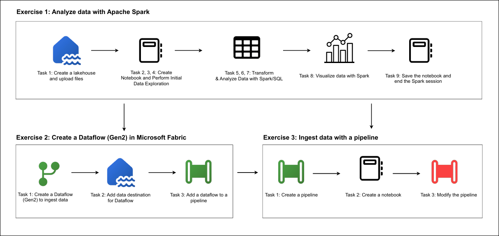

## Explanation of Components

1. **Analyze data with Apache Spark in Fabric**: Learning how to use Apache Spark within Microsoft Fabric to explore and analyze large-scale datasets. This includes creating notebooks, executing distributed data operations, and performing transformations to uncover insights.

1. **Create and use Dataflows (Gen2) in Microsoft Fabric**: Understanding how to use Power Query Online to build Dataflows (Gen2), which connect to data sources, perform transformations, and feed downstream components like pipelines or Power BI reports.pipelines or Power BI datasets.

1. **Ingest data with a pipeline in Microsoft Fabric**: Building and configuring data pipelines to ingest data from external sources into a Fabric lakehouse. This process includes applying transformations using Apache Spark and automating data loading for analysis.

## Getting Started with Lab

Welcome to your How to use Apache Spark in Microsoft Fabric Workshop! We've prepared a seamless environment for you to explore and learn about the services. Let's begin by making the most of this experience.
 
## Accessing Your Lab Environment
 
Once you're ready to dive in, your virtual machine and lab guide will be right at your fingertips within your web browser.

 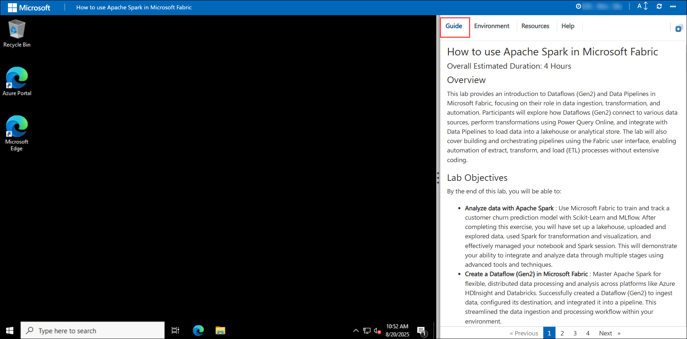
 
## Virtual Machine & Lab Guide

Your virtual machine is your workhorse throughout the workshop. The lab guide is your roadmap to success.

## Exploring Your Lab Resources
 
To get a better understanding of your lab resources and credentials, navigate to the **Environment** tab. Here, you will find the Azure credentials. Click on the **Environment** option to verify the credentials.
 
  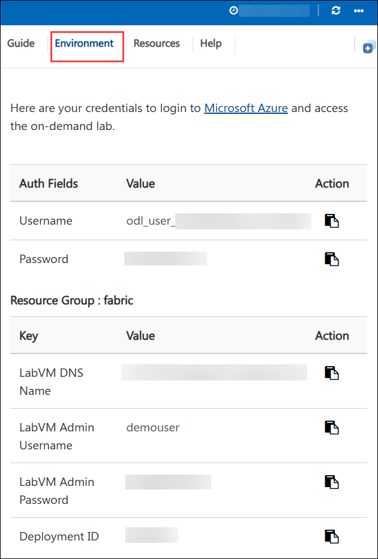
 
## Utilizing the Split Window Feature
 
For convenience, you can open the lab guide in a separate window by selecting the **Split Window** button from the top right corner.
 
  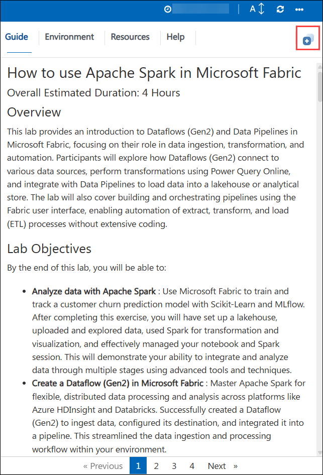

## Managing Your Virtual Machine
 
Feel free to **start, stop**, or **restart** your virtual machine as needed from the **Resources** tab. Your experience is in your hands!

   

## Utilizing the Zoom In/Out Feature

To adjust the zoom level for the environment page, click the **A↕ : 100%** icon located next to the timer in the lab environment.

   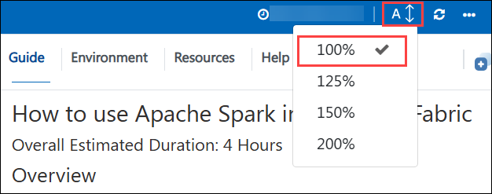

## Let's Get Started with Fabric Portal

1. In the Lab VM, click on the **Microsoft Edge** browser, which is available on the desktop.

   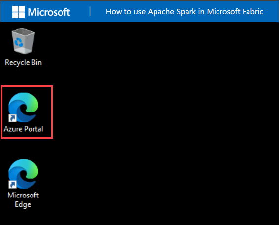

1. Copy the **Fabric link** below and open this link in a new tab on the Microsoft Edge Browser.

   ```
   https://app.fabric.microsoft.com
   ```
   
1. On the **Enter your email, we'll check if you need to create a new account** tab, you will see the login screen, in that enter the following email/username, and click on **Submit (2)**.
 
   - **Email/Username:** <inject key="AzureAdUserEmail"></inject> **(1)**

     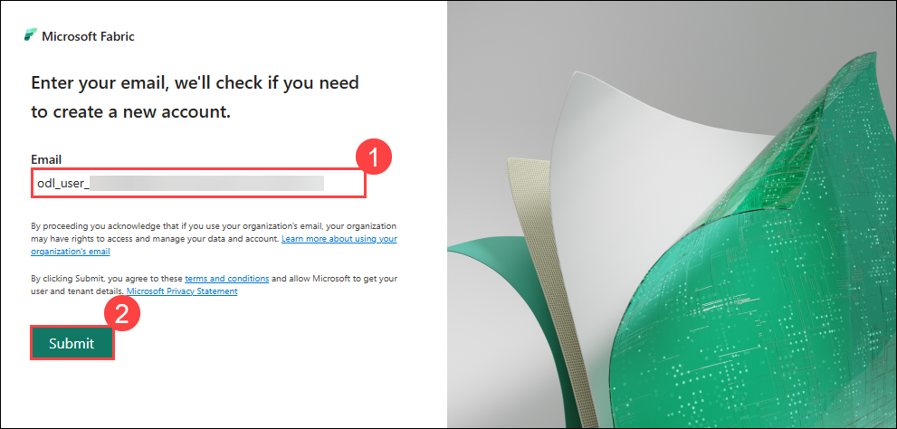

1. Now enter the following password and click on **Sign in (2)**.
 
   - **Password:** <inject key="AzureAdUserPassword"></inject> **(1)** 

      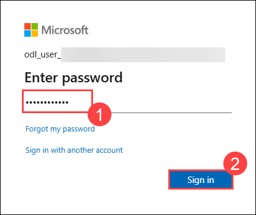

1. If you see a pop-up **Stay Signed in?**, click **No**.

   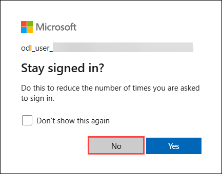

      > **Note**: If prompted with MFA, please follow the steps highlighted under - [Steps to Proceed with MFA Setup if Ask Later Option is Not Visible](#steps-to-proceed-with-mfa-setup-if-ask-later-option-is-not-visible)

1. You will be navigated to the Fabric Home page.

   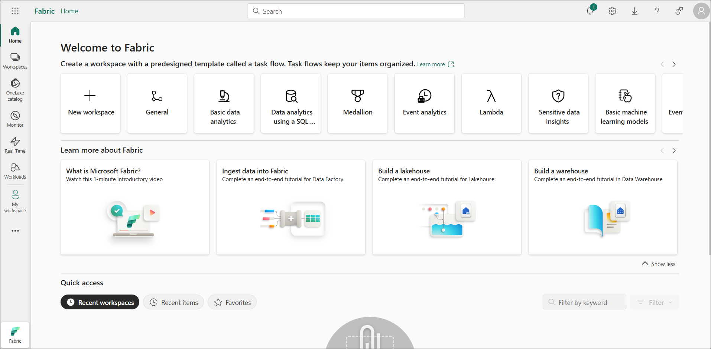

1. Click the **Profile (1)** icon from the top-right corner, then select the **Free trial (2)** button from the panel.

     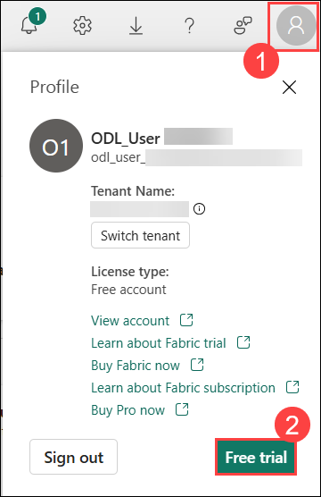

1. On the **Activate your 60-day free Fabric trial capacity** pop-up, click the **Activate** button to proceed.  

      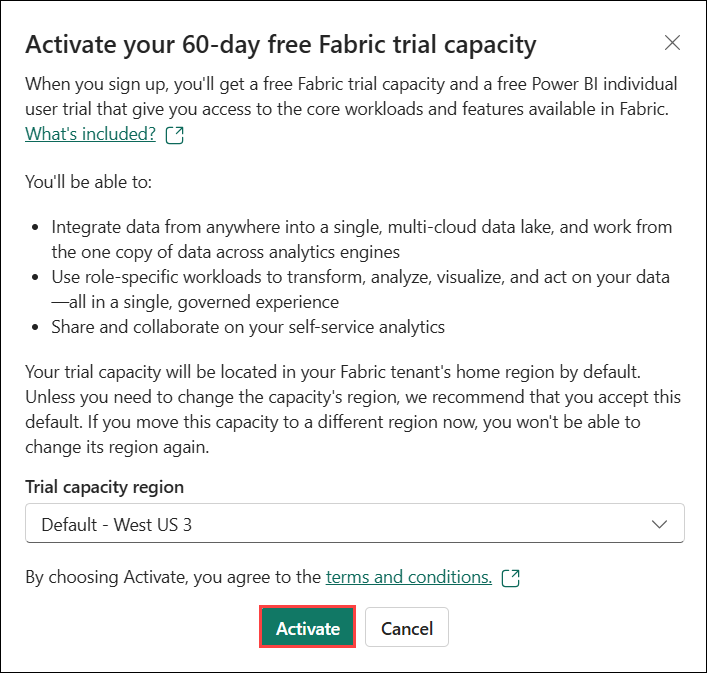
   
1. Once the trial capacity is ready and the confirmation message appears, click **Got it** to start working in Fabric.

      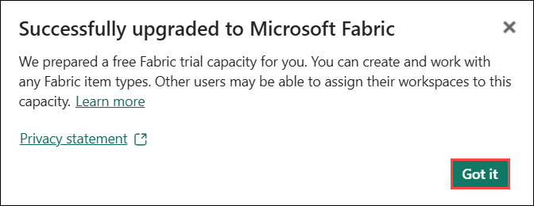
   
1. Open the **Account Manager** again and observe the new **Trial Status** section, which displays the number of days remaining in your trial.

    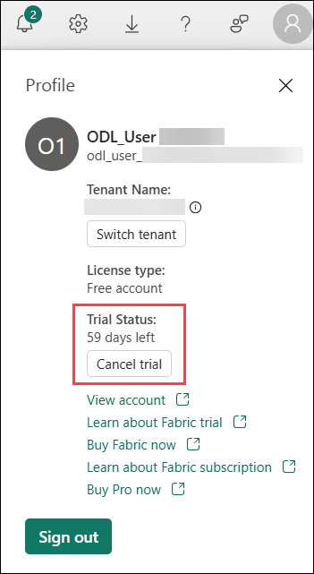

      > **Note:** You now have a **Fabric (Preview) trial** that includes a **Fabric (Preview) trial capacity**.

1. From the left pane, select **Workspaces (1)**, then click **+ New workspace (2)** at the bottom.

      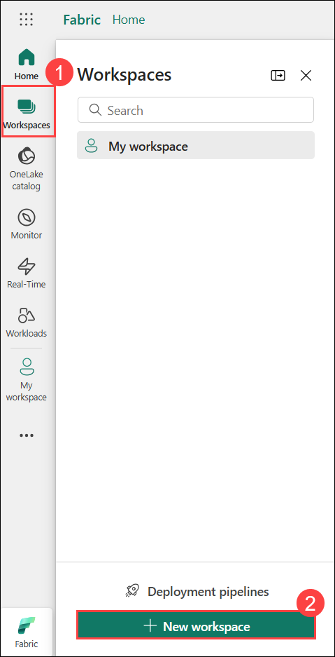

1. In the **Create a workspace** dialog box, enter the name as **fabric-<inject key="DeploymentID" enableCopy="false"/>** **(1)**, then click **Apply (2)** to create the workspace.

     
   
1. When your new workspace opens, it should appear empty, as shown in the image.

    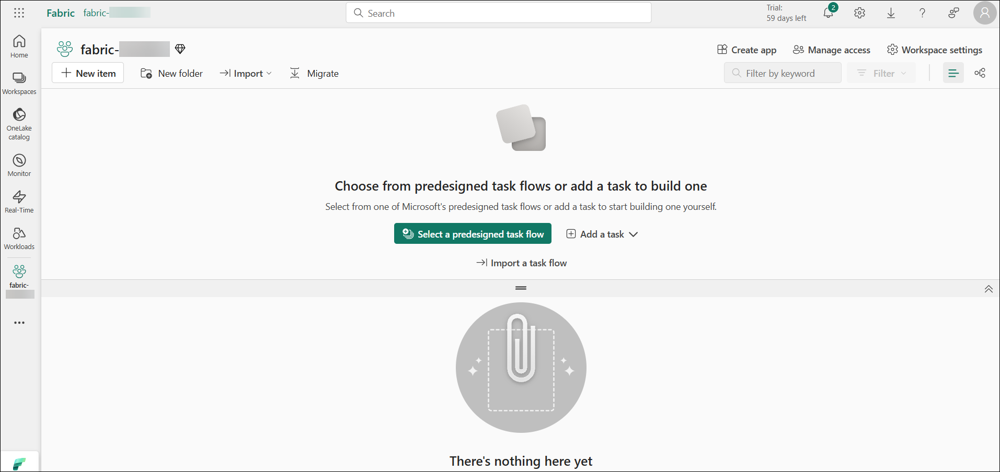

## Steps to Proceed with MFA Setup if Ask Later Option is Not Visible

   > **Note:** Continue with the exercises if MFA is already enabled or the option is unavailable.

1. At the **"More information required"** prompt, select **Next**.

1. On the **"Keep your account secure"** page, select **Next** twice.

1. **Note:** If you don’t have the Microsoft Authenticator app installed on your mobile device:

   - Open **Google Play Store** (Android) or **App Store** (iOS).
   - Search for **Microsoft Authenticator** and tap **Install**.
   - Open the **Microsoft Authenticator** app, select **Add account**, then choose **Work or school account**.

1. A **QR code** will be displayed on your computer screen.

1. In the Authenticator app, select **Scan a QR code** and scan the code displayed on your screen.

1. After scanning, click **Next** to proceed.

1. On your phone, enter the number shown on your computer screen in the Authenticator app and select **Next**.
       
1. If prompted to stay signed in, you can click **No**.

1. If a **Welcome to Microsoft Azure** popup window appears, click **Cancel** to skip the tour.
 
1. Now, click on the **Next** from the lower right corner to move to the next page.

## Support Contact

The CloudLabs support team is available 24/7, 365 days a year, via email and live chat to ensure seamless assistance at any time. We offer dedicated support channels tailored specifically for both learners and instructors, ensuring that all your needs are promptly and efficiently addressed.

Learner Support Contacts:

- Email Support: cloudlabs-support@spektrasystems.com
- Live Chat Support: https://cloudlabs.ai/labs-support

Now, click on **Next >>** from the lower right corner to move on to the next page.
   
   

## Happy Learning!!
